<div align="center">

# Gear

**Adapt your agent to real-world tasks.**

[](https://github.com/rsi-gear/gear/releases)
[](LICENSE)
[](https://discord.gg/cZ4NBbHDk)

[English](README.md) | [简体中文](README.zh-CN.md) · [User guide](https://rsigear.xyz/docs/gear) · [Examples](https://rsigear.xyz/docs/gear/examples/evolution-search)

</div>

Gear is an open-source optimization framework for improving AI agent performance on real-world tasks.

First, define the optimization objective for your workflow and prepare a benchmark that represents your target scenario. Use an existing benchmark or [build your own task set with clear success criteria](docs/guide/en/datasets.md). Then use the [Refine Skill](skills/refine/SKILL.md) to optimize your agent using that benchmark. Gear iteratively evaluates and refines the agent's instructions, tools, and workflows to produce an agent tailored to your target scenario.

## Competitive performance with a smaller model

On AutomationBench's 100 public Marketing tasks, GPT 5.6 Luna at max reasoning effort achieved a **partial-credit score of 88.88%** with Gear's optimized DSH harness, compared with **84.08%** for GPT 6 Astra at max effort in Codex. Luna's task pass rate was **53%**.


### Benchmark results

Given our limited compute budget, our evaluations currently cover the benchmarks below. We report results before and after optimization and welcome additional experiments and results from the community.

| Benchmark | Before | After | Gain | Setup | Metric |
| --- | --- | --- | --- | --- | --- |
| AutomationBench / Marketing | 27% | **53%** | **+96.30%** | GPT 5.6 Luna + DSH | [Task pass rate](https://github.com/zapier/AutomationBench#scoring) |
| AutomationBench / Marketing | 75.37% | **88.88%** | **+17.92%** | GPT 5.6 Luna + DSH | [Partial-credit score (`partial_credit`)](https://github.com/zapier/AutomationBench#scoring) |
| AutomationBench / Marketing | 57% | **61%** | **+7.02%** | GPT 6 Astra (max) | [Task pass rate](https://github.com/zapier/AutomationBench#scoring) |
| AutomationBench / Marketing | 84.08% | **86.30%** | **+2.64%** | GPT 6 Astra (max) | [Partial-credit score (`partial_credit`)](https://github.com/zapier/AutomationBench#scoring) |
| Terminal-Bench 2.1 | 52.87% | **84.26%** | **+59.37%** | GPT 5.6 Luna + DSH | [Task pass rate](https://www.tbench.ai/?version=2.1) |
| Terminal-Bench 2.1 | 87.4% | — | — | [GPT 6 Astra (high) + Codex](https://www.tbench.ai/?version=2.1) | [Task pass rate](https://www.tbench.ai/?version=2.1) |
| Terminal-Bench 2.1 | 83.8% | — | — | [Fable 5 (xhigh) + Claude Code](https://www.tbench.ai/?version=2.1) | [Task pass rate](https://www.tbench.ai/?version=2.1) |
| Terminal-Bench 2.1 | 83.2% | — | — | [GPT-5.5 (xhigh) + Codex](https://www.tbench.ai/?version=2.1) | [Task pass rate](https://www.tbench.ai/?version=2.1) |

Gain is the relative improvement: (After − Before) / Before × 100%, calculated from the displayed values. The partial-credit score is the average fraction of scored assertions satisfied per task.

For Luna, the comparison is between the original harness at medium reasoning effort and the optimized harness at max effort. Astra's Marketing results compare [native Codex](examples/evolution-search/codex-astra-max-evaluation.json) with the [optimized DSH harness](docs/guide/en/example-algorithm.md), both at max effort. The optimized harness was evaluated with Astra without an additional optimization round. Terminal-Bench reference configurations were not optimized with Gear; their scores appear in the Before column, while After and Gain are not applicable. Reasoning effort for these reference configurations is listed in Setup.

[Scoring and sources](docs/guide/en/results.md) · [Full experiment](docs/guide/en/example-algorithm.md)

## Quick start

Use Gear through its **Refine Skill** in Codex, Claude Code, DSH, or another compatible agent environment. Start with an existing benchmark or provide your own tasks in [Harbor format](docs/guide/en/datasets.md).

**Let your agent install Gear.** Paste the following prompt into your agent session:

```text
Follow https://rsigear.xyz/docs/gear/quickstart to install Gear in my environment.
Install rsi-gear@latest and agent-hitch@latest using npm and verify that all required dependencies are available.
Install the complete Refine Skill bundled with Gear in my current agent environment and configure its connection to Gear.
Use my actual task paths, target harness, and model settings; ask me for any missing information.
Verify that the Refine Skill can connect to Gear, then report the verification result and explain how to start my first optimization run.
```

For manual installation, install Gear and [Hitch](https://github.com/rsi-gear/agent-hitch), the evaluation runner. The following example also installs DSH as the task agent runtime:

```bash
npm install --global rsi-gear@latest agent-hitch@latest @deepseek-ai/dsh@latest
hitch eval setup harbor
```

Follow the [setup guide](docs/guide/en/quickstart.md) to install the bundled [Refine Skill](skills/refine/SKILL.md) in your agent environment and configure your benchmark. Then invoke `/refine` where supported, or submit the following request:

```text
Use the Refine Skill to improve performance on AutomationBench's Marketing tasks.
Use Codex + Astra to propose improvements and DSH + Luna to run the tasks.
Run one round of optimization.
```

The agent that proposes changes is called the **Meta agent**. It can use a different model from the task agent that executes the benchmark tasks.

## Algorithm design



Gear adopts a two-level architecture inspired by **meta-learning**, separating task-level execution from harness optimization guided by evaluation feedback.

- **Inner loop: task execution and evaluation.** Given a fixed model and harness configuration, the task agent interacts with the task environment to produce execution trajectories and task outcomes. These are evaluated according to predefined criteria, providing evidence for the outer loop.
- **Outer loop: harness optimization.** The Meta agent analyzes execution trajectories and evaluation feedback to identify failure modes and propose candidate harness modifications. Gear's optimization algorithm evaluates and selects candidates according to the configured objective and evaluation budget, determining the harness used in subsequent iterations.

A model's **harness** consists of the instructions, tools, and workflows used to run it as an agent. Gear aims to **evolve the model and harness together**, improving agent behavior through harness modifications and model capabilities through training, with task feedback guiding both processes. Harness optimization is supported today. Model training is experimental, and the full joint optimization loop remains under development.

### What can evolve?

Optimization is limited to the components you authorize Gear to modify.

| Component | What can change | Status |
| --- | --- | --- |
| Prompts and policies | Task instructions, system prompts, and action policies. | Supported |
| Tools and hooks | Tool implementations and hooks that run before or after tool execution. | Supported |
| Skills and workflows | Reusable procedures, helper scripts, and execution order. | Supported |
| Context management | Context selection and conversation history summarization. | Supported |
| Harness composition | Plugin and provider selection and configuration. | Supported |
| Model weights | Model parameters updated through training using task feedback. | Experimental; full training and evaluation loop under development |

You can also customize the **optimization algorithm**: how it proposes changes, selects tasks, executes and scores task attempts, compares candidates, and determines which versions to retain. [Example 2](docs/guide/en/example-algorithm.md) demonstrates these configurable components in a GEPA-based search.

Gear records each harness version and its evaluation results, so you can inspect the changes and reuse the resulting harness.

## Explore the examples

- [Optimize a harness for Marketing](docs/guide/en/example-harness.md): follow five rounds of harness optimization, from the initial configuration to the final retained harness.
- [Customize the optimization algorithm](docs/guide/en/example-algorithm.md): change how Gear proposes candidate modifications, selects tasks for evaluation, and retains candidates. The Marketing experiment uses a GEPA variant that allocates more evaluation budget to promising candidates.

## Architecture


[Learn more about Hitch](https://github.com/rsi-gear/agent-hitch)

## Roadmap

Gear supports harness optimization today. Two components of the broader learning loop remain under development:

- [ ] **Iterative model training and evaluation.** Use task feedback to train the model, evaluate the updated model, and repeat. An [experimental training workflow](docs/guide/en/training.md) is available; the full model iteration loop is not yet complete.
- [ ] **Automatic seed task generation.** Generate targeted practice tasks, or *seed tasks*, from task failures and incorporate them into subsequent optimization rounds. This automatic task generation loop is not yet complete.

## Build with us

Start with the [user guide](docs/guide/en/index.md), browse the [example code](examples/evolution-search/README.md), or join [Discord](https://discord.gg/cZ4NBbHDk).

For local development:

```bash
npm ci
npm run typecheck
npm run build
npm test
```

[Contributing](CONTRIBUTING.md) · [Documentation guidelines](docs/guide/README.md) · [GitHub issues](https://github.com/rsi-gear/gear/issues) · [MIT license](LICENSE)
