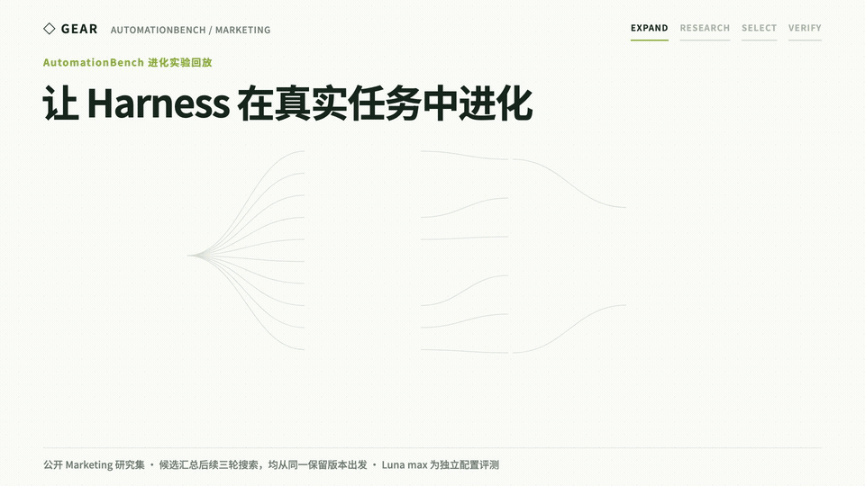
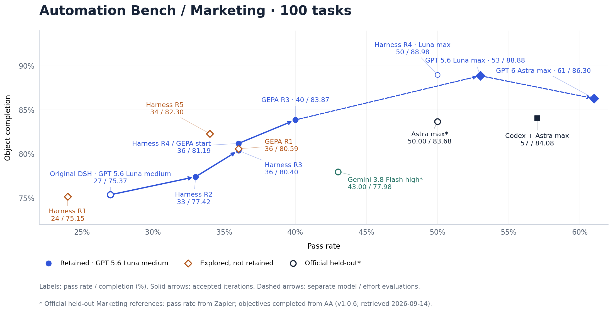

<div align="center">

# Gear

**让你的 Agent 适应真实世界的任务。**

[](https://github.com/rsi-gear/gear/releases)
[](LICENSE)
[](https://discord.gg/cZ4NBbHDk)

[English](README.md) | [简体中文](README.zh-CN.md) · [用户指南](https://rsigear.xyz/docs/gear/zh) · [案例](https://rsigear.xyz/docs/gear/zh/examples/evolution-search)

</div>



<p align="center">
  <strong>RSI 实践：AutomationBench 进化实验回放</strong>
</p>

Gear 是一套开源优化框架，用于提升 AI Agent 在真实世界任务中的表现。

要让 Agent 适应目标场景，首先准备一个包含代表性任务、具有明确验收标准的 benchmark。你可以使用现有 benchmark，也可以[构建自己的任务集](docs/guide/zh-CN/datasets.md)。在这个 benchmark 上运行 [Refine Skill](skills/refine/SKILL.md)。Gear 会利用评测结果，迭代改进 Agent 的模型、指令、工具和工作流程。

下面两个案例对比了 Luna Max 搭配 Gear 优化的 harness，与 Astra Max 搭配 Codex 在相同 AutomationBench 任务中的执行轨迹，展示它们如何读取信息、应用规则，并交付最终结果。

<table>
  <tr>
    <th width="50%">落地页告警</th>
    <th width="50%">精选摘要优化</th>
  </tr>
  <tr>
    <td><a href="docs/guide/assets/landing-page-alerts-replay.mp4"></a></td>
    <td><a href="docs/guide/assets/featured-snippet-replay.mp4"></a></td>
  </tr>
  <tr>
    <td>计分项通过数：Luna <strong>5/5</strong> · Astra <strong>4/5</strong><br><a href="docs/guide/assets/landing-page-alerts-replay.mp4">观看完整尺寸视频</a></td>
    <td>计分项通过数：Luna <strong>2/2</strong> · Astra <strong>1/2</strong><br><a href="docs/guide/assets/featured-snippet-replay.mp4">观看完整尺寸视频</a></td>
  </tr>
</table>

## 小模型也可以和 SOTA 模型掰手腕

在 AutomationBench 的 100 个公开 Marketing 任务上，GPT 5.6 Luna 使用 max 推理档位和经过 Gear 优化的 DSH harness，取得了 **88.88% 的目标完成率**，高于 GPT 6 Astra 使用 max 档位和 Codex 时的 **84.08%**。Luna 的任务通过率为 **53%**。

两种模型使用同一版优化后的 DSH harness（`a0740800`）时，**Luna max 平均每题 API 等价费用约为 $0.0568，Astra max 为 $1.1858，Luna 低 95.21%**。



### 基准评测结果

受限于当前算力预算，我们的评测目前覆盖下列基准，并公开优化前后的结果。欢迎社区贡献更多实验与结果。

| 任务集 | 优化前 | 优化后 | 提升 | 配置 | 指标 |
| --- | --- | --- | --- | --- | --- |
| AutomationBench / Marketing | 27% | **53%** | **+96.30%** | GPT 5.6 Luna + DSH | [任务通过率](https://github.com/zapier/AutomationBench#scoring) |
| AutomationBench / Marketing | 75.37% | **88.88%** | **+17.92%** | GPT 5.6 Luna + DSH | [目标完成率（`partial_credit`）](https://github.com/zapier/AutomationBench#scoring) |
| AutomationBench / Marketing | 57% | **61%** | **+7.02%** | GPT 6 Astra (max) | [任务通过率](https://github.com/zapier/AutomationBench#scoring) |
| AutomationBench / Marketing | 84.08% | **86.30%** | **+2.64%** | GPT 6 Astra (max) | [目标完成率（`partial_credit`）](https://github.com/zapier/AutomationBench#scoring) |
| Terminal-Bench 2.1 | 52.87% | **84.26%** | **+59.37%** | GPT 5.6 Luna + DSH | [任务通过率](https://www.tbench.ai/?version=2.1) |
| Terminal-Bench 2.1 | 87.4% | — | — | [GPT 6 Astra (high) + Codex](https://www.tbench.ai/?version=2.1) | [任务通过率](https://www.tbench.ai/?version=2.1) |
| Terminal-Bench 2.1 | 83.8% | — | — | [Fable 5 (xhigh) + Claude Code](https://www.tbench.ai/?version=2.1) | [任务通过率](https://www.tbench.ai/?version=2.1) |
| Terminal-Bench 2.1 | 83.2% | — | — | [GPT-5.5 (xhigh) + Codex](https://www.tbench.ai/?version=2.1) | [任务通过率](https://www.tbench.ai/?version=2.1) |

相对提升 =（优化后 − 优化前）/ 优化前 × 100%，按表中展示值计算。目标完成率先计算每题满足的计分目标比例，再对任务取平均。

Luna 对比的是原始 harness 的 medium 推理档位与优化后 harness 的 max 档位。Astra 的 Marketing 成绩对比[原生 Codex](examples/evolution-search/codex-astra-max-evaluation.json) 与[优化后的 DSH harness](docs/guide/zh-CN/example-algorithm.md)，均使用 max 档位。优化后的 harness 直接使用 Astra 评测，没有新增优化轮次。Terminal-Bench 对照配置未经过 Gear 优化，成绩列在「优化前」，「优化后」与「提升」不适用；这些对照配置的推理档位见「配置」。

[评分方式与来源](docs/guide/zh-CN/results.md) · [Token 消耗与计费口径](docs/marketing-token-cost.zh-CN.md) · [完整实验](docs/guide/zh-CN/example-algorithm.md)

## 快速开始

通过 **Refine Skill**，你可以在 Codex、Claude Code、DSH 或其他兼容的 Agent 环境中使用 Gear。你可以使用已有 benchmark，也可以用 [Harbor 格式](docs/guide/zh-CN/datasets.md)定义自己的任务。

**让 Agent 帮你安装。** 把下面的 prompt 复制给你正在使用的 Agent：

```text
请按照 https://rsigear.xyz/docs/gear/zh/quickstart 在当前环境中安装 Gear。
通过 npm 安装 rsi-gear@latest 和 agent-hitch@latest，并检查所需依赖。
把 Gear 自带的完整 Refine Skill 接入我当前使用的 Agent，并配置它与 Gear 的连接。
使用我实际的任务路径、目标 harness 和模型配置；缺少必要信息时再询问我。
完成后验证 Skill 能否连接 Gear，告诉我检查结果，以及如何开始第一次优化。
```

也可以手动安装 Gear 和负责运行评测的 [Hitch](https://github.com/rsi-gear/agent-hitch)。下面用 DSH 作为执行任务的 Agent：

```bash
npm install --global rsi-gear@latest agent-hitch@latest @deepseek-ai/dsh@latest
hitch eval setup harbor
```

按照[安装指南](docs/guide/zh-CN/quickstart.md)，把随包的 [Refine Skill](skills/refine/SKILL.md) 接入你的 Agent，并连接任务集。然后使用宿主支持的 `/refine`，或者直接用自然语言说：

```text
使用 Refine Skill 优化 AutomationBench 中 Marketing 的任务表现。
用 Codex + Astra 提出改进，用 DSH + Luna 执行任务。
运行一轮优化。
```

负责提出改进的 Agent 叫作 **Meta Agent**。它和执行任务的 Agent 可以使用不同的模型。

## 算法设计


Gear 采用受 **meta-learning（元学习）** 启发的双层架构，将任务级执行与评测反馈驱动的 harness 优化分为内外两层。

- **内层：任务执行与评测。** 在给定且固定的模型与 harness 配置下，任务 Agent 与任务环境交互，生成执行轨迹和任务结果。评测器依据预先定义的标准对其进行评估，为外层优化提供证据。
- **外层：harness 优化。** Meta Agent 分析执行轨迹与评测反馈，识别失败模式并提出候选 harness 修改。Gear 的优化算法根据配置的优化目标与评测预算，对候选进行评估和选择，确定后续迭代使用的 harness。

模型周围的指令、工具和工作流程，合称 **harness**。Gear 的设计目标是让**模型与 harness 共同进化**：修改 harness，改善做事方法；训练模型，提升模型本身的能力；两者都由任务结果指导。当前已实现 harness 进化，模型训练已有实验性路径，完整的联合迭代闭环仍在建设中。

### 哪些组件可以进化？

优化仅限于你授权 Gear 修改的组件。

| 组件 | 可以改变什么 | 当前状态 |
| --- | --- | --- |
| Prompt 与策略 | 任务指令、系统提示、采取行动时遵循的规则。 | 已支持 |
| 工具与 hooks | 工具实现，以及工具执行前后运行的 hooks。 | 已支持 |
| Skills 与工作流 | 可复用的操作方法、辅助脚本和执行步骤。 | 已支持 |
| 上下文管理 | 让 Agent 看到哪些信息，如何压缩和总结较长的历史记录。 | 已支持 |
| Harness 组合 | 使用哪些插件和服务，以及如何配置它们。 | 已支持 |
| 模型权重 | 利用任务反馈，通过训练更新模型参数。 | 实验性；完整训练与评测闭环仍在建设中 |

你还可以修改**优化算法本身**：如何提出修改、挑选任务、执行和评分、比较候选，以及决定保留哪个版本。[案例二](docs/guide/zh-CN/example-algorithm.md)用基于 GEPA 的搜索展示了这些可替换模块。

Gear 记录每一版 harness 及其评测结果，你可以检查改动并复用优化后的 harness。

你可以[定义加权优化目标](docs/refine-objectives.zh-CN.md)，组合已声明的通过率、过程分、费用或 token，并保留所有原始计量。

## 看看两个完整案例

- [优化 Marketing harness](docs/guide/zh-CN/example-harness.md)：了解五轮 harness 优化，从初始配置到最终保留的 harness。
- [定制优化算法](docs/guide/zh-CN/example-algorithm.md)：修改 Gear 如何提出候选改动、选择评测任务和保留候选。Marketing 实验采用 GEPA 的一种变体，将更多评测预算分配给有潜力的候选。

## 架构



[深入了解 Hitch](https://github.com/rsi-gear/agent-hitch)

## Roadmap

Gear 目前已支持 harness 优化。完整学习循环中的两个组件仍在建设中：

- [ ] **迭代模型训练与评测。** 利用任务反馈训练模型、评测更新后的模型，并重复这一过程。已有[实验性训练流程](docs/guide/zh-CN/training.md)，但完整的模型迭代闭环尚未完成。
- [ ] **自动生成 seed tasks。** 根据任务失败情况，构造有针对性的练习任务，即 *seed tasks*，并将其纳入后续优化轮次。这套自动生成任务的闭环尚未完成。

## 一起完善 Gear

阅读[用户指南](docs/guide/zh-CN/index.md)，查看[示例代码](examples/evolution-search/README.zh-CN.md)，或加入 [Discord](https://discord.gg/cZ4NBbHDk) 讨论。

本地开发：

```bash
npm ci
npm run typecheck
npm run build
npm test
```

[贡献指南](CONTRIBUTING.md) · [文档维护说明](docs/guide/README.md) · [GitHub Issues](https://github.com/rsi-gear/gear/issues) · [MIT 许可](LICENSE)
