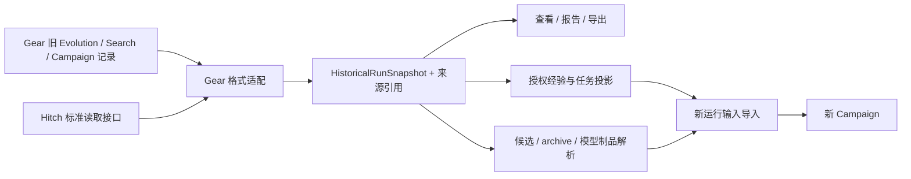

# Gear 算法作者 SDK：运行接口重构与历史实验数据兼容方案 v3

状态：设计与实验验收方案，2026-09-25；未开始本方案实现。依据用户确认：新接口和运行环境可以不兼容，历史实验日志与产物需要继续使用。本文取代 [v2](algorithm-author-sdk-plan-v2.zh-CN.md) 作为后续实施依据；v2、[第一版草案](algorithm-author-sdk-plan.zh-CN.md) 与 [Sol xhigh 独立评审](algorithm-author-sdk-plan-review-sol-xhigh.zh-CN.md) 均保留不变。此次修改只涉及设计文档，没有修改算法、旧实验数据或服务器运行环境。

核对源码 HEAD：`a5011e879e11586c9b62da2ba894944d61fb7541`。被评审第一版的 SHA-256：`78b4649acc242efefc5416c4a93b8777953ea36efd0b77784b74de184da178c1`。以下“已有”来自本次源码检查；“拟新增”是设计；可行性评级是工程判断，不等于 PoC 或测试已通过。v3 重新核对了历史输入、Search/Refine 接线与已有实验报告；没有执行历史数据导入、服务器操作、真实模型或 GPU。本文件第 9 节沿用 v2 已做的有限内核探针，不是本轮新增验收结果。

## 1. 修改后的结论与首期范围

采用一套新的作者 API、能力宿主和运行入口，直接整理现有接线；历史兼容集中在只读数据适配层，继续使用 Hitch 这一正式依赖。这样可以避免维护两套 worker 分派，删除 recipe 专属宿主兼容门面，以及为恢复旧 journal 而保留旧 RefineService 接口的要求。新算法作者无需理解旧 Evolution/Refine/Search 的内部对象。

| 边界 | 本方案承诺 |
| --- | --- |
| 旧算法接口、host 工厂、CLI 配置、Python RPC | 允许破坏性变更；内置算法和文档随新接口迁移，不维护旧调用方式 |
| 旧 journal 在新版本原地 resume | 不提供；保留可读取的历史状态、操作结果与未决记录，从有效产物创建新运行 |
| 已存日志、轨迹、评分、候选谱系 | 原数据保留；按已识别格式提供只读查看、导出和有来源的复用 |
| 已存 Harness / 模型权重 | 精确制品仍存在且兼容时可作为新实验起点；缺失时保留记录并报告缺失，不能凭 SHA/路径重造制品 |
| 新版本创建的运行 | 仍提供同一冻结实现身份下的故障恢复、预算核算、原操作 key 对账；不承诺任意后续升级透明恢复 |
| FCS / RHO / 固定 GRPO 的科学行为 | 保持各自策略、测量与判定语义；接口变更不授权改变算法 |

首期交付纯 Python/TS 短流程、稳定并行、角色/编辑/评估、研究输出、受管理观察、配置复用与历史数据输入。每个算法只维护一种语言的一份科学实现。历史导入不是另一套供作者编程的兼容 API：作者使用同样的 Agent、TaskSet、Experience 与 archive 引用，格式识别由框架完成。

Hitch 的安装、标准接口与必要的版本检查继续保留；取消的是旧 Gear 运行接口兼容，没有新增“去掉 Hitch 依赖”或“完全离线”目标。现有 Campaign、不可变制品、任务/证据授权、Hitch 和 Slime 底座继续复用；没有因取消兼容而重写它们的必要。contracts、engine、store 等文件可以按需要调整，不再要求“只能新增文件”；仍只做有明确收益和验证依据的改动。

先验证受管理 async 前沿与历史只读切片，再验证外部开发者使用共同 profile 编写新算法。RHO、训练和 FCS 迁移随后进行，FCS 的完整等价审计是最终切换条件。耐久 repeat、复杂子流程、在线事件流、新训练方法、Harness/权重交替优化和评价器共演化分阶段扩展。普通短循环只支持受管理 await，不承诺任意 Python/JS IO 自动恢复。

## 2. 已有代码到底能复用什么

下列位置相对于仓库根目录；行号对应上述源码快照。

| 现有部分与代码证据 | 已经实现的能力 | 本次处理与可行性 |
| --- | --- | --- |
| `src/algorithm/contracts.ts:87,140` | Provider 生命周期；Algorithm 的 describe/initialize/reduce | 优先复用；它是内核合同，可整理，不作为必须兼容的旧作者 API。高可行性 |
| `runtime/engine.ts:243,561` | 决定/操作原子推进、稳定 ID、预算、逐项结果、组内全部终态后 reduce、unknown 对账 | 优先复用同一个 writer/账本；必要的内核调整单独验证，新版本不接续旧 journal。高可行性 |
| `runtime/providers.ts:10,59` | BindingDeriveProvider 的确定性操作模式；LocalDurableProvider 的落盘与 inspect | 复用接口和模式；不能误用 started→unknown 的 helper 实现可安全重算的控制步骤 |
| `artifacts.ts:20`、`bindings.ts:6` | JSON/bytes 内容寻址、摘要校验；固定 schema 下创建/派生绑定 | 优先复用现有 CAS；如新格式有变，旧 bytes/hash 由版本化 reader 保留原语义。高可行性 |
| `data/measurement.ts:43,85,93` | 冻结测量条件、比较 key、证据引用、重评关联 | Evaluation 包装这些记录，保持不可比性校验。高可行性 |
| `data/tasks.ts:16,66,101`、`research-profile.ts:79,125` | 任务用途/暴露约束、任务选择/消费、授权经验视图；已有任务发布纯函数 | 复用现有授权；纯函数存在不等于公共 tasks.publish operation 已接好。高可行性 |
| `providers/roles.ts:554`、`workspace-edit.ts:612` | 真实 DSH 角色与受限 Git 编辑、证据读取、结果封存 | 复用物理能力，新增通用装配。中等风险 |
| `providers/hitch.ts:81,520`、`data/fresh-rollout-context.ts:16` | 精确 Git revision、任务证据、Hitch rollout 和独立 fresh context | 可用于新算法；仍依赖冻结 EvolutionSpec、schema v1 编译数据集、有限采样合同，须在 profile 展开时处理 |
| `configured-host.ts:18,89,132`、`default-host.ts:45,51,85`、`fresh-profile.ts:47,62` | 可运行但只装配 rho/ahe/evo；角色、binding 和任务接线按 recipe 分支 | 直接收敛为通用能力宿主；迁移内置调用者并删除旧专属工厂，不保留兼容门面。中等风险 |
| `loader.ts`、`hosts/python.ts`、Python `worker.py:141` | 闭包身份、两语言加载、Python RPC、低层 reducer/provider 调用 | 新增 author runner 模式与受限前沿协议；现有同步 dispatch 不直接执行 coroutine。最高技术不确定性 |
| `hosts/python.ts:192`、Python `worker.py:23` | artifact.get 整块 base64；4 MiB 帧 | 新增有界读取/分页协议；仅 state 存 ref 不能解决大响应问题 |
| `providers/training-mapping.ts:62,71,86,111` | 训练 CAS 绑定、固定 Harness 校验、精确 parent/checkpoint、原 key 映射 | 高度复用；训练作者 API 主要是 typed 适配和宿主装配 |
| `providers/training.ts:39`、`model-evaluation.ts:68`、`recipes/grpo.ts:30` | Slime 作业 lookup/恢复；模型评测；固定 Harness GRPO 的 dev/held-out 判定 | 后续包装，CPU 合同与真实 GPU 分开验收；不能把训练例子改成单一平均分门控后声称等价 |
| `cli.ts:259,361`、`engine.ts:617` | init/check/run/resume；runUntilBlocked 默认最多 100 ticks，waiting 时 CLI 返回并关闭 worker | 新增作者运行驱动、静态能力解析与简化配置。中等风险，不能仅换模板 |
| `runtime/store.ts:103,126` | 完整链校验的读取；commit 再读取旧 head；POSIX 单写者锁 | 先测现有成本；重放分页不会消除 store 的累计开销。长实验发布须另设性能门 |
| `runtime/identity.ts:6`、`data/identity.ts` | 内核源码闭包、provider/宿主及环境身份冻结 | 新运行仍冻结完整身份；历史读取不实例化旧 runtime，不要求旧包可执行 |

补充检查发现，现有历史输入不能直接承担全部数据兼容：

| 现有代码 | 已有能力与缺口 | 修改方向 |
| --- | --- | --- |
| `data/legacy.ts:15` | 从 sealed experienceSnapshot 产生 seed-summary；没有可执行任务或真实轨迹 | 抽取版本化 snapshot reader；保持摘要与轨迹的区别 |
| `data/history-source.ts:26,134` | 核验旧 round、原编译数据集与可选 Hitch 有界轨迹接口；评估来源限于 baseline/parentBaselines/candidatePool/round.evaluation | 复用来源校验、HitchTrajectoryReader 和投影逻辑；补齐历史评估枚举，将报告查看与可执行任务导入分开 |
| `src/search/archive.ts`、`src/search/campaign-engine.ts`、`src/refine/service.ts:2537` | 新 FCS 保存 ResearchArchive、Campaign 操作与 round.searchOutcome；不能只靠上述 seedEvaluations 枚举覆盖 | 增加 Search/Campaign archive 数据读取，关联 Hitch eval/run 身份与阶段结果 |
| `data/experience.ts:48,54,163` | 区分原来源验证与 unverified import；ExperienceView 固定 labelsExposed=false | 保留来源与用途边界；含评分的报告视图与无标签研究经验分开，不能直接把全部旧日志塞进 ExperienceView |

可直接复用的是协议、验证规则与物理能力。新的 async runner、通用 profile、研究输出、完整历史输入适配与 CLI 体验均是待开发内容。依赖 Hitch 是正常分工，实际缺口是 Gear 侧历史格式覆盖与输入映射。历史格式的 coverage 清单须在 A0 由真实目录盘点确定，不能声称任意旧版格式已支持。

## 3. 对评审意见的具体修正

### 3.1 预算/时间观察：选定普通 operation 路径，暂不修改内核纯提交规则

不新增“无操作非终态决定”。新增一个内部纯本地 provider `author.observe`，符合已有 OperationProvider：

1. 作者 worker 遇到 `await ctx.budget()` 或 `await ctx.now()`，只报告观察请求，不先获得新值继续决策。
2. 主机侧 author adapter 在当前 initialize/reduce 边界取得 `context.budget` 或受控 host wall clock。封存 `{kind, value, campaignId, decisionIndex, snapshotDigest}`；这里的版本标识表示该决策边界的观察，不假装是未提供的 journal 序列号。
3. 将冻结值作为 `author.observe` 的输入，连同 pending logical address 返回 AlgorithmDecision。设置 `limits={}`、无计量维度、`startsBudgetClock=false`；provider preflight 不提升时钟启动权限。
4. 原 Campaign 先提交意图，然后该纯 provider 返回冻结值。下一次 reduce 才把结果送回重放中的 await。它不读取当前余额或当前时间，不需要网络，也不创建额外账本。
5. 提交前崩溃：该观察尚不存在，可以在下一次规划重新采样，且作者没据其提交任何下游效果。提交后崩溃：冻结值已在 envelope，重复 submit/inspect 只返回同一值。丢回复也可由冻结输入确定性恢复。

实现参考 BindingDeriveProvider 的确定性行为，或新增专用可安全重算的纯 provider；不能直接套 LocalDurableProvider 后把“started、未写结果”的纯观察永久卡成 unknown。真实模型/训练 unknown 仍遵循原合同，不扩大其重放权限。

该方案满足 engine.ts 对非终态必须有操作/投影的要求，目前无需为此修改 contracts.ts/engine.ts；这是有源码依据的实现选择，不是旧 API 兼容约束。代价是观察多一个受管理边界、journal/IPC 开销；会计用量为零不代表 CPU/I/O 免费。`budget()` 是边界上的已观察余额，不是并发后台资源的持续实时读数；预算限制仍由当前 kernel/provider 强制执行。wall clock 不是单调 deadline，时钟回拨和已有 deadline 行为另测。

准入和 typed runner 只允许内部 adapter 构造观察 envelope；作者不能把任意值冒充真实账本快照。继续保留“可信作者代码、非恶意代码沙箱”的边界。

### 3.2 宿主配置：直接收敛为一套能力装配

新增 `createCapabilityHostProfile` 与可冻结的 RuntimeProfile。它不含 `recipe: rho|ahe|evo`，按能力装配已有底层端口：

- 数据源/用途/读取权限：FreshSeedExperienceSource、createResearchProfileFromSource、TaskViewAuthority。
- 角色与编辑：createDshStructuredAdapter、createWorkspaceEditAdapter。
- 执行与测量：HitchRolloutPort / VerifiedExecutionAdapter、受信 feedback 与 MeasurementRecord。
- 绑定、制品和可选训练：BindingStore、现有训练/模型评估 provider。

直接重构 configured/default/fresh host 的重复装配，迁移现有 RHO/AHE/Evo 调用者；最终由同一能力装配器处理不同算法。旧 recipe 的角色 prompt、用途、回滚和接受规则归算法包或数据 preset，不再要求三套工厂保留旧签名。RefineService 与 search/campaign-engine 的算法选择、执行、结果呈现可以改接口并逐步收敛；它们不再承担跨版本恢复门面。仍有实际调用者的旧接线在迁移步骤中短暂存在，完成后删除，不作为发布支持面。

RuntimeProfile 管理：允许的 provider 和角色模板、模型目的地、文件/证据权限、数据/初始 Agent 别名、预算来源和预留、schema/capability、安装依赖闭包。算法包管理：角色名字、prompt、输入/输出 schema、科学策略和所需能力。

**普通作者新增角色的规则：**可在 profile 批准的角色模板内实例化新名称和 schema，例如 `my-diagnoser` 请求已有 read-only analyst 模板；不需管理员逐个给角色名称改白名单。新增工具、可读数据、写入范围或模型目的地则属于新能力，须由宿主配置提供。最终 resolved manifest 冻结实例化后的精确角色集合、schema、prompt 和授权，恢复期间不重新解释可变配置。

RuntimeProfile 直接冻结任务、模型、Hitch、采样与资源，执行端口接受这些所需字段；可以修改 fresh-rollout-context 对 EvolutionSpec 的耦合。内部短期复用映射函数可以，但普通作者不必构造旧 EvolutionSpec。旧 spec 只在历史 reader 中作为来源记录读取；新 profile 的展开结果由 inspect/explain 展示。schema v2 资源数据集、有 seed/temperature 的尚不受支持采样不得静默映射成别的执行方式；v1 的首期能力边界明确显示。

验收必须使用一个非 RHO/AHE/Evo 的新 Python 算法，增加自定义角色且复用同一 profile，不改 TS 宿主代码。录制假模型只证明装配合同，真实小任务另验收。

### 3.3 通用研究输出：首期就支持，不把 archive 藏在内部历史

保留 `ctx.result(best)` 简写，同时增加：

```python
archive_ref = await ctx.checkpoint(
    "population", archive, schema="my-search.population.v1"
)
return ctx.result(
    selected=best,                      # 可省略；有些算法没有单一 winner
    outputs={"population": archive_ref},
)
```

checkpoint 接受可序列化值或 typed ref。SDK 把 Agent/Evaluation 包装对象编码为绑定/证据引用，不要求作者手写 digest。schema 来自冻结算法包；内置有严格定义的证据 schema 不能被用户自定义同名对象伪装。大数据走分块 artifact，checkpoint 只保存根引用。

新增 `author.checkpoint` 纯持久操作：验证输入引用/用途、封存 OutputEntry，按稳定操作 key 返回 ref；与 observe 相同通过已有操作合同提交。运行中 checkpoint 可被 inspect 发现；终态 AlgorithmDecision.nextState 内的 `outputsRef` 发布最终 OutputManifest，并按显式 selected 值更新本 Campaign 绑定。返回结果和绑定在一个提交里可见；部署/服务更新是独立显式能力，不是发布研究结果的默认副作用。

OutputEntry/Manifest 明确：名称、schema/ref、产生的 campaign/逻辑步骤、父引用、subject binding、证据引用、用途/暴露标签。来源由 SDK/journal 填写；普通作者声称“verified”不能变成受信来源。archive 保存非 winner、谱系和逐任务统计；通用层不规定哪些成员值得保留，也不把 select 的非退步默认值变成引擎规则。

新格式的跨运行导入限定首期在同一受信宿主的明确 source campaign；旧实验先经第 6 节的只读 reader 形成历史快照，再走同一输入导入服务：新 profile 校验原 OutputManifest 或经 reader 封存的历史来源快照、可达引用和允许用途，将需要的对象复制/登记到新 ArtifactStore，再产生输入引用。持有 hash 不等于有权读任意历史实验；也不能只复制外层 ref 而漏掉对应 binding/模型 CAS。权重物理搬运仍由模型存储能力处理。通用 refs 图由 schema 声明边，不依赖扫描任意字符串猜依赖。首期 Campaign 全量保留制品，不引入会误删 archive 子引用的 GC；将来清理必须从 committed outputs/history roots 计算保留集。

### 3.4 Agent、模型与测量：明确两类能力，不制造不存在的统一槽位

一个运行仍只有一份冻结 BindingSchema，复用当前 BindingStore；不允许运行中因为训练一步就偷偷增加 learner 槽位。

| 作者对象/能力 | 底层真实表示 | 操作规则 |
| --- | --- | --- |
| HarnessAgent | `harness.directory.v1` binding，及冻结 execution profile 引用；可含受支持 Skill binding | 用现有 Hitch rollout；模型路由来自该 profile，不能伪造一个可训练模型槽 |
| TrainableAgent | `training.model-binding.v1` learner + `training.fixed-harness.v1` 等预声明 binding | 用 training.slime / model.evaluate；父模型与训练 CAS 精确对应 |
| TaskSet / Environment / Evaluator | 独立版本化 refs | 不强塞进 Agent；测量条件继续冻结这些版本 |
| Evaluation | MeasurementRecord + 逐任务状态/原始 evidence refs | 保持现有 comparisonKey；不同 evaluator/rubric 条件不直接混算 |

公共 Agent 包装包含 binding 引用、类型/能力描述和来自宿主的执行/训练配置引用；包装中的能力描述不作为权限凭据。具体实际能力由已封存 profile 和 schema 推导。`ctx.train` 在准入前校验 trainable capability，再通过 resolveFrozenTrainingBindings/mapFrozenTrainingRequest 校验 parent、fixed Harness、reference model、checkpoint、数据和预算。

训练结果派生的 learner binding 必须通过 model.evaluate 路由使用实际新权重；不能传回 Harness rollout 然后继续调用固定旧模型。固定 Harness GRPO 的 dev gate、held-out gate、资源释放和 no-update 都保留，不用演示性 `select(pass_rate)` 替换现有科学合同。

Harness 与权重交替优化需要初始 schema 同时预声明合法槽位、编辑后重新封存训练 Harness 的兼容转换及相应 backend；不计入首期。训练 editor 与训练 target 的角色绑定也需显式区分，后续提供，不能假定更新任意模型都会自动影响 optimizer。

### 3.5 async 前沿、分页和性能：定义 v1 可验证的边界

新增 WorkflowDefinition、author runner 与 replay adapter；优先复用 Algorithm 作为内部执行合同，允许必要调整。Python worker 与 TS 隔离 worker 统一采用新版本请求/结果协议，迁移仓库内调用者后移除旧同步 dispatch 兼容路径；不要求同一 worker 同时支持新旧 RPC。两语言共用协议、各自提供惯用 API；科学算法无需两份实现。

worker 到达新 Gear await 时报告 frontier 并停住，Campaign 决定提交前不执行外部动作。不能用可被用户捕获的暂停异常。前沿请求、历史匹配、重复 await、同一步骤被并行重复消费、早 return、输入漂移、try/finally 和进程关闭均纳入 PoC。检测到不受支持 await 或未受管理并发时给源码位置错误；静态分析不承诺证明任意 Python/JS 纯度。

state 保存 `runnerVersion/historyHeadRef/pendingGroup/outputsRef/resultRef`。结果页和引用先写入 CAS，只有 nextState/operation 提交后才成为可发现根。下一个 reduce 将 current completed 按冻结 pendingGroup 匹配并追加历史，再从已提交历史重放。不得利用 artifact.put 回调写第二个可变 workflow head。

分页协议首期建议：每个历史页的编码 JSON ≤256 KiB；大条目只存 ref；author RPC 的每个编码后消息 ≤1 MiB，低于旧 4 MiB 安全上限；制品分块每块原始 bytes ≤256 KiB。digest/cursor/offset/length 都校验，worker 只能读取 profile 授权且已进入当前输入、历史或输出闭包的引用。真实 trace 继续走已有受限 evidence provider，不因为新增通用 artifact reader 扩大可见性。

现有 `FileArtifactStore.getBytes` 为整块读取，不能假装新增 chunk RPC 就得到磁盘流式 CAS。首期历史从一开始拆成小对象；大模型/轨迹返回专用 refs。若分块读取旧大 artifact，主机可验证整块后在有界缓存中切片，但明确计入内存/IO成本，防止每取一块都重解码完整64MiB对象。真正流式大对象存储属于单独版本化扩展，不修改旧 CAS 编码蒙混过关。

**发现的额外性能风险：**CampaignStore.load 会遍历整个 journal 链，commit 再调用 load；kernel.tick 还会获取跨进程锁。只优化 replay tape，整体仍可能产生高累计成本。首期显式限制短流程（初始目标最多 200 个 workflow 前沿、另设操作预算；具体发布阈值由固定机器 PoC 预先冻结），到达上限时 controller 在提交下一个新意图前报告 `AuthorStepLimitExceeded`，保留已提交状态且不宣称完成；相同配置 resume 仍受同一上限约束。需要更大范围时从明确 checkpoint 创建新运行，不能借重启绕过上限。

先记录现有 store 成本与新增 runner/历史读取成本，再决定是否为新 author runtime 增加缓存/索引或版本化 store。未经验证的性能优化不修改旧 Search oracle或放宽原超时。1000边界/10000操作/1000轮 repeat 是后续长流程发布门，不是短流程 v1 的隐含承诺。repeat/subworkflow 的耐久状态合同在真实作者试用后确定，避免先造第二个引擎。

### 3.6 CLI：增加持续驱动，不把 waiting 当作结束

当前 algorithmCommand 一次调用 runUntilBlocked；waiting 时输出后关闭 worker。这是已有低层命令行为，新高层算法不能要求用户每个异步阶段手动 resume。

新增 author runner controller，调用现有 runtime.tick：advanced 则继续、waiting 则按 provider状态有界退避后继续、complete 则输出运行结果。设 CPU/决策工作量上限，未知外部状态明确为 needs-reconciliation，不通过重试次数换新 key。默认前台跟随；显式 detach/退出只结束观察进程，取消外部作业必须走原 cancel/释放合同。进程退出后使用精确 run ID resume。

controller 是同一 Campaign 的驱动循环，不另建作业状态或账本；进度来自已提交 journal/outputs。当前内核每批最多处理 8 个 pending 操作，v1 保持该实际语义，不先暴露一个未实现的任意并发配置。任务失败的 fail-fast/collect 策略、超时和 cancel 引用实际操作身份。

采用新 RunSpec/运行目录 lock/静态 check/预检/inspect/explain；不保留 schema v1 低层配置直接执行。旧配置可由 history inspect 展示并给出新配置映射说明，不承诺自动转换出可运行且科学等价的实验。解析后的 snapshot 包含真实profile、角色prompt/schema、数据用途、版本和预算映射，恢复读取 lock 并复核原身份，不重新解析变化后的别名。观察循环节流避免大量相同 running 回执生成日志；如需内核合并无变化记录，作为单独测量后决定的优化，不能预设已实现。

## 4. 最终作者形态

仍保留普通 async 函数，并增加科学输出：

```python
@algorithm
async def search(ctx):
    best = ctx.initial_agent
    population = []
    tasks = await ctx.tasks.sample(ctx.data.search, count=10)

    for _ in range(ctx.config.rounds):
        baseline = await ctx.evaluate(best, tasks=tasks)
        proposal = await ctx.propose(best, feedback=baseline,
                                     role="optimizer", count=4)
        measured = await ctx.parallel([
            ctx.evaluate(agent, tasks=tasks)
            for agent in proposal.candidates
        ])
        population.extend(measured)
        best = ctx.select([baseline, *measured],
                          metric="pass_rate", require_improvement=True).agent

    archive = await ctx.checkpoint("population", population,
                                   schema="example.population.v1")
    return ctx.result(selected=best, outputs={"population": archive})
```

这只是可运行目标形态下的简单搜索，不是 GEPA/RHO 论文复现。复杂父代选择可以完全不用 ctx.select；population/checkpoint 不要求成员是 winner。RHO 仍保留无标签研究、成对 self-preference 与原接受规则；评价器训练或蒸馏也不会被强制压成固定 pass-rate gate。

作者项目使用 algorithm.py/algorithm.ts、RunSpec、必要的 prompts/schema。宿主管理员一次性安装 profile；作者在已有能力内增加角色和改科学逻辑无需写 host.mjs。本文新增 API 仍未实现，不能现在直接运行上述示例。

## 5. 需要修改哪些文件

下表是按当前源码确定的修改落点；拟新增文件名可在实现时合并。以单一执行实现和单一数据读取入口为目标，不以“不动旧文件”作为约束。

| 工作包 | 拟新增/组织位置 | 直接修改与复用 | 退役或保留边界 |
| --- | --- | --- | --- |
| 作者合同、重放、观察、输出 | `src/algorithm/author/{contracts,replay,history,context,control-provider,outputs}.ts` | AlgorithmRuntime/OperationProvider/ArtifactStore；必要时调整 contracts/engine | 保留单一 journal writer；不接续旧执行状态 |
| 两语言 SDK/worker | Python `gear_algorithm/author/`，TS author exports | loader.ts、hosts/python.ts、worker.py、包导出与验证脚本 | 内置调用者迁移后删除旧 worker dispatch，不写双协议兼容器 |
| 通用能力宿主 | `author/{capability-profile,capability-host}.ts` | configured-host/default-host/fresh-profile、fresh-rollout-context、research/roles/workspace/Hitch | 合并 recipe 专属装配；不暴露 EvolutionSpec 给普通作者 |
| 用户对象与训练 | `author/{agent,evaluation,operations,training}.ts`，Python wrappers | BindingStore/MeasurementRecord/training-mapping/Slime/model-evaluation | 保留真实槽位、权重路由、测量可比性与 GRPO 判定 |
| CLI/运行驱动 | `author/{run-spec,runner,inspect}.ts`、新模板 | cli.ts、RefineService 的调用接线、公开 exports | 新运行只使用新配置；读旧数据走 history 命令 |
| 历史实验读取 | `src/history/{contracts,catalog,readers/*,projections}.ts` | 复用 data/legacy/history-source、Search archive、state；轨迹与评估读取走 Hitch 标准接口 | 只维护 Gear 历史格式适配与测试样本；继续依赖 Hitch，不实现 Hitch 私有存储解析器 |
| 历史输入导入 | `src/history/{import,artifact-resolver}.ts`，`author/import.ts` | 现有授权/任务/测量/binding/CAS；新输出图导入共用解析器 | 原数据只读；导入后的可用闭包、缺失依赖和来源显式记录 |
| FCS 迁移与去耦合 | 新作者科学编排入口 | recipes/gepa*、search/campaign-engine、RefineService、gepa-publication/gepa-research-checkpoint | 迁移科学规则与持久输出；删除只为双写旧 Search/Evolution 状态而存在的桥接，不删除实际研究输出功能 |
| 性能与长期运行 | 基准；必要的新版 store/后续 workflows | runtime/store、分页读取、重放 | 旧字节由只读 codec 解释；不要求新 store 继续写旧格式 |

FCS 当前还把发布、研究 checkpoint 与旧 SearchJournal/Refine 状态桥接在一起；取消运行兼容后，可以让新运行直接发布通用 OutputManifest，由新服务读取一份权威结果。旧 journal 的历史展示由 reader 负责。预算、操作去重、未决外部作业对账、阶段中断后的研究成果可见性仍需保留，不能误当作“兼容代码”一起删除。

相比 v2，本方案取消长期双接口维护、旧 resume 环境封存与兼容双写桥接要求，同时补齐已有历史读取与导入能力；Hitch 能完成的读取直接复用。净收益主要是结构与后续维护简化；async runner、真实 provider 接线和数据格式核验仍需投入，不能据此承诺几天完成。确切规模在 A0 后估算。

## 6. 历史实验数据兼容：复用 Hitch 的只读适配层

### 6.1 三种“继续使用”与明确不接管的状态

1. **查看和分析：**读取原日志、任务级分数、失败状态、候选版本、谱系、资源用量和配置；使用新 Gear 与受支持 Hitch，不要求旧 Gear 执行环境还能启动。字段无法核实也可按原记录展示，但标明来源与缺项。
2. **作为新算法的输入：**从历史快照取得授权轨迹/摘要、archive、可重用任务与精确 Harness/权重。研究经验与训练数据使用各自的权限、用途和格式转换；不是给算法一个任意旧目录路径。
3. **从历史产物开始新实验：**解析精确候选制品，生成新 Binding/RunSpec，分配新 campaign ID、预算和操作身份，并记录 derivedFrom。旧费用只作为历史统计；新运行不继承旧未花完预算或把旧操作记作自己提交的调用。

旧运行停在第 N 步，不会在新运行中从第 N+1 步恢复。旧 pending/unknown、Slime 作业 ID、取消状态都作为历史记录保留，不因导入而轮询、重提或接管外部作业。旧目录与已安装环境不在这轮设计修改中删除或停止；新版本不要求维持旧 Gear runtime 可执行，Hitch 作为正式依赖继续使用。

### 6.2 最小数据路径与版本化 reader



在现有 history-source/legacy 能力上整理 HistoricalRunReader，负责识别 Gear 记录、关联与分页；HistoricalRunSnapshot 统一表示结果。首期覆盖经盘点确认的旧 Evolution/Refine round 与 sealed snapshot、SearchJournal/ResearchArchive、当前 Campaign journal/CAS，并使用其中的 eval/run ID 关联 Hitch 结果与轨迹。Gear reader 按明确 schema/布局选择，不仅凭 Git SHA 猜格式；Hitch 数据格式交由 Hitch 处理。

Gear 的历史模块只需理解自身记录，不实例化旧 AlgorithmRuntime/RefineService，不执行旧算法包。继续安装并使用受支持的 Hitch，通过现有 HitchTrajectoryReader 的 inspectCapabilities、inspectTrajectoryAnalysis、inspectTrajectoryEvents 等标准只读接口获取数据，保留 run ID、canonicalSha256、分页覆盖与版本校验。报告中已经保存的指标可直接读取；需要物理证据时再向 Hitch 查询。Hitch 的调用、存储定位与版本约束都是正常依赖成本，不据此再造一个脱离 Hitch 的读取子系统。若某种历史格式 Hitch 尚不能读取，先确定缺口，优先补 Hitch 的标准读取/导出能力；不预设由 Gear 解析其私有文件。

首次扫描按需要缓存 catalog/索引，写到新目录；Gear 原记录不写回、不自动升级。导入使用一个已封存快照：记录 Gear 源文件摘要、格式版本、reader 版本，以及 Hitch 返回的来源摘要与读取范围。对仍在变化的运行只读取已提交记录并校验快照一致性；做不到时报告“源仍变化”，不把混合时间点数据当作完整终态。

HistoricalRunSnapshot 最少含：原 evolution/round/campaign/eval/run ID；已记录的 Gear/Hitch/模型和配置身份；原始记录及 Hitch 来源 refs；任务/数据集/条件标识；逐任务 valid/invalid/error 与分数可用性；候选/父子关系/阶段；成本与原预算记录；依赖清单及缺失原因。每项可用能力分别记录，不用一个 completed 或 verified 布尔值代表全部内容：报告可读不意味着轨迹齐全，轨迹齐全也不意味着任务可重跑。

**不强制收集所有依赖后才能看日志。** 只剩日志时仍能查看；能从 Hitch 取得轨迹时可形成符合权限的经验；有完整任务资产时才提供可执行 TaskSet；有完整模型/绑定时才提供 TrainableAgent。部分文件损坏时报告具体条目失败，不伪造空成功记录或悄悄丢弃整轮。

### 6.3 事实、权限和评分口径

报告视图保留原分数与失败原因；给无标签算法的 ExperienceView 仍只暴露允许的投影。不能把“方便复用日志”等同于把 grader/held-out 内容直接暴露给优化器。历史奖励或 verifier 反馈若用于训练，必须走声明了标签用途的训练数据能力，不硬塞进现有 labelsExposed=false 的 ExperienceView。

保留数据集 digest、任务内容、subject/Harness/模型身份、evaluator/rubric、采样、阶段与已知用途。缺少某条件时标为 unknown；能读旧分数不表示能与新测量直接比较。只有满足现有 measurement 比较合同的证据才可自动参与排名或接受判定，否则展示旧报告并用新配置重新评估，产生新的 MeasurementRecord。

原 sealed 来源通过对应 authority 的完整验证后可以保留其验证结论；任意导入文件仍为 unverified。重新计算 digest 只证明新快照绑定了这些 bytes，不证明历史执行真实或测量可信。导入保留原始 provenance 与新校验记录，不把普通 manifest 自动升级成 verified。

任务的 seenInTraining/graderLabelExposed 与同集/held-out 属性随来源传递；未知曝光不能冒充干净 final-test，后续脱敏也不清除既有暴露。历史摘要不是实际轨迹，历史任务说明也不等于完整可执行环境。valid 的零分、invalid、未执行、阶段提前筛除分别保留。

### 6.4 可复用制品与作者体验

Harness 导入核对完整 Git commit/tree 与必要文件、锁文件和执行配置；路径移动通过显式 resolver 映射，不改变内容身份。模型导入核对 checkpoint/adapter、基座、tokenizer、配置与 backend 可用性；权重不在小型 CAS 内时保留经验证的外部 manifest，并由模型存储能力复制或固定引用。缺失制品不阻止看报告，但不能把该候选当作可运行 Agent。

新运行需要的普通制品闭包复制到新的存储并校验；大型外部制品采用显式固定引用时，记录可用性和保留责任。只写一个指向旧文件的裸绝对路径不算完成导入。任务和训练数据同样校验其依赖；新增来源不会赋予超出 profile 的能力。

提供一组统一的历史入口，而不是让作者选旧版本 adapter。以下是拟实现的交互形态，命令和 YAML 尚不存在：

```text
gear history inspect <旧实验目录>
gear history import <旧实验目录> --into ./history/tb21
gear algorithm run run.yaml
```

```yaml
# 新 RunSpec 的目标形态；具体 schema 在 A0 冻结
algorithm: ./algorithm.py
profile: local-harness
inputs:
  initial_agent:
    history: ./history/tb21
    candidate: <精确候选 ID>
  experience:
    history: ./history/tb21
    projection: research-traces
```

profile/输入解析在运行前完成来源授权、快照与制品解析，冻结 lock；算法内仍使用 ctx.initial_agent 和受管理数据 API。Python 与 TS 共享这套输入合同。`history import` 的报告列明已导入、仅可查看、不可复用的条目和原因；用户无须手改旧 JSON 或复原旧 npm 环境。这些是现有读取能力之上的薄入口；Hitch 返回的轨迹直接投影/引用，不建立第二套完整轨迹存储。首期承诺命令行查看、结构化导出与 SDK 输入；额外可视化界面单独安排。

### 6.5 数据和执行版本的发布边界

新 SDK 用新版本创建运行，旧 run 交给 history reader；错误提示直接引导历史导入，不在 resume 里偷偷重新开始。新运行的 kernel/provider/算法包身份校验继续强制，不因允许破坏性升级而取消。

现有 `docs/algorithm-baselines/f715748` 及部署记录保留为审计依据，不再要求为每次新 SDK 发布封存一个能执行所有旧 run 的环境。FCS 旧实现及其必要依赖可以放入独立测试 oracle；生产包只保留新执行路径与数据 reader。数据 reader 的兼容范围独立记录并回归，不能随旧 runtime 一起删掉。

发布门禁要求 Gear 原记录读取前后摘要一致、新 Gear 配合受支持 Hitch 可读取历史、制品可用性明确，并用真实实验验证；不要求移除 Hitch 或完全离线。此次文档修改不进行原目录转换、依赖清理或部署切换。

## 7. 实验、验收与分阶段提交

这是后续执行计划，除第 9 节有限内核探针外均尚未执行。源码阅读只能确认接口与复用路径，无法替代下面的验收。

| 阶段/建议 commit 边界 | 做什么 | 可接受的证据与停止条件 |
| --- | --- | --- |
| A0 合同、历史盘点与双语言前沿探针 | 冻结新 API/协议；序列/分支/短循环/并行；observe/checkpoint；盘点真实历史格式、抽取只读样本 | 两语言意图提交前无外部副作用；观察冻结；原 key 对账；明确历史支持清单与缺失依赖；失败先缩窄范围并修方案 |
| A1 历史读取与输入导入 | Gear 格式适配、Hitch 标准读取接线、报告/经验投影、制品与输入引用 | 新 Gear + 受支持 Hitch 读取真实旧数据，无需旧 Gear worker/runtime；源目录不变；TB2.1 历史计数、候选和口径一致；不能只用手造 fixture 宣称兼容 |
| A2 最小作者切片与接口收敛 | HarnessAgent、角色/编辑/评估、新协议、通用 profile、run/resume；改现有工厂与内置调用者 | 外部 Python 算法+新角色复用 profile，不改核心；TS 示例同协议；历史非 winner 成为新运行起点，做一次真实小评估；旧协议不成为新增需求 |
| A3 提前人工验收 | 两名未参与实现者写搜索变体/多阶段算法，并使用历史实验输入 | 记录耗时、改动文件、管理员交互、首个错误；已有环境目标 30 分钟/半天；若仍需理解旧 runtime 或改核心则暂停扩张 |
| A4 科学对照与长期流程取舍 | RHO 高层迁移、archive 复用；按证据决定 repeat/subworkflow 与 store 优化 | 对照旧 Python recipe 固定输入、无标签研究与接受规则；非 winner 和谱系可用；分开测重放/journal/锁成本 |
| A5 训练适配 | TrainableAgent、固定 GRPO、历史模型/训练输入解析、新权重评估路由 | CPU 故障矩阵与真实历史模型 manifest 读取；环境可用时真实 GPU 小作业；确认实际权重用于评测与释放；无 GPU 不声称端到端通过 |
| A6 FCS 迁移、桥接删除与发布 | 新作者科学入口；改 RefineService/result 接线；删除生产旧 runtime/双写兼容桥 | 冻结 35 项差分语义、受影响 Search 回归、原预算/时钟/外部操作约束；旧实验再做 Gear + Hitch 读取回归；最后独立有界 TB2.1 接线 |

每阶段可拆为可审查 commit；实现者提交、主审复核后进入下一阶段。A1 不删除旧生产路径，A2 随调用者迁移收敛 SDK/宿主，FCS 相关桥接在 A6 对照完成后删除。阶段顺序用于控制风险，不表示对外承诺保留旧接口。

冻结差分 oracle 不能随新实现修改策略。可以改测试入口适配新 API；因新 campaign ID、schema 外壳而需要的身份映射须单独列明，不改变科学输入/输出、实际调用顺序、费用与失败判定断言。新运行内部重试始终复用原 key，不要求新实验沿用旧实验的操作 ID。纯旧 API 形状测试可以退役，不能用此理由删掉算法行为检查。

### 7.1 恢复与数据实验矩阵

- **顺序/分支：**每一个意图、结果和下一决定提交前后杀worker/controller；物理调用记录应与无故障执行匹配。
- **观察：**预算观察前后、费用回执跨边界、时钟前进/回拨；已提交值复用、未提交值不驱动下游副作用；观察不启动费用时钟、不重复计量。
- **并行：**部分完成、逆序回包、重复await、取消未释放、unknown；结果按声明地址汇合，已完成调用不重做。
- **输出：**checkpoint提交/终态提交中断；有selected与无selected；导入非winner、删除/篡改子ref、任务用途越权；公开输出与原journal来源一致。
- **对象/测量：**旧权重与新权重路由对照、假learner槽、固定Harness不匹配、不同judge/采样强行比较、invalid与零分区分。
- **协议：**超过1MiB消息/超大条目、分块断线、重复cursor、来源外artifact请求；不靠把4MiB限制直接调大掩盖问题。
- **历史：**Gear 格式识别、Hitch 能力/版本与分页读取、部分缺件、旧路径搬迁、摘要篡改、源仍变化；原记录不变；不启动旧 Gear 执行器也能读取历史。
- **新运行起点：**旧非 winner 精确解析并导入；产生新 campaign/预算/身份，来源可追溯；旧 pending 操作不被导入驱动；新运行可在自身冻结身份下恢复。

### 7.2 性能与真实实验口径

固定测试机器和依赖版本，比较相同物理fake provider序列在现有低层Algorithm与新作者层的墙钟/CPU/峰值内存/读取字节/journal记录数。短流程基线在A0冻结；同时给出绝对成本与相对额外开销，不能只用总模型耗时稀释框架开销。

长流程探针包含1000串行边界、10000声明操作、1000轮耐久循环冷恢复，逐项记录是否实现/是否通过。将 replay tape 成本与现有 CampaignStore 完整链校验成本分开；若后者主导，再设计新store后端。原Search门槛继续原样保留。

真实Harness小实验用于验证角色/编辑/Hitch/证据/恢复接线，不用几道题的涨分作为SDK易用性证明。FCS后续若复用TB2.1十任务同集三轮，须单独标注同集口径与候选筛除，并与已完成实验分开归档，不混算。

### 7.3 指定真实历史实验的验收

采用 [2026-09-25 TB2.1 十任务三轮报告](experiments/tb21-failure-cluster-luna-10x3-20260925.json) 作为近期 Search/Campaign 格式的对照清单；它不能代替原始数据，也不覆盖更早的全部格式。实施时读取真实保存的 Gear state、Search/Campaign archive/CAS、候选 Git 对象，并通过 Hitch 标准接口取得相关 eval/run 数据；Hitch 可访问的历史记录不强制先搬成 Gear 私有副本。路径记录为：

`/root/gear-lab/state/failure-cluster-campaign-tb21-10x3-luna-20260925-standard`

evolution 为 `7e0e34a1-0ec3-41d9-8a9c-595c942bbe16`，batch 为 `f5a2fc6c-8b7b-4a32-a368-5f5844959bbe`；具体 Hitch 存储定位配置及候选 Git 位置在 A0 盘点，不假设都在这个 state 目录中。

必须核对：

- 10 个固定任务、3 轮、搜索与评估使用同一任务集；meta/target 均为 gpt-6-luna；报告不得变成 held-out 结果。
- 9 次 evaluation、34 次有效 trial、0 次 invalid。基线 4/10，第一轮候选 2/10，第二轮 4/10；第三轮在 local/bridge 共 4 次 trial 后筛除，没有完整十任务分数，不能补成 0/10。
- 最终 champion 未变；4/10 是复用的初始基线，不是一次新 final evaluation。候选拒绝原因、commit、谱系和阶段结果与原记录一致。
- 5 次部署失败尝试与单任务 canary 保持独立，不计入上述 34 次；另取真实失败尝试核对 invalid/error 状态，不能从成功批次的 0 invalid 推断失败数据兼容已测。
- 从被拒绝候选中导入一个精确 Harness 作为新实验起点，保留 source candidate/commit/evidence，创建新 campaign 并按新测量条件评估，不改变历史接受结论。

还需至少一份**重构前 Evolution/Refine 真实日志样本**和一份**真实训练记录/模型 manifest 样本**。前者验收旧 snapshot/round 读取，后者核验 checkpoint/ref/依赖与可用性；近期 FCS 成功记录不能代替它们。A0 若找不到样本，明确记录该格式未获验证，并将对应兼容范围的发布门禁保持未通过，不能用新造 fixture 替代真实兼容证据。

验收环境安装新 Gear 与受支持的 Hitch，保留正常的 Hitch 存储/连接配置；不加载旧 Gear worker、算法插件或执行器。历史读取允许调用 Hitch 的只读接口，不重新执行任务、训练或提交模型请求。报告计数重建、经验投影、候选导入分别验收。A2/A5 的新执行或 GPU 测试另有预算，不把读取历史记成重新完成旧实验。

## 8. 可行性判断与剩余不确定性

- **可以直接推进的部分：**作者对象包装、通用outputs、普通Operation形式的观察、测量条件与现有Slime适配，均有明确落点；不需改变底层科学准则。
- **需要真实接线验证的部分：**通用 profile、新角色权限、Hitch 数据/采样范围、CLI 持续驱动、模型权重路由，以及从 RefineService/FCS 中删除兼容双写后剩余的发布责任。已有接口可复用，组合后的行为尚未验证。
- **最高技术不确定性：**两语言 async 暂停/重放语义与长期流程总体成本；最高数据不确定性是实际旧日志格式、外部轨迹/模型是否仍存在及依赖是否完整。分别以 A0 前沿探针、历史盘点和性能测量作决策，不能靠取消兼容直接消除。
- **应后置的部分：**开放在线事件流、复杂竞速并发、任务/评价器共演化完整策略、editor训练新方法、混合Harness/权重优化、自动代码版本迁移。首期保留typed能力和输出扩展面即可。

执行顺序调整为：冻结新合同与历史边界 → 只读历史切片 → 新作者真实接入和人工试用 → 科学流程/训练/FCS 迁移 → 删除生产兼容桥接。首期成功标准同时包含“作者无需理解旧系统也能写算法”和“旧实验仍可查看、可用产物能进入新实验”。

## 9. 沿用 v2 已执行的有限可行性探针

为验证第 3.1 节能否复用当前协议，使用当前 `src/algorithm` 的 11 个内核闭包文件，在临时目录用 TypeScript 6.0.3 单文件转译，再以 Node 26.5.1 运行真实 AlgorithmRuntime/CampaignStore。每个输入文件的 SHA-256 与 HEAD 对应内容核对一致。没有修改源文件、工作树 lib 或提供新 SDK 实现。

探针使用最小确定性本地 provider，不是拟实现的 async runner。流程：先提交含冻结时间/预算的意图 → 改变主机模拟时钟并重建 Runtime → 第一次纯操作提交故意丢回复，内核保留 unknown → 再重建 Runtime，provider 显式报告可安全重放 → 以原 key 返回原输入。

已通过的断言：意图中的观察先于执行封存；时钟改变后仍返回原值；两次纯 submit 使用同一 operation ID；budgetStartedAt 始终未设置；spent 始终为空且余额仍为 10。使用 3 个 Runtime 实例、2 次纯操作提交，没有模型/网络/GPU调用。这里的“重建”是同进程重新构造对象并读取落盘状态，不是进程强杀或完整故障矩阵。

这验证了“现有 kernel 接受不启动费用时钟的纯观察操作，以及其原身份恢复”这项设计选择；未验证 author RPC、async/finally、实际账单并发更新、真实时钟deadline和长流程性能。保留这些项目为 A0 后续门禁，不把五条断言表述成作者层已经完成。

第一次探针误用了工作树中陈旧的 `lib/`，该构建不识别当前源码已支持的 replay-safe，运行报错。发现后改为上述当前源码隔离转译，未降低断言。旧构建失败不作为当前源码缺陷，也不计为通过证据；这进一步说明后续验收必须绑定确切源码/构建身份。

结构化证据见 [观察操作可行性记录](experiments/author-observation-feasibility-20260925.json)。临时脚本 `/private/tmp/gear-author-observation-current-source.mjs` 仅用于本次探针；完整可维护测试应在 A0 实现时建立。v3 本轮只做源码/文档复核，没有重跑该探针。
