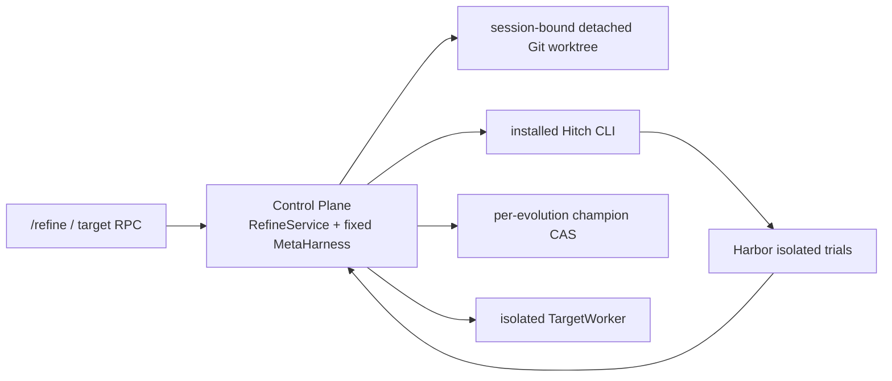

# DSH Self-Evolving Harness Plugin Spec

> 本文保留 DSH native adapter 的实现规格。Harness-neutral Meta 入口、独立
> `gear-refine serve` 和通用 Refine Skill 见
> [Harness-neutral Refine Skill 与独立控制面](harness-agnostic-refine-skill.md)。

- 状态：Implemented v0.6
- 目标运行时：DeepSeek Harness 0.1.0-rc.8
- 评测后端：Hitch 0.2.x CLI + Harbor
- 详细实现规格：[Git-native Candidate Workspace](git-native-candidate-workspace-development-spec.md)

## 1. 定位

Gear V1 是 **meta-managed harness evolution**：固定 MetaHarness 负责诊断和写代码，TargetHarness 是演进对象。Meta 不修改自己当前使用的 harness，也不在 Control Plane 激活 target candidate。

一次普通 `/refine` 创建一个新的 evolution。一个 evolution 拥有自己的 immutable spec、Meta session/history、champion、rounds、locks、worker records 和 candidate worktrees。只有 multi-round batch 和显式 `continue` 会在同一 evolution 内复用这些状态。

## 2. 核心不变量

- Control Plane 永不 mount、import 或执行 champion/candidate plugin。
- Meta 直接编辑 DSH 原生 TypeScript/JavaScript、prompt、skill、workflow 和 composition；不存在第二套 policy 解释器。
- 类型只约束 workspace identity、finalization、evidence 和 promotion 事务，不解释 pre/routing/post 的业务语义。
- TargetHarnessRef 是完整 DSH 仓库的 exact Git commit；manifest digest 是二次完整性校验。
- candidate 不可改变 DSH base、依赖/lockfile、compiler/toolchain、模型/provider、sandbox、Hitch、Harbor verifier 或 promotion policy。
- baseline/candidate 只有 harness ref 不同；dataset、模型、参数、attempt、timeout、sandbox 和评分公式保持 parity。
- 基础设施失败进入 `failed`，不能伪装成零分。
- held-out ref、轨迹和结果对 Meta/target 不可见。
- promotion 只 CAS 更新当前 evolution champion；published pointer 只能显式更新。

## 3. 信任与进程边界



Meta session 的 active composition、skill catalog、system prompt、hooks 和 provider locator 都不能指向 target repository。Target 内容只通过只读 typed evidence API或 session-bound candidate coding tools进入模型可见上下文。

Meta Python helper 运行在独立、无网络的 scratch sandbox，不能直接读取 candidate、DSH repo、Gear state、Hitch root、held-out 或 host credentials。源码编辑使用另一个受限 provider 权限域；它不把 host worktree path暴露给模型。

TargetWorker 与 Harbor trial 使用固定 sandbox/credential/network profile并钉住 exact commit。candidate code 无法调用 Gear promotion authority。

## 4. Harness 与 candidate workspace

可演进目录是：

```text
harness/
  preset/
  plugins/
  prompts/
  skills/
  workflows/
```

`manifest.json`、仓库外路径、Git metadata、依赖和 lockfile属于固定 substrate。

每轮在 baseline 完成后从该轮 parent exact commit 创建 detached worktree，并通过可信 binding绑定：

```text
Meta session id -> evolution id -> round id -> workspace id -> generation
```

Gear 复用 DSH 标准 `read`、`write`、`edit`、`glob`、`grep` 和可选 `bash`。`CandidateFileSystem`、search subprocess adapter 和 candidate shell负责：

- 将逻辑 `/candidate/harness` 映射到 active worktree；
- 拒绝绝对 host path、`..`、symlink/hardlink、二进制/NUL和 protected files；
- 保留 DSH 原生 atomic write、read-before-edit、观察版本和输出上限；
- search 只允许固定 packaged ripgrep argv，并强制 candidate cwd、空环境、禁止 follow/preprocessor；
- bash 使用无网络、无 socket、无 host credential的 OS sandbox，只能写 targetRoot和 command scratch，不允许后台进程。

`finalize_candidate` 开始 seal：停止接收新修改并等待在途操作完成。Gear 随后从 Git worktree计算 authoritative diff和 patch digest，模型提交的文件列表或 diff从不作为权威输入。seal 后任何修改都会使验证失败。

固定 compiler只能写 targetRoot。composition、import allowlist、tree类型和 manifest完整性通过后，Gear重建 manifest、创建 commit并写入：

```text
refs/dsh-refine/evolutions/<evolution-id>/candidates/<commit>
```

Meta 不拥有 commit/push/champion update能力。

## 5. Meta 能力

refine-meta 的直接工具：

| 类别 | 工具 |
| --- | --- |
| evidence | `harness_current`、`harness_read`、`seed_tasks_load`、`trajectory_query`、`hitch_status` |
| coding | DSH `read`、`write`、`edit`、`glob`、`grep`、可选 `bash` |
| control | `candidate_diff`、`candidate_check`、`finalize_candidate`、`decline_candidate` |
| analysis | `ipython_input` |

IPython 中提供同构的 `harness.*`、`seed_tasks.*`、`trajectory.*`、`hitch.*` 和 `candidate.*` control API。它是 session-aware persistent namespace，但不替代 coding tools，也不拥有 host filesystem authority。

target 只可调用 `refine.run`/`refine.status`；rollout 没有 refine control API，也没有 candidate provider。

## 6. Meta session 与 evidence

每个 evolution 有一个根 Meta 逻辑上下文，各 candidate 从真实 parent checkpoint 创建独立分支。新 evolution 必须新建根 session；同一 batch 多轮和显式 continue 复用其逻辑身份。启用 DSH context offloading 后，一个 candidate attempt 可以跨多个历史物理 session，但同一执行始终只有一个可写的 active session；切换不改变 attempt、workspace、deadline 或累计模型预算。resume 同时验证 evolution ownership、spec digest、MetaHarnessRef 和 execution generation。旧 checkpoint 不改写，释放 live handle 不删除持久日志。交接及恢复规则见 [DSH Meta context offloading spec](dsh-meta-context-offloading-spec.zh-CN.md)。

每轮 wake envelope包含 evolution/batch/round identity、parent ref/digest、baseline seed summary、task结果、eval/run refs、candidate逻辑路径和 advisory focus。它不内联完整源码或 raw trajectory。

Meta 必须：

1. 读取当前 baseline summary；
2. 对每个失败 baseline run读取 compact diagnostic card；长内容仅通过 Gear 返回的不透明 `detailRef` 按需展开；
3. finalize时引用已访问、属于本轮 seed baseline的 evidence refs；
4. 或用 `decline_candidate` 提交带 rationale的 no-change。

Gear保存 `ProposalEvidenceAudit`、Meta session id、request header seq和承载 finalize/decline的既有 DSH `tool/call.seq`。跨 evolution、跨 round、candidate或 held-out ref均拒绝。Gear不向 DSH日志注册仓库外自定义 event。

## 7. Evolution、batch 与状态

```text
stateRoot/
  registry.json
  published.json
  evolutions/<evolution-id>/
    spec.json
    champion.json
    meta.json
    rounds/
    locks/
    workers/
    candidate-worktrees/
```

EvolutionSpec固定初始 commit/digest、seed/held-out ref及内容 digest、Meta identity、promotion policy、budget、toolchain和sandbox。continue前重新计算 dataset identity；内容变化必须创建新 evolution。

状态机：

```text
queued
 -> baseline-running
 -> preparing-candidate
 -> candidate-editing
 -> building-candidate
 -> candidate-seed-running
 -> held-out-running
 -> promoting
 -> accepted | rejected | rejected-for-substrate | failed
```

`decline_candidate` 直接形成 `rejected + no-change`。seed gate未通过不运行 held-out。accepted candidate通过 parent CAS更新该 evolution champion；并发或 parent变化时失败关闭。

一个 round可以同时改变多个 semantic surface。`--focus` 只是 advisory，不限制文件或要求每个 surface单独提交。multi-round串行运行，每轮使用新 worktree；业务拒绝/no-change继续，基础设施失败终止 batch。

Meta proposal 超时属于可重试的基础设施失败。控制器在同一 candidate、同一 round 内复用 frozen parent、baseline evidence 和 parent Meta checkpoint，以新的 child session/worktree 干净重试；重试不增加 `roundIndex`。若重试耗尽并导致可选 candidate 少于 `survivors`，round 进入 `failed` 且 batch 停止，不得折叠为 `rejected/no-change`。

## 8. 命令语义

```text
/refine <seed-task-ref> [--rounds N] [--budget B] [--focus FOCUS] [--from initial|published|<exact-ref>] [--name NAME]
/refine continue <evolution-id> [--rounds N] [--focus FOCUS]
/refine continue <evolution-id> --round <round-id>
/refine status
/refine status <evolution-id> [<round-id>]
/refine publish <evolution-id> [<exact-ref>]
/refine rollback <evolution-id> <verified-exact-ref>
```

普通 `/refine` 永远创建新 evolution和batch，并拒绝 `--round`。`--from` 默认 configured initial champion；跨 lineage复用必须显式选择 published或 exact commit。不带 `--round` 的 `continue` 可改变新 batch 的 round count和 advisory focus；`--round` 恢复指定的既有 round，不创建新 batch，且不能与 `--rounds` 或 `--focus` 组合。恢复 round 正常结算后，控制器沿用原 `batchId`、`roundCount` 和 advisory focus，从其 `roundIndex` 继续原 batch 的剩余 rounds。

published pointer不等于任何 evolution champion。`publish` 只接受该 evolution当前 champion或 accepted history并执行 CAS；`rollback` 只改变指定 evolution。

TargetWorker `createCurrent()` 使用 published pointer；`createForEvolution()` 使用指定 evolution champion；`create()` 只接受该 evolution champion或 accepted historical commit。worker key和record都按 evolution隔离。

## 9. Hitch、Harbor 与 promotion

Gear只调用已安装的 Hitch CLI，不 deep-import Hitch。Hitch负责 exact local commit运输、Harbor trial、canonical run/trajectory保存和 actual commit报告；Gear负责 evidence scope、parity、seed/held-out gates、decision和pointer CAS。

promotion至少要求：

- 所有相关 eval基础设施成功且 canonical trajectory可读取；
- Hitch requested/actual commit和 candidate identity一致；
- baseline/candidate invocation fingerprint及 dataset一致；
- candidate seed score、绝对增益、required task和 no-regression policy通过；
- held-out candidate相对 baseline满足固定回归阈值；
- 当前 champion仍是本轮 parent exact commit。

## 10. 恢复与迁移

状态文件使用 temp、fsync、atomic rename。锁按 evolution隔离。启动时 non-terminal v3 rounds标记 recovery failure，owned orphan worktrees需验证 sidecar identity/token和精确根路径后清理；未知目录不删除。

legacy v2按 batch导入独立 archived evolution。旧 top-level champion迁移为 published pointer；旧共享 Meta session永不恢复；旧 mutation只作为 audit translation保存，不能重新执行。迁移有 journal并可幂等重试。

## 11. 非目标

- 演进 MetaHarness、模型、provider、Seed Task、DSH base或 Agent Loop；
- candidate新增依赖、权限、网络、credential或 mount；
- 在 Control Plane执行 target candidate；
- 将 held-out evidence暴露给 Meta；
- 一轮并行生成多个 candidate或 best-of-N tournament；
- 自动合并不同 evolution的 Meta history/champion；
- 自动 publish或允许模型 commit/push。

## 12. 参考

- [Git-native Candidate Workspace 开发规格](git-native-candidate-workspace-development-spec.md)
- [IPython Kernel 移植决策](ipython-kernel-port.md)
- [Gear ↔ Hitch CLI 集成设计](hitch-dsh-integration.md)
- [Hitch Local Exact Commit → Harbor Transport](hitch-local-commit-harbor-requirements.md)
