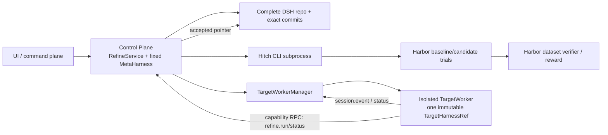

# DSH Self-Evolving Harness Plugin Spec

- 状态：Draft v0.5.0
- 目标运行时：DeepSeek Harness（DSH）
- 评测后端：Hitch 0.2.x CLI + Harbor
- 更新：2026-08-21 — TargetHarness 的唯一版本身份收敛为完整 DSH 源码仓库的 exact Git commit；Gear 只调用已安装的 Hitch CLI，并复用现有 `deepseek` adapter/headless；Hitch 只需补上 local exact commit 进入 Harbor 的运输能力。Harbor dataset reward 是 V1 promotion 的权威评分，DSH 保留原生 session 日志。

## 1. 目标与定位

实现一套运行于 DSH 生态内、但不把不可信 TargetHarness 加载进控制面进程的自动演进系统：

1. 每个 DSH session 可拥有独立、持久的 IPython kernel；
2. `/refine` 和 `refine.run()` 可异步发起 refinement round；
3. 固定 meta agent 根据 baseline 轨迹与 verifier 证据直接编写原生 DSH plugin source；
4. RefineService 把修改构建为完整 DSH 源码仓库中的 immutable Git commit，并通过 Hitch CLI + Harbor 对 baseline/candidate 做对等评测；
5. 满足固定 promotion gate 的 candidate 自动成为 champion，不经过人工代码审批。

V1 是 **meta-managed harness evolution**：MetaHarness 是固定优化器，TargetHarness 是演进对象。这里的 “Self-Evolving” 指系统在固定控制面管理下自动改进 target harness，不表示 meta agent 正在修改自己当前使用的 harness。演进 MetaHarness、模型、Seed Task、DSH Agent Loop、权限或 sandbox profile 均不属于 V1。

## 2. 核心不变量

- **控制面永不激活 TargetHarness**：RefineService、MetaHarness 和 promotion gate 所在进程不得 import、mount 或执行 champion/candidate plugin；Harbor dataset verifier 只能在 trial 边界内观察其受控 workspace/output。
- **代码是动作空间**：meta 直接生成 DSH 原生 TypeScript/JavaScript plugin、prompt、skill 和 composition 文件；系统不引入另一套 policy 语言或解释器。
- **类型只约束事务，不解释行为**：`HarnessMutation` 是带 CAS、路径、证据和源码内容的提交 envelope；它不声明 pre/routing/post 的业务语义，也不替候选代码执行这些语义。
- **所有 candidate 都按可执行代码处理**：不区分“安全 declarative candidate”和“危险 executable candidate”；首次构建后只能在固定隔离环境内加载。
- **外部评测决定 promotion**：candidate 内部的 action verifier 可帮助 target 自纠，但不能参与可信评分或放宽 promotion gate。
- **Git 版本与运行时钉住**：`TargetHarnessRef` 是完整 DSH 源码仓库中的 full Git commit OID；每个 TargetWorker、rollout、Hitch resolution 和 round record 都绑定该 exact commit，pointer 更新不热替换已有 session。
- **模型可见即已记录**：进入 Control Plane 或 meta 上下文的 IPython tool call、评测摘要、证据 ref、meta proposal 与实际 meta request header 都可由 durable event/ref 重建；kernel namespace 只是便利状态。Harbor 内尚未导出的 DSH native log 不伪称为 Gear durable evidence。
- **基础设施失败不是零分**：构建、local source transport、Harbor setup、DSH 启动、模型 transport 或 dataset verifier 基础设施失败使 round 进入 `failed`，不得伪装成 candidate 得分为 0；正常到达 dataset 定义预算的 task timeout 按 Harbor 合同评分。

## 3. 进程与信任架构



### 3.1 Control Plane

Control Plane 只装配固定 DSH composition：RefineService、`refine-meta` preset、MetaHarness 的 IPython/typed API、TargetWorkerManager、Hitch CLI evaluator、HarnessBuilder 和 promotion gate。它不扫描 TargetHarness 的 skill 目录，不把 target prompt 注入 system prompt，也不提供可 import target commit 的 Cordis loader 路径。

### 3.2 TargetWorker

普通交互 target session 不再运行于 Control Plane。TargetWorkerManager 为某个 immutable `TargetHarnessRef` 启动隔离子进程或容器；该 worker 在启动时从 exact commit 加载 target DSH composition，并在退出前始终钉住同一 ref。

V1 复用现有 DSH SDK runtime，而不是另造 agent loop：`dsh-jsonrpc-agent` 已支持一个长驻进程承载多个 session，并通过 `session.event` 转发完整 `SessionEvent`、通过 `session.status` 转发 agent 生命周期。TargetWorker 所需的增量协议是：

| 增量 | 目的 |
| --- | --- |
| `session/open { sessionId, mode: create | resume }` | 显式调用 `ctx.agents.create()` 或 `ctx.agents.resume()`，并在 unpublished setup 中挂载 worker boot 时由 exact commit 固定的 target preset；避免现有 lazy-create 无法表达 crash recovery |
| `session/cancel` / `session/close` | 支持交互取消、关闭单 session；进程级 `shutdown` 保留 |
| server→client `control/refine.run` / `control/refine.status` | target 侧 Host Bridge 只有这两个 capability；Control Plane 校验 worker/session/ref 后代理到 RefineService |

现有 SDK runtime 的长驻进程、完整事件流和 TypeScript client 只用于普通交互 TargetWorker；TargetWorkerManager 使用 low-level `HarnessClient` 的 prompt receipt + notification subscription，不用把一次 idle interval 当完整交互 session 的 high-level `run()`。Harbor rollout 不复用这条交互 transport：V1 由已安装的 Hitch CLI 通过现有 `deepseek` adapter 启动 candidate commit 中的官方 DSH headless。两条路径都钉住同一个 exact commit，但 V1 不要求它们产生逐事件相同的轨迹。现有 `subagent-dsh-sdk` 的“一次 subagent 新起一个进程”生命周期不复用。交互协议扩展仍需同步 TypeScript/Python SDK projection。

worker 记录 `{workerId, sessionId, targetHarnessRef, targetManifestDigest, sandboxProfileRef}`。promotion 后，新 session 读取新 champion；已有 session 继续使用旧 worker。旧 worker crash 时，TargetWorkerManager 必须按记录重新启动旧 ref并 `resume` 原 session，不能偷偷升级到新 champion。

### 3.3 全自动安全前提

全自动 promotion 的安全边界是容器/进程外部策略，不是源码审查：

- TargetWorker 与 Harbor trial 都钉住 exact `TargetHarnessRef` 和固定 sandbox/credential/network profile；交互 worker 可长驻且走 SDK，trial 是一次性并走 headless，但 trial 权限不得更宽。
- worker 不继承 host environment、Hitch credential、Git credential或 Control Plane filesystem。模型访问经固定 allowlisted proxy；worker 只拿短期、限额、不可用于其他服务的 capability token。
- TargetWorker 的 project mount 必须 mask `.dsh-refine`、Harness repo、Seed/held-out repo、Hitch root 与 host state；即使这些目录物理上位于 project tree 下也不可见。交互 target 只看到用户 task workspace projection。
- 默认禁止外网；若 Seed Task 明确需要网络，只能使用固定 allowlist/profile，candidate 不能修改。
- target commit 无法改变 sandbox、credential broker、模型/provider、Harbor dataset verifier/reward、Hitch、RefineService 或 promotion 配置。
- 如果部署还不能提供上述隔离和 scoped model credential，V1 必须 fail closed，不能退化为在 host DSH 进程中自动加载 candidate。

## 4. Harness 身份与代码动作空间

### 4.1 Artifact 布局

```text
harness/
  manifest.json
  preset/
    agent.cordis.yml
  plugins/
    context.ts
    pre-action.ts
    routing.ts
    post-action.ts
    action-verifiers.ts
  prompts/
  skills/
  workflows/
```

文件可按 candidate 需要增删；上图只是推荐布局。`agent.cordis.yml` 使用 DSH Loader/Cordis 原生 composition，plugin 使用 DSH 已有 extension points，例如 `ctx.systemPrompt.section()`、`agent/pre-step`、`tools/pre-execute`、`tools/post-execute`、tool/skill/subagent registries 和 workflow services。

```ts
interface HarnessManifest {
  schemaVersion: 1
  parentRef?: HarnessRef
  dshBaseRef: string
  toolchainRef: string
  sandboxProfileRef: SandboxProfileRef
  artifacts: Array<{ path: string; digest: string; bytes: number }>
  digest: string
}
```

manifest 中不保存可变 path 作为身份；`digest` 覆盖规范化 manifest 与所有 target artifact bytes。完整 Git commit OID 是 `TargetHarnessRef`、champion pointer 和 Hitch resolution 使用的唯一版本身份；manifest digest 是 commit 内目标文件的二次完整性校验，不形成第二套 promotion lineage。两者都可写入 round record，但发生冲突时必须 fail closed，不能用 digest 代替 commit 运行。

这意味着 meta 可以在 `pre-action.ts` 加 validation/planning，在 `routing.ts` 改 tool/skill/subagent routing，在 `post-action.ts` 加 normalization、reflection 或经验提取，也可以在 `action-verifiers.ts` 自行选择 action 后、target round 结束时或其他现有 hook 上触发检查。系统不提供固定 pre/routing/post interpreter；candidate plugin 本身就是行为实现。

### 4.2 固定 substrate 与可演进代码

| 固定且不可修改 | TargetHarness 可演进 |
| --- | --- |
| MetaHarness、RefineService、HarnessBuilder/Loader | supplemental prompt 与 context assembly plugin |
| DSH base revision 与构建 toolchain | pre-action / routing / post-action plugin |
| TargetWorker/Harbor sandbox profile 与 credential policy | action-level verifier 与自纠逻辑 |
| Hitch adapter、Harbor dataset/verifier、promotion gate | DSH 原生 skills、workflows、tool wrappers |
| 模型/provider 与实际 LLM config parity 检查 | compaction/retrieval policy（限固定 API/依赖） |
| Seed Task / held-out ref 与评分公式 | 允许路径内的 composition 文件 |

需要新增 DSH service、依赖、系统权限、网络能力、provider 或 sandbox mount 的 proposal 不能由 candidate 自行实现，记为 `rejected-for-substrate`。这不是限制 meta 编写普通 plugin code，而是禁止 candidate 扩张固定信任基础。

### 4.3 Mutation envelope

```ts
interface HarnessMutation {
  parentRef: HarnessRef
  parentDigest: string
  target: SemanticTarget
  ops: ArtifactOp[]
  rationale: string
  evidenceRefs: EvidenceRef[]
  expectedOutcome: string
}

type SemanticTarget =
  | 'context'
  | 'pre_action'
  | 'routing'
  | 'post_action'
  | 'action_verifier'
  | 'skill'
  | 'tool'
  | 'workflow'
  | 'compaction'

type ArtifactOp =
  | { type: 'create'; path: string; content: string; expect: 'absent' }
  | { type: 'patch'; path: string; patch: string; expectedDigest: string }
  | { type: 'delete'; path: string; expectedDigest: string }
```

`ArtifactOp.content` 可以是完整原生代码。固定 validator 只执行结构检查：parent CAS、相对路径与 symlink containment、允许目录、单一 semantic target、操作大小/数量上限、held-out evidence 禁止、依赖/lockfile 禁止和 manifest 完整性。它不尝试理解代码是否“真的属于 post_action”，也不把源码翻译为 policy。

默认每轮只修改一个 semantic target，可包含为完成该目标所需的多个文件。绝对路径、`..`、symlink escape、package manager lifecycle script、lockfile/依赖新增、二进制、生成物直写以及 evaluator/control/sandbox 路径一律拒绝。

### 4.4 Build 与 identity

HarnessBuilder 在 disposable build sandbox 中：

1. 对 parent full commit 和 manifest digest 做 CAS；
2. 从 parent commit 创建 disposable worktree 并应用 ops；
3. 用固定 DSH base、Node 版本、compiler 配置和依赖 allowlist typecheck/build；
4. 生成完整 preset/artifact manifest；
5. 计算覆盖 source、composition、skills、build output、toolchain ref 与 sandbox profile ref 的 manifest digest；
6. 在完整 DSH 源码仓库中创建 immutable Git commit，确认 worktree clean，并把 full commit OID 作为 candidate ref。

preset id 可采用 `target-<manifestDigest>`，不得覆盖同名目录。Control Plane 可以构建和读取 candidate commit，但不能把其中的 target composition import 到自身进程；其首次激活必须在 Harbor/TargetWorker 内。Hitch 的 prepared artifact 属于执行阶段，由现有 `deepseek` adapter 在 Harbor 内从该 exact commit 产生，不由 Gear 另建 artifact store。

## 5. Session 角色、能力与 Meta 生命周期

### 5.1 能力矩阵

| Session 角色 | 运行位置 | `ipython_input` | Host Bridge / 控制能力 |
| --- | --- | --- | --- |
| `refine-meta` | Control Plane，固定 MetaHarness | 有 | `harness.current`、`harness.read`、`seed_tasks.load`、`trajectory.query`、`hitch.status`、`submit_refinement_proposal` |
| target interactive | isolated TargetWorker | 有 | 仅 `refine.run`、`refine.status` |
| rollout | Harbor trial | 可选，默认启用但不持久化 snapshot | 无 refine/trajectory/Hitch/champion API |

Meta session 不挂载 champion preset，其 SkillProvider locator、`skill-filesystem.customSkillDirs`、system-prompt sections、tools、hooks 与 workflows 均不得指向 harness repo。TargetHarness 内容进入 meta 的唯一通道是 typed API 返回的带 ref/digest/来源标记的数据；它可能影响 meta 的判断，但不能成为 meta 的活跃 composition 或 authority。这个约束同时由 composition 检查和整个 meta Python 进程的 OS sandbox 执行：kernel 不在 host workspace 中运行、不能读取 Control Plane state/session log/DSH repo/held-out，也不继承 host credentials。只限制 Host Bridge 或包装 `%%bash` 不构成这个边界，因为 Python `open()` 与 `subprocess` 可以绕过它们。

`harness.current()` 返回 ref、manifest 与 path/digest index；`harness.read({ref,path,offset,limit})` 只读允许 tree、校验 ref/path/digest并有 page/byte bounds。`trajectory.query({})` 返回历史 round 的 seed evidence index；`trajectory.query({refs:[evalId|runId],offset,limit})` 只能解析 round record 中已钉住的 seed baseline/candidate run，通过 `hitch trajectory inspect <run-id> --json` 分页读取 canonical trajectory。未知 run、held-out run 和任意本地路径均拒绝；返回值删除 Hitch path、按事件数和序列化字节双重限界，并按敏感字段、已知 pass-through credential 值和 held-out ref 做结构化脱敏。MetaHarness 的固定 skill catalog 可以包含 pinned DSH API/插件开发文档，但不得包含 TargetHarness 目录。任何 meta-visible refinement-history projection 必须删除 `heldOut*` fields 和 partition refs；Control Plane 的完整 record 不直接暴露给 meta。

target 的 `refine.status` 也只返回 public projection：round id、粗粒度 status、terminal decision 与 seed-side summary；不返回 held-out ref/delta、workspace/verifier refs、Meta session id 或 Control Plane path。特权 UI 若要审计完整 record，使用独立 human-authorized control endpoint，不能复用 target capability。

### 5.2 Meta session 由谁创建、如何唤醒

workspace-scoped RefineService 是 meta session 的唯一 owner。状态写入 `.dsh-refine/meta.json`：

```ts
interface MetaSessionState {
  sessionId: SessionId
  metaHarnessRef: MetaHarnessRef
}
```

RefineService 第一次需要 meta 时执行：

1. 读取 `meta.json`；若 `metaHarnessRef` 与当前固定 manifest 不同，创建新 session 并原子替换记录；
2. 若 id 对应 live agent，复用其 `AgentHandle`；
3. 否则优先 `ctx.agents.resume({ resumeSessionId, setup: mountRefineMeta })`；持久化中不存在时才 `ctx.agents.create({ sessionId, setup: mountRefineMeta })`；
4. RefineService 持有 handle 直到 workspace service dispose。

每个 round 在 baseline evidence 就绪后，用 `agent.followup(roundEnvelopeMessage)` 唤醒同一个 meta session。消息只包含 round/ref/证据索引，不内联整份 target tree；meta 通过 typed API 分页读取。MetaHarness 变更必须 rotate session，禁止在已有 meta history 上换 composition。

`submit_refinement_proposal({roundId, mutation: HarnessMutation | null})` 是一次性提交协议：只接受当前 waiting-proposal round、正确 meta session 与未使用 round id；由 tool execution 完成提交，stale/duplicate submission 拒绝。每轮记录 `metaSessionId`、proposal-producing request 所适用的最近一个 `request/header.seq`，以及承载 typed bridge 调用的既有 `tool/call.seq`（字段名保留为 `proposalEventSeq`）。若该 round 内出现多个不同的有效 header，则 fail closed，从而形成输入配置到 proposal 的归因链，而不假设 DSH 每轮都会重复写一条未变化的 header。这里的“有效 header”比较 `config/system/tools`；`adapterDefaults` 只记录同一有效配置来自默认值还是显式值，不改变模型行为，因此不制造归因冲突。

Gear 不向 DSH session log 追加仓库外自定义事件。DSH rc.8 的 declaration merging 只提供编译期类型扩展，cold reader 的持久化事件目录仍由 DSH 构建时生成，尚无 out-of-tree runtime registration surface；插件事件会导致进程重启后的 session resume 被拒绝。proposal 的业务事实由 Gear round state 持久化，DSH log 只提供内置 `request/header` 与 `tool/call` 归因锚点。若旧 meta session 因未知插件事件或持久化缺失而不可恢复，RefineService 自动 rotate 到新的固定 MetaHarness session 并原子更新 `meta.json`。

## 6. Session-aware NotebookRuntime

持久 IPython 使用独立 capability seam `NotebookRuntime`，不伪装成现有 one-shot `CodeRuntime` provider。现有 `CodeRunRequest` 刻意不包含 session/owner，provider 无法仅凭 `run()` 正确选择 kernel；在 provider 内暗建 session map 会把 consumer 责任泄漏到 service definition 之外。

```ts
interface NotebookExecuteRequest {
  sessionId: SessionId
  cwd: string
  code: string
  role: 'refine-meta' | 'target' | 'rollout'
  signal: AbortSignal
}

abstract class NotebookRuntime extends Service {
  abstract execute(request: NotebookExecuteRequest): Promise<NotebookResult>
  abstract interrupt(sessionId: SessionId): Promise<void>
  abstract restart(sessionId: SessionId): Promise<void>
  abstract disposeSession(sessionId: SessionId): Promise<void>
}
```

Provider 为每个 `SessionId` 懒创建一个 kernel、串行执行 cell，并在 session/agent disposal 时回收。Prime Agent 的对应做法也是由 `AgentSession` 持有 `IpythonKernelProvisioner`，工具 closure 捕获 provisioner；`KernelManager.sessionId` 用于 ownership/cleanup，而不是让一个无 session 参数的全局 runtime 猜调用者。

`refine-meta` 的逻辑 cwd 只参与 session identity/binding；实际 kernel cwd 是 `stateRoot/meta-notebooks` 下按 session 隔离、权限为 owner-only 的随机 scratch。整个 helper 进程及其子进程由 OS sandbox 包裹：filesystem read 默认从 `/` deny，再只放行固定系统/Python runtime、packaged helper 与当前 scratch；write 只放行当前 scratch；network 全禁；environment 采用白名单重建并将 HOME/TMPDIR/XDG/IPython state 重定向进 scratch。sandbox 初始化或平台依赖缺失时，Control Plane fail closed，不退回 direct spawn。

Host Bridge handlers 在 session setup 时按角色注册；每个 request 带 generation、request id、abort signal 和 current-generation check。kernel 不保存 host credential。snapshot 是 owner-private、绑定 session id + Target/MetaHarnessRef 的可选 dill 文件；rollout 默认禁用。恢复失败或无 snapshot 时启动空 namespace，并向模型记录 notice；系统不自动重放历史 cell 来重新执行副作用，日志重放只重建模型当时看见的证据。

busy kernel 在无 UI 的 meta/rollout 中按固定超时自动 interrupt，仍 busy 则 kill/restart 并记录 reset；interactive target 可由 UI 选择继续等待或 restart。完整移植设计见 [IPython Kernel 移植决策](ipython-kernel-port.md)。

## 7. `/refine` admission 与 round 状态机

```text
/refine <seed-task-ref> [--rounds N] [--budget B] [--target TARGET]
/refine status [ROUND_ID]
/refine rollback <VERIFIED_HARNESS_REF>
```

`/refine` 是 command-plane 调用，不发送给 target 模型。它由 fixed TargetWorker/UI command adapter 截获并经同一个 capability RPC 转给 RefineService；handler 不属于 candidate preset。target kernel 的 `refine.run()` 走相同 RPC。两条入口都只做 admission：验证参数、获取 workspace 跨进程锁、创建 round record，然后立即返回 `{roundId, status: "queued"}`。UI request/target turn 随后取消或断开不会取消已接受 round；后台 RefineService 是唯一 owner。

同一 workspace 同时至多一个 active round。锁必须跨进程，round/champion/meta 文件使用 temp + fsync + atomic rename，并以 parent ref/digest CAS 更新 champion。重复请求返回 active round id，不创建第二轮。

### 7.1 单轮流程

1. **admit**：钉住 parent champion、Seed Task ref、held-out ref、MetaHarnessRef、target/meta model policy、sandbox profile、预算和阈值。
2. **baseline**：若 cache key 完全一致则复用；否则以 parent exact commit 调用 Hitch CLI，在 Harbor 跑 seed dataset 并读取其 verifier/reward 结果。
3. **wake meta**：同一 persistent meta session 读取 target manifest、seed 评测结果、DSH 可用的原生 session 日志索引与 redacted history；held-out ref、aggregate delta、目录和证据完全不可见。
4. **proposal**：meta 提交一个 `HarnessMutation` 或 `null`。`null` 直接记 `no-op`，不创建 candidate。
5. **validate/build**：执行结构 validator、CAS、fixed-toolchain build并创建 clean exact Git commit；需要 substrate 扩张则 `rejected-for-substrate`，普通失败则 `failed`。
6. **candidate eval**：以 candidate exact commit 和相同 CLI 参数在 Harbor 跑同一 seed dataset。
7. **seed gate**：Hitch/Harbor 基础设施全部成功、required tasks 无回归、Harbor reward delta 达阈值后才继续。
8. **held-out gate**：分别以 parent/candidate exact commit 跑不可见 held-out dataset，required/回归阈值必须通过。
9. **promote**：以 parent CAS 原子更新 `champion.json`；否则记 `rejected`。任何结果都写完整 record、释放锁；下一轮只能从已接受 champion 开始。

`--rounds N` 由后台 service 串行创建最多 N 个 round；一次拒绝/no-op 不改变 parent，是否继续由固定 Config 决定，默认继续；`failed` 终止本次 multi-round job。`--budget B` 是每 task wall-clock timeout；LLM output cap 由实际 `LlmCallConfig.maxTokens` 管理，不把 wall time 冒充 token budget。

进程重启时，持锁但非 terminal 的 round 标记 `failed`，V1 不做 step-level resume；已完成的 Hitch eval result 可由后续新 round 按完整 cache key 复用。

## 8. 评测与 Promotion

### 8.1 权威边界

- **action verifier**：TargetHarness 原生 plugin code，可在 pre/post/action/target-round hook 上运行，帮助 agent 自纠；属于被演进行为，不可信。
- **Harbor dataset verifier/reward**：在隔离 trial 中按 dataset 定义执行，是 V1 task score 的权威来源；Gear 不再另起 verifier sidecar，也不修改 Hitch run。
- **promotion gate**：RefineService 固定代码，比较 infra、parity、required tasks、score delta 和 held-out delta；candidate 不能调用或修改。

DSH 在 trial 内保存原生 session 日志；Hitch 的 run-centered trajectory store 负责在容器退出前把 provider-native 日志导出、校验并原子导入 host `runs/<run-id>`。有效 canonical trajectory 是 eval trial 的基础设施成功条件，而不是可选 final-text 附件。Gear 不复制 trajectory 文件，只在 round evidence 中保存 Hitch `eval_id`/`run_id`，并通过 Hitch CLI 的显式查询合同读取。

### 8.2 Parity

baseline/candidate 必须相同：Harbor dataset/ref 与 task 选择、provider/model、attempt 数、agent args、timeout、concurrency、runtime image、sandbox/credential/network profile和评分公式。允许的唯一意图差异是 `TargetHarnessRef`：parent commit 对 candidate commit。两者还必须基于同一个固定 `dshBaseRef`。

V1 parity 以 Gear 生成并持久化的规范化 Hitch CLI invocation、Hitch resolution 和 eval summary 为准。provider 本身不保证确定性；通过多任务与阈值控制噪声。逐 trial 的实际 DSH request header 对比可以后续加入，但不是 local commit 运输或 V1 promotion 的 blocker。

### 8.3 Hard constraints

promotion 至少要求：

- 所有 baseline/candidate Hitch/Harbor eval 基础设施成功；
- `required: true` 的 seed 与 held-out task 不回归；
- seed score delta `>= minScoreDelta`；
- held-out score delta `>= -maxHeldOutRegression`；
- CLI parity、sandbox profile identity 与 Hitch actual resolved commit 校验通过；
- parent champion CAS 仍成立。

V1 使用 Harbor dataset 返回的 reward；若 dataset 只给 pass/fail，则映射为 `passed / total`。attempt 数与阈值均由 RefineService Config 固定。连续分的统一标定、多次统计检验和动态 task generation 后续再做。

### 8.4 Hitch/Harbor

所有 candidate 都包含或可能包含可执行 plugin code，因此 baseline、candidate 和 held-out 全部使用 Harbor；`hitch run` 的 host workspace 不能作为安全替代。Gear 通过子进程调用已安装的 `hitch eval run --backend harbor ... --output json`，不 deep-import Hitch 内部模块，也不要求 Hitch 提供 Node SDK。Harness full Git commit 是版本 id，Hitch resolution/prepare/run/eval 是执行权威，RefineService 保存 refs、actual commit、score summary，以及每个 trial 的 `run_id`/attempt。新 run-centered eval schema 以顶层 `trials[]` 的 `observation_status/reward/run_id` 为权威；任一 invalid observation 都是 infrastructure failure。旧 Harbor-shaped `summary.trials` 仅作为向后兼容输入。

Hitch `dev@8c034d9` 已交付 local exact commit transport：接受 clean local repo（部署可另设限制）的 `deepseek@git+file:///...#<full-commit>`，在 host 解析并锁定 exact commit，把该 commit 所需的 Git object pack 送入 Harbor，并在容器内用现有 `deepseek` recipe/headless prepare/run；容器内实际 commit/tree 与 host resolution 相同。`feat/run-centered-trajectory-storage-spec@c564bde` 在此基础上导出 DSH provider-native trajectory，并提供 `hitch trajectory inspect <run-id> --json`。其他 local/refname guard 保持不变。完整运输合同见 [Hitch Local Exact Commit → Harbor Transport 开发需求](hitch-local-commit-harbor-requirements.md)。

## 9. Seed Task Set

```ts
interface SeedTaskPartition {
  ref: string
  harborDataset: string
  requiredTaskIds?: string[]
}
```

Seed/held-out partition 通过 immutable `ref` 钉住 Harbor dataset 定义；dataset 负责 task discovery、workspace materialization、verification 和 reward。若 dataset 来源是 Git，ref 必须是 exact commit。promotion thresholds 仍由 RefineService 固定，candidate 不可见也不可修改 verifier/reward 实现。

`tasks/` 是 meta 可见优化集，`held-out/` 只对 RefineService 可见。`seed_tasks.load`、`trajectory.query` 和 proposal evidence validator 从根上过滤 held-out task/ref/path，不能依赖 prompt 提醒。held-out ref 轮换后 baseline cache key 变化。

## 10. 持久化与记录

```text
.dsh-refine/
  champion.json
  meta.json
  locks/round.lock
  rounds/<round-id>.json
  workers/<session-id>.json
  meta-harness/<meta-harness-ref>.json
```

```ts
type RoundStatus =
  | 'queued'
  | 'baseline'
  | 'waiting-proposal'
  | 'building'
  | 'candidate-eval'
  | 'held-out-eval'
  | 'terminal'

interface RefinementRecord {
  id: RoundId
  status: RoundStatus
  parentRef: HarnessRef
  parentManifestDigest?: string
  candidateRef?: HarnessRef
  candidateManifestDigest?: string
  mutationRef?: MutationRef
  metaHarnessRef: MetaHarnessRef
  metaSessionId?: SessionId
  metaRequestHeaderSeq?: number
  proposalEventSeq?: number // 指向承载 typed proposal bridge 调用的既有 tool/call 事件
  metaModel?: LlmCallConfig
  sandboxProfileRef: SandboxProfileRef
  baselineEvalRef?: HitchEvalRef
  baselineRunRefs?: HitchRunRef[]
  candidateEvalRef?: HitchEvalRef
  candidateRunRefs?: HitchRunRef[]
  baselineActualCommit?: HarnessRef
  candidateActualCommit?: HarnessRef
  baselineScore?: number
  candidateScore?: number
  heldOutBaselineEvalRef?: HitchEvalRef
  heldOutCandidateEvalRef?: HitchEvalRef
  heldOutBaselineScore?: number
  heldOutCandidateScore?: number
  decision?: 'accepted' | 'rejected' | 'rejected-for-substrate' | 'no-op' | 'failed'
  scoreDelta?: number
  heldOutScoreDelta?: number
  createdAt: string
  updatedAt: string
}
```

`status !== 'terminal'` 时 `decision` 必须缺省；进入 `terminal` 的同一次 atomic write 必须写入 decision。`accepted` 还必须具备 candidate、两侧 seed/held-out eval refs、actual commit、score 与 delta；package invariant 直接检查 requested ref、Hitch actual resolution 和 champion pointer 相等。baseline 之前失败的 round 可以没有 `metaSessionId`，因为 Meta session 按需创建。

`MetaHarnessRef` 指向 immutable manifest，覆盖 DSH revision、refine plugin/build、`refine-meta` preset、meta prompt/fixed skills、typed API schema 与 sandbox profile。V1 为常量；未来若演进 meta，它可直接成为独立 lineage pointer，无需改变 record 结构。

## 11. DSH 实现要求与验收

实现为 DSH packages 时遵守仓库规范：capability seam 包含 Definition/Provider/Consumer；跨进程/持久化输入运行时校验；`RoundId`/`HarnessRef` 等用 `Branded<B>`；新增 `refine/*` events 更新 persistence catalog；每个 package 有 invariant、README/JSDoc、HMR disposal、REAL composition、keyless snapshot；SDK wire 改动同步 TypeScript/Python projection；非平凡改动写 Agent Note。

V1 必须证明：

- MetaHarness/Control Plane 的 module graph、skill locator 与 prompt sources 中没有 TargetHarness 路径；向 target artifact 放置同名控制 plugin 不能在 host 激活。
- target/rollout 看不到 meta APIs；target 只有 `refine.run/status` public projection 且 project mount 看不到 `.dsh-refine`/Harness/Seed/Hitch state；rollout 无控制 capability；调用绕过路径在 executor/RPC handler 被拒绝。
- Meta session 可 create、进程重启后 resume、MetaHarnessRef 变化或旧日志不兼容时 rotate；每个 proposal 可追到 proposal-producing request 的有效 request header 与承载提交的唯一内置 tool-call event。
- `/refine` 和 `refine.run()` 在持久化 admission 后立即返回；调用方取消不取消 round；跨进程并发只产生一个 active round。
- Notebook namespace 按 SessionId 隔离并跨 tool call/compaction 保持；dispose、interrupt、restart 和 worker crash 不遗留 kernel；snapshot 缺失不会伪称已重放副作用。
- meta 可提交原生 pre/routing/post/action-verifier plugin code；系统没有 policy interpreter；构建只使用固定依赖/toolchain。
- candidate source 在 host import 会被架构测试阻断；所有 candidate/baseline/held-out trials 均在 Harbor 或等价固定隔离 profile 中运行。
- baseline/candidate 的规范化 Hitch CLI 参数、dataset/ref、model、attempt、timeout、concurrency、agent args 与 sandbox profile 除 harness ref 外相同；infra failure 产生 `failed` 而非零分。
- baseline/candidate/held-out 都复用现有 Hitch `deepseek` adapter 与 DSH headless；Gear 不 deep-import Hitch，不维护第二套 prepared artifact、trajectory 或 verifier sidecar；seed trajectory 只通过已记录 run ref 和 Hitch CLI 分页读取。
- local exact commit 在 host 解析后被完整运进 Harbor；trial 内 materialized commit/tree 与 host resolution 相等，untracked 文件、凭据、hook 和无关 refs 不进入 payload。
- held-out 数据及 aggregate delta 不能经 meta typed API、target `refine.status`、history projection、filesystem 或 evidence ref 泄露；未通过 held-out gate 不更新 champion。
- promotion/rollback 只原子移动 pointer 到已验证 immutable ref；已有 target session 始终钉住原 ref并可按该 ref resume。

## 12. 非目标

- 演进 MetaHarness、模型、provider、Seed Task、Harbor dataset verifier/reward、promotion gate、sandbox 或 DSH Agent Loop；
- 在运行中的 target session 热替换 harness；
- 为 candidate code 提供人工 review gate（V1 选择全自动，以隔离和外部 evaluator 兜底）；
- 把 IPython、Hitch workspace 或 TypeScript typecheck 当作安全 sandbox；
- 自动新增 npm/Python 依赖、系统服务、credential、网络权限或 container mount；
- Hitch Node SDK、`dsh-evolving` adapter、Gear 自有 harness overlay/artifact store；
- 由 Gear 再复制一份 Hitch canonical trajectory、保存完整 workspace snapshot或维护 Gear verifier sidecar；
- 要求交互 SDK TargetWorker 与 Harbor headless 逐事件完全相同；
- 完整 GEAR Supervisor、训练/checkpoint evolution、连续分或多次统计评测。

## 13. 参考

- [IPython Kernel 移植决策](ipython-kernel-port.md)
- [Gear ↔ Hitch CLI 集成设计](hitch-dsh-integration.md)
- [Hitch Local Exact Commit → Harbor Transport 开发需求](hitch-local-commit-harbor-requirements.md)
- [DSH SDK JSON-RPC server](../deepseek-harness/packages/sdk/server/README.md)
- [DSH SDK client](../deepseek-harness/packages/sdk/client/README.md)
- [DSH agent factory/resume](../deepseek-harness/packages/core/agent-loop/README.md)
- [DSH agent presets](../deepseek-harness/packages/preset/agent-presets/README.md)
- [DSH command subsystem](../deepseek-harness/docs/subsystems/commands.md)
