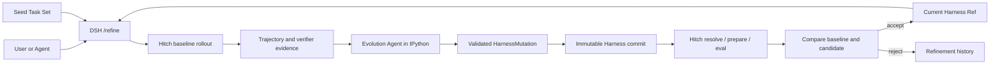

# DSH Self-Evolving Harness Plugin Spec

- 状态：Draft v0.3.7
- 目标运行时：DeepSeek Harness（DSH）
- 设计参考：Prime Agent persistent IPython + `/refine`
- 版本与评测后端：Hitch 0.1.x
- 更新：2026-08-19 — v0.2：采纳"cell 执行入 session 日志"的日志重建原则；补充双层模型与成本分层；轨迹 JSONL 消费契约；baseline 复用；评测两层隔离；DSH 落地规范要求
- 更新：2026-08-19 — v0.3：按 DSH 与 agent-hitch 源码核查结果修订——V1 动作空间按 DSH 现有能力逐项标注落地现状并给出收窄规则；Hitch 集成写明三件实际交付物（adapter 源码修改、DSH stdout NDJSON 事件输出模式、eval 本地源限制与 V1 绕行路线）；新增 HarnessLoader 装配落点映射（preset / skill provider / systemPrompt section）；新增评测过拟合防护与待验证假设
- 更新：2026-08-19 — v0.3.1：§7 的具体改动设计移入独立文档 [Hitch ↔ DSH 对接改动](hitch-dsh-integration.md)（adapter 形态、事件映射表、"为何不事后解析 session log"论证、实施顺序）
- 更新：2026-08-19 — v0.3.2：纳入 agent-hitch 工作区新能力（未提交改动）——复用清单新增 `--resolved-revision-file`、`memory_mb`、`HITCH_EVAL_BOOTSTRAP_DIR`；详见对接文档 §2.3、§4
- 更新：2026-08-19 — v0.3.3：完整性补全——新增 §12 Seed Task Set 与分数（任务格式、seed repo 独立化、verifier 声明式、score=通过率、held-out 隔离由 handler 强制）；§6 新增并发/中断/预算语义（单 round 锁、中断轮标记 failed 不续跑、`--budget B`=rollout timeout）；§5 补 champion 运行时生效路径；§9 补 seed repo 布局；§10 补两条 seed 相关验收条目
- 更新：2026-08-20 — v0.3.4：澄清工具面与 skill 加载——`ipython_input` 是新增工具而非唯一工具，DSH 既有工具面原样保留；skill 加载保持 DSH 原生（SKILL.md + SkillProvider 缝），不采纳 prime-agent 的 Python-skill 装包方式
- 更新：2026-08-20 — v0.3.5：取消独立 `cell/run` 事件域——cell 即工具调用，重放 = 重放 `tool/call` + `tool/result`（DSH 工具管道默认记录），消除与工具管道的双重记录
- 更新：2026-08-20 — v0.3.6：§6 流程补 held-out 复核步骤（与 §8 过拟合防护一致，`RefinementRecord` 增 held-out 字段）；§7/§8 安全论证改挂到固定 rollout sandbox——declarative mutation 只保证无新可执行代码，行为面风险由 sandbox 兜底
- 更新：2026-08-20 — v0.3.7：确立 meta 与 target 的分离边界（固定优化器，meta-managed harness evolution）——§1 定位声明、§4 typed API 按 session 角色装配矩阵、§6 新增分离边界小节、`RefinementRecord` 增 `metaHarnessRef`/`metaModel`、§10 增激活隔离与 API 角色验收条目、§11 增"不演进 meta harness"非目标

## 1. 目标

实现一个运行在 DSH 内的自进化 Harness plugin：

1. 为每个 DSH session 提供持久 IPython 环境；
2. 提供 `/refine`，根据指定 Seed Task 分析当前 Harness，并在受限动作空间内生成、验证和评测改进；
3. 使用 Hitch 管理不可变 Harness revision、构建产物、隔离运行、评测记录和回滚所需历史。

V1 只演进 Harness，不演进 Seed Task、模型或 DSH Agent Loop。

**V1 定位是 meta-managed harness evolution**：meta agent 是固定优化器（跑在不可变的 `refine-meta` 控制面上），target/rollout harness 是演进对象。meta 通过 refinement history 与轨迹学习事实，但其激活的 prompt、skills 与 tools 不随 champion 演进——演进 meta harness 自身不属于 V1（§6 分离边界、§11）。

## 2. 核心原则

- **小步修改**：一次 refinement 只修改一个语义目标，便于归因和回滚。
- **证据驱动**：每个修改必须引用 Seed Task trajectory、错误或 verifier 结果。
- **先计划后应用**：proposal 生成期间不修改 Harness；应用前使用 parent digest 做 CAS 检查。
- **候选隔离**：candidate 不修改当前 champion，也不在当前 turn 中热替换正在执行的 Harness。
- **评测决定激活**：candidate 通过相同 Seed Task、模型、环境和预算的对照评测后才能成为 champion。
- **基础层不可变**：原始 DSH system prompt、模型、权限和 evaluator 不属于自动修改范围；`system_prompt` mutation 只修改 supplemental prompt layer。
- **日志重建**：模型的决策依据必须可从 session 日志重放（cell 执行经 `tool/call` + `tool/result` 入日志，即 DSH 工具管道的默认记录）；IPython 变量只是可丢弃的便利状态，不是真相源。
- **两层隔离**：评测的版本隔离（固定 dsh 版本，保证可归因）与进程安全（Harbor / 该版本 dsh 自身 sandbox）是两个正交维度，不混用。

## 3. 架构



DSH plugin 包含五个组件：

- `PythonNotebookRuntime`：管理 per-session IPython kernel；
- `RefineCommand`：注册 DSH `/refine` slash command；
- `RefineService`：执行 refinement 状态机；
- `HarnessLoader`：把 champion/candidate overlay 装配进 DSH；
- `HitchClient`：只调用 Hitch CLI、daemon 和 schema，不复制 Hitch 内部实现。

## 4. Persistent IPython

每个 DSH session 拥有一个独立 kernel。kernel 在多次 tool call 和 context compaction 之间保持变量、import、函数和分析结果。

IPython 的设计理由是**上下文外置（context offloading）**：分析状态放在环境里，模型只传递引用、不传递值。

- **引用优于值**：模型说"用 baseline_metrics 对比 candidate_metrics"，上下文里只有符号，值在 kernel 里——上下文变短、KV 命中率上升、推理成本下降；
- **编排性**：分析逻辑（读轨迹 → 清洗 → 聚合 → 统计）写成 cell 序列，中间结果保留、逐步可审查，分析代码本身成为可 diff、可沉淀为 skill 的 harness 组件；
- **长任务连续性**：变量跨 tool call 和 compaction 保持，compaction 压缩上下文不丢分析状态。

模型可见工具：

```ts
interface IpythonInput {
  code: string
}
```

`ipython_input` 是**新增**工具，不是唯一工具：DSH 既有工具面（preset 组合出的 bash/fs/web/skill catalog/terminal/subagent/workflow 等）原样保留。prime-agent 的"ipython 为唯一模型工具"的 RLM 模型不采纳。skill 的加载与调用保持 DSH 原生方式（SKILL.md + SkillProvider 缝 + catalog 上下文）；prime-agent 的 Python-skill 装包进 kernel venv、cell 内调用方式不采纳——kernel 只预加载本节的 typed Python API。

最低能力：

- cell 串行执行，支持 stdout、stderr、result、display 和异常；
- 支持 interrupt、restart、dispose；
- 可选 safe snapshot，session resume 时逐变量恢复——**便利功能，不是真相源**；变量缺失可重算，session 日志不可丢；
- kernel restart 后撤销旧 generation 的 Host Bridge handle；
- kernel 不保存模型 credential、Hitch token 或 DSH Host authority。

### 日志与回放（模型可见 ⟺ 已入日志）

- cell 执行不设独立事件域：`ipython_input` 是普通 DSH 工具，cell 代码与输出经工具管道的 `tool/call` + `tool/result` 入 session 日志（DSH 默认记录，surface 可重放）；
- 模型引用变量而做出的决策，其依据（cell 输出）必须能从日志重放得到——模型视角可由日志重建；
- 变量值本身是衍生状态，不入日志；snapshot 是可丢弃的恢复便利，resume 后缺失的变量通过重放 `tool/call` + `tool/result` 重算；
- `tool/call` + `tool/result` 同时是 trajectory 证据的一部分，供外层 meta agent 分析与归因。

预加载的 typed Python API 按 **session 角色** 装配，不是每个 session 同款：

| Session 角色 | IPython 工具 | 控制面 typed API |
| --- | --- | --- |
| 普通交互/target session | ✓ | `refine.run` / `refine.status`（agent 可发起 refinement，与 `/refine` 共用 RefineService） |
| refine-meta session | ✓ | `harness.current`、`seed_tasks.load`、`trajectory.query`、`hitch.status`、`submit_refinement_proposal`；**没有 `refine.run`**（meta 不嵌套发起 round） |
| rollout session | ✓ | 无任何 refine/trajectory/Hitch/champion 控制 API |

```python
harness.current()                  # 仅 refine-meta：当前 Harness manifest 和 ref
seed_tasks.load(ref)               # 仅 refine-meta：读取 Seed Task Set
trajectory.query(round_id, ...)    # 仅 refine-meta：分析 rollout evidence
await hitch.status(run_id)         # 仅 refine-meta：查询 Hitch run/eval
submit_refinement_proposal(m)      # 仅 refine-meta：提交 HarnessMutation
await refine.run(seed_tasks=...)   # target session：与 /refine 共用 RefineService；meta 不可调用
```

Python API 通过 DSH Host Bridge 执行。kernel 可以分析和提交 proposal，但不能直接写 Harness repo、创建 commit 或切换 champion。

## 5. Harness 与动作空间

一个 Harness revision 是可由 DSH 加载的不可变 overlay：

```text
harness/
  manifest.json
  prompts/
  memories/
  skills/
  hooks/
  workflows/
```

```ts
interface HarnessManifest {
  schemaVersion: 1
  parentRef?: string
  dshRevision: string
  artifacts: Array<{ path: string; digest: string }>
  digest: string
}

interface HarnessMutation {
  parentRef: string
  parentDigest: string
  target: SemanticTarget
  ops: ArtifactOp[]
  rationale: string
  evidenceRefs: string[]
  expectedOutcome: string
}

type ArtifactOp =
  | { type: 'create'; path: string; content: string; expect: 'absent' }
  | { type: 'patch'; path: string; patch: string; expectedDigest: string }
  | { type: 'delete'; path: string; expectedDigest: string }
```

V1 动作空间，按 DSH 现有能力标注落地现状（核查于 2026-08-19）：

| Target | 可修改组件 | DSH 落地现状 |
| --- | --- | --- |
| `context` | supplemental system prompt、skill catalog、tool visibility、history/compaction policy、ordering | **现成**：`ctx.systemPrompt.section()`（agent scope，order 约定见 system-prompt 包）；`ctx.skills` 分层 catalog；preset 组合决定 tool visibility；`compaction-basic` config（thresholdRatio、retainTokens、per-model modelPolicies） |
| `pre_action` | validation、routing、planning | **现成**：`agent/pre-step`、`tools/pre-execute` waterfall listener（overlay 以插件/preset 文件形态承载） |
| `post_action` | normalization、retry、experience extraction、reflection、workflow update | **部分现成**：normalization 走 `tools/post-execute`，retry 存在于 compaction policy 与 tools waterfall；experience extraction 与 reflection 在 DSH **无对应组件**，V1 不开放（需先建 substrate） |
| `skill` | 正文与 catalog、invocation policy、trigger、verifier、recovery | **受限现成**：DSH skill 是 `SKILL.md` + frontmatter，一等字段仅 `modelInvocable`/`userInvocable` + 自由 `metadata` 透传；trigger/verifier/recovery 语义经 `SkillCandidate.metadata` 承载、由 refine 插件解释执行，不改 skill schema |
| `routing` | tool、skill、subagent routing | **现成**：分层 registry + preset + `ctx.subagents` 多后端；模型和 provider 固定 |
| `memory` | retrieval、write policy、retention | **受限现成**：DSH 无独立 memory 组件，V1 仅开放 compaction policy；独立 memory substrate 后续版本再议 |
| `verifier` | correctness、quality、safety、cost | **需新建**：以 overlay `workflows/` 内脚本承载；candidate verifier 不能单独决定自身 promotion |

**V1 收窄规则**：只有标注"现成"或"受限现成"的组件可产生可应用的 mutation；标注"需先建 substrate"或"无对应组件"的子项，meta agent 的 proposal 一律走 rejected-for-substrate 决策——记录意图与证据、不应用，待人工实现 substrate 后在后续版本开放。校验器按本表实现白名单。

默认一次 Mutation 只能命中表中的一个组件。绝对路径、`..`、symlink escape、任意 shell operation 和修改 evaluator/Hitch/权限的操作必须被拒绝。

### HarnessLoader 的 DSH 装配落点

DSH 没有 overlay 差量装配原语（`packages/extensions` 的 `cordis_mount` 是进程内存级挂载，无持久化/晋升路径，明确**不用于** champion 装配，仅供 meta agent 在受控 session 内做一次性实验）。champion/candidate 的加载由既有机制组合完成：

- **整体载体：agent preset**（`packages/preset/agent-presets`）。candidate commit 由 `HarnessLoader` 物化为一个 preset 目录（`agent.cordis.yml` 引用 overlay 文件），在 agent scope 下挂载、随 session 生命周期回收，resume/fork 重建同款组合。preset 是文件级组合、无 patch 语义——`HarnessMutation` 的 ops 在专用 harness repo 中先解析为完整 artifact 树再 commit；DSH 侧永远加载完整树，不在运行时做 diff 合并。**champion 的运行时生效路径**：session 创建时 `HarnessLoader` 读取 `.dsh-refine/champion.json`、将 champion 物化为 preset 并经 `ctx.agentPresets` 的发现/挂载机制装配（与 `agent-preset/selected` 同款路径）；已在运行的 session 不受影响（§8 任务边界原则）。
- **skill：自定义 SkillProvider**（`ctx.skills.registerProvider()`，`skill-badge` 为 60 行范例）。provider 在 candidate preset 的 scope 层注册、`locator` 指向 harness commit 内的 skill 文件；同名 skill 依 nearest-layer-wins 被 candidate 层覆盖。轻量替代：`skill-filesystem` 的 `customSkillDirs` 指向 overlay `skills/` 目录（零自定义代码，但失去版本语义）。skill 的加载始终走 DSH 的 SkillProvider 缝（§4），不移植 prime-agent 的 Python-skill 装包方式。
- **supplemental prompt：`ctx.systemPrompt.section()`**（agent scope 注册）。
- **自修改不落运行时**：所有 mutation 只经 harness repo commit 生效；`cordis_mount` 类运行时挂载产生的状态不持久、不参评。

## 6. `/refine` 合同

```text
/refine <seed-task-ref> [--rounds N] [--budget B] [--target TARGET]
/refine status [ROUND_ID]
/refine rollback <HARNESS_REF>
```

`/refine` 运行在 DSH command plane，不作为普通 user message 发送给 Target Agent。`await refine.run(...)` 与 slash command 调用同一个服务，并在当前 turn 结束后的 idle boundary 执行。

### 双层模型与成本分层

refinement 循环由两个模型角色构成，角色分离是刻意的：

| 角色 | 职责 | 模型策略 |
| --- | --- | --- |
| **meta agent（外层）** | 读轨迹、verifier 结果和 refinement history，输出 `HarnessMutation`；只做决策，不执行任务 | 成本分层：使用便宜的中档模型。harness-updating 能力不挑模型，贵模型不带来明显更好的提案（**未验证假设**，见下"待验证假设"） |
| **rollout agent（内层）** | 用固定 dsh revision + candidate overlay 执行 Seed Task，产出轨迹 JSONL 和分数；只执行与产证据，不做决策 | 评测对等性：同一轮 baseline/candidate 使用完全相同模型、provider、sampling 参数（第 8 节） |

两层之间的数据契约不对称：meta 产出 `HarnessMutation`（JSON，小、决策），rollout 产出轨迹（JSONL，大、证据）。meta agent（即下文流程中的 Evolution Agent）运行在独立 DSH session，拥有自己的 scope 和 session 日志，经 `/refine` 命令或 idle boundary 维护任务唤醒；它不接触 champion 之外未验证的 harness 内容（其组合与边界见下）。

### meta 与 target 的分离边界（固定优化器）

meta agent 迭代的是 **target/rollout harness**（mutation 与 promotion 的对象），不是自己激活的 harness。V1 把它写成明确边界，而非试图消除：

- **MetaHarness 固定**：meta 跑在 `refine-meta` preset 上（base dsh + refine 插件 + IPython + 控制面 typed API），不含 champion overlay；champion 内容对它来说是**被读取的数据**，不是活跃 composition。
- **激活隔离**：meta session 不得挂载 target/champion 的 system prompt section、SkillProvider、`skill-filesystem` 的 `customSkillDirs`、tool visibility、hooks 或 workflows；meta 自己的固定 skill catalog 来源只能是 `refine-meta` preset，不得指向 harness repo。TargetHarness 内容进入 meta 上下文的唯一通道是控制面 typed API（`harness.current()`、`trajectory.query()` 等），且只能作为**带来源标记的数据**进入——不能成为 meta 的活跃 prompt、skill、tool 或 hook，也不能改变 meta 的权限与控制面能力。
- **语义注入不可消除**：TargetHarness 的文本仍可能影响 meta 的 proposal 判断（它毕竟要读这些内容）。精确的说法是——**candidate 不能修改评审者的活跃 composition 和 authority**；因此 mutation schema、动作空间校验与 promotion 判据必须由固定 host 代码强制执行，而非 prompt 约定。
- **meta 身份可归因**：`metaHarnessRef` 指 meta 控制面的内容身份（dshRevision + refine 插件版本 + `refine-meta` preset digest + meta prompt/固定 skill digest + typed API schema version），每轮记录；meta 模型按实际解析后的调用配置记录（provider/model/maxTokens/sampling）。V1 中 `metaHarnessRef` 是常量——未来若演进 meta 自身（target 与 meta 两条 lineage 分别演进），它就是 MetaHarness lineage 的锚点。

每轮流程：

每轮流程：

1. 固定 champion、Seed Task Set、模型、DSH revision、环境、seed 和预算；
2. 使用 Hitch 对 champion 执行 baseline rollout；
3. meta agent（Evolution Agent）在独立 DSH session/IPython kernel 中读取 Harness、trajectory、verifier 结果和 refinement history；
4. 输出一个 JSON `HarnessMutation`；没有充分证据时输出空 proposal；
5. 校验动作空间、风险、路径和 parent digest；
6. 在专用 Harness Git repo 中应用 mutation 并创建不可变 candidate commit；
7. 使用 Hitch resolve/prepare candidate，并对 baseline/candidate 执行匹配评测；
8. 满足 hard constraints 且 score 改善达到阈值时，在 held-out 子集上对 candidate 做复核（与 baseline 同参数，见 §8 过拟合防护）；held-out 回归不超过阈值才更新 champion pointer，否则保留原 champion 并按 `rejected` 记录；
9. 记录 proposal、diff、evidence、Hitch refs、score、decision 和 rollback target。

`--rounds N` 重复上述过程；下一轮只能基于上一轮接受的 champion。失败或拒绝的 candidate 不得成为后续 parent。

champion 未改变时，baseline rollout 结果在相邻轮之间可复用；只有 candidate 需要全量评测。champion 变化后，下一轮必须重新执行 baseline。

### 并发、中断与预算

- 同一时刻至多一个 round；重复 `/refine` 调用拒绝并返回当前 round id（champion CAS 串行化的前提）；
- round 各步骤状态持久化于 `rounds/<round-id>.json`；进程重启后中断轮直接标记 `failed`，不做断点续跑——champion 未变时 baseline 结果仍可复用，重跑成本仅 candidate 侧；
- `--budget B` 语义：单任务 rollout 的 wall-clock timeout，经 Hitch `timeout_ms` 传递；token 预算依赖 rollout agent 侧既有配置（如 compaction policy），V1 不引入独立 token 限额机制。

### 待验证假设

- **"harness-updating 能力不挑模型"**：成本分层的前提，目前无证据。V1 安排同轮 A/B（相同 proposal 生成任务、两档模型）对照提案质量；证伪则 meta agent 升档，并修订成本模型。
- **上下文外置的实际收益**：KV 命中率提升与推理成本下降是推理级推断，V1 记录 cell 输出截断率、compaction 触发频率与上下文长度分布作为间接证据。

## 7. Hitch 集成

Harness Git commit 是版本 ID，Hitch 是 revision、artifact、run 和 eval 的权威执行记录：

```text
# V1 对照评测走 hitch run（显式本地 git 源，本地 harness repo 可用）
hitch resolve dsh-evolving@git+file://<harness-repo>#<sha> --json
hitch prepare dsh-evolving@git+file://<harness-repo>#<sha> --json
hitch run --harness dsh-evolving@git+file://<harness-repo>#<sha> --output jsonl ...

# executable candidate 阶段启用 Harbor eval（需 registered remote source，见下）
hitch eval run --backend harbor --harness dsh-evolving@commit:<sha> ...
```

V1 直接复用 Hitch 已实现的：

- exact commit resolution 和 content identity；
- prepared artifact cache；
- `--resolved-revision-file` 锁定解析复用（resolve 一次、钉住 identity、后续 prepare/run 复用；baseline 复用与 champion/candidate 钉同一 identity 的实现点）；
- run supervision、timeout、cancel 和 terminal status；
- `worktree | copy` workspace isolation；
- authenticated daemon queue；
- Harbor eval、trial 和 reward records（含 `memory_mb` 容器内存控制与 `HITCH_EVAL_BOOTSTRAP_DIR` 架构感知 bootstrap，2026-08-19 工作区新增）。

需要新增 Hitch harness definition：`dsh-evolving`。这包含三件实际交付物（v0.2 称"薄"，按源码核查修订如下）；具体改动设计（adapter 形态、事件映射表、"为何不事后解析 session log"的完整论证、实施顺序与验收）见 [Hitch ↔ DSH 对接改动](hitch-dsh-integration.md)：

1. **Hitch adapter（源码修改，非配置扩展）**。Hitch 的适配器注册表硬编码在 `src/adapters.js` 的 `definitions` 对象（现有 codex/claude/pi/opencode，各约 60 行：`id/command/path_env/version_args/revision_sources/capabilities/process()/translate()`），没有配置级插件面——新增定义是对 agent-hitch 仓库的源码提交。`revision_sources.commit` 声明 harness overlay repo 的 Git URL、构建命令与 entrypoint；构建命令负责固定 `dshRevision`（安装/检出指定 dsh 版本）并把 overlay 物化为可执行入口（如包装脚本 `dsh --profile headless --patch <overlay.cordis.yml>`）。不得重写 Hitch resolver、artifact store、scheduler 或 process supervisor。
2. **DSH stdout NDJSON 事件输出模式（DSH 侧交付物）**。Hitch run 引擎只消费子进程 stdout 的逐行 JSON（`engine.js` `consumeLines` → `adapter.translate()` 归一化为 `session.created`/`message.delta`/`tool.started`/`tool.completed`/`usage.updated`/`diagnostic`），prompt 经 stdin 传入。DSH headless 目前只把最终 assistant 纯文本写 stdout——**不新增此模式，轨迹 JSONL 契约就没有数据源**。实现是一个薄插件/flag：订阅 `session/event`，逐行 JSON 写 stdout；与最终文本输出互斥或并存（并存时 adapter 只解析 JSON 行，纯文本行走 `process.stdout` 事件）。
3. **eval 本地源限制与 V1 绕行**。`hitch eval`（`evals.js`）有两个硬守卫：harness_ref 必须为不可变 ref（可满足）；**拒绝 local `git+file` 源、要求 registered remote Git source**。自进化 harness repo 是本地 Git 仓库，candidate commit 不在 adapter 注册的远端 URL 上。V1 处理：**对照评测不经 `hitch eval`**——用 `hitch run`（支持 `git+file://…#<sha>` 显式本地源）执行参数完全一致的 baseline/candidate 两次 run，`RefineService` 读取各自 run 目录的 `events.jsonl` 计算分数差。V1 对照评测的安全兜底不是"Hitch eval 的容器隔离"，而是 §8 两层隔离中的固定 rollout sandbox/权限 + workspace 隔离（`worktree | copy`）——declarative mutation 不引入新可执行代码，但仍是注入给 rollout 模型的文本（可诱导模型用既有工具做任意操作），其残留风险由固定 sandbox 配置兜底。executable hook/tool candidate 阶段再启用 Harbor eval，届时三选一：放宽该守卫（agent-hitch 为自有仓库，改动数行）、为 harness repo 挂真实远端、或注册 file remote；且 dsh + Node 22 + kernel Python 栈需可进 Harbor 镜像（另行解决镜像构建）。

Hitch Harbor 一次只评测一个 Harness ref，因此 baseline 和 candidate 使用两次参数完全一致的 eval，由 `RefineService` 合并结果。Hitch workspace 不是安全 sandbox；executable hook/tool candidate 必须使用 Harbor Docker。

### 轨迹 JSONL 消费契约

rollout 产出的轨迹 JSONL 是 meta agent 的证据输入。plugin 只消费、不复制：Hitch run 文件是权威，plugin 记录引用位置。

最小消费字段：`roundId`、`harnessRef`、`taskRef`、事件类型与时间序、verifier 结果与分数。大输出经 spill 定位符引用，不内联进 JSONL。轨迹 schema 由 Hitch run 产出格式决定，plugin 不做格式重写。

Hitch 不决定哪个版本是 champion。DSH plugin 只维护一个最小索引：

```ts
interface RefinementRecord {
  id: string
  parentRef: HarnessRef              // TargetHarness champion
  candidateRef?: HarnessRef
  mutationRef?: MutationRef
  metaHarnessRef: MetaHarnessRef     // 固定 meta composition 的内容身份（§6 分离边界；V1 为常量，未来方案三的 lineage 锚点）
  metaModel: {                       // meta 的实际解析后调用配置（非配置文件期望值）
    provider: string
    model: string
    maxTokens?: number
    sampling?: Record<string, unknown>
  }
  baselineRunRefs: string[]
  candidateRunRefs: string[]
  heldOutRunRefs?: string[]    // held-out 复核 rollouts（§8）
  heldOutScoreDelta?: number   // held-out 上的分数差（candidate - baseline）
  decision: 'accepted' | 'rejected' | 'rejected-for-substrate' | 'failed'
  scoreDelta?: number
  createdAt: string
}

`MetaHarnessRef` 覆盖 dshRevision、refine 插件版本、`refine-meta` preset digest、meta prompt/固定 skill digest 与 typed API schema version——直接指向一份不可变 manifest，不手工拼字符串。
```

该索引只保存 lineage 和 Hitch record reference；不复制 Hitch artifact、event 或 terminal state。

## 8. 评测与激活

baseline 和 candidate 必须使用相同：

- Seed Task revision 和任务顺序；
- 模型、provider 和 sampling 参数；
- DSH base revision；
- workspace image、permission、seed、timeout 和 token budget；
- verifier 和评分公式。

自动接受仅适用于 declarative mutation——它保证的是"无新可执行代码进入 harness 运行时"，不保证"不诱导 rollout 模型的行为"；行为面风险由本节的 rollout sandbox/权限固定配置兜底。修改 executable hook、tool 或 verifier code 的 candidate 即使得分更高，也需要人工确认；权限、网络、credential、模型和 evaluator 变更永不自动接受。

### 过拟合防护

Seed Task Set 是固定的优化目标，存在 harness 进化为"针对该任务集与 verifier 的过拟合器"的风险（reward hacking 入口）。V1 规则：

- 在 seed 任务集之外维护一个 **held-out 子集**（同分布、不参与证据引用与 proposal 生成）；champion 切换前在 held-out 上复核，回归超过阈值则拒绝 promotion 并记录；
- held-out 集定期轮换；轮换后相邻轮的 baseline 复用失效，必须重跑；
- refinement history 记录每个 accepted mutation 在 held-out 上的 delta，供外层分析漂移趋势；
- verifier 结果只对 seed 任务集声明效力；任何 proposal 的 evidenceRefs 不得引用 held-out 数据。

### 两层隔离

评测环境包含两个正交的隔离维度，不能混用：

- **版本隔离**：评测沙箱固定某次迭代后的 dsh 版本（revision + candidate overlay），让该版本 dsh 以同 seed、同模型、同预算执行 Seed Task——隔离 harness 组合的确定性，保证分数差异可归因于 harness diff，而非运行时漂移；
- **进程安全**：执行不可信代码（模型生成的候选 hook/tool）用 Harbor Docker；rollout 过程中模型经工具执行的代码仍由该版本 dsh 自身配置的 sandbox 管辖。Hitch workspace 不是进程安全边界。

champion 只在任务边界更新。新任务由 `HarnessLoader` 加载新 ref；正在运行的 session 不热替换。rollback 只移动 champion pointer 到已存在且验证过的 Harness ref。

## 9. 最小持久化

```text
.dsh-refine/
  champion.json
  rounds/<round-id>.json

<harness-repo>/
  harness/...

<seed-repo>/
  tasks/<task-id>/...
  held-out/<task-id>/...

<hitch-root>/
  store/
  runs/
  evals/
  workspaces/
```

`<hitch-root>` 必须位于被管理的 source repo 之外，并由 Hitch 独占写入。

## 10. V1 验收标准

### DSH 落地规范要求

作为 DSH package 落地时，必须满足仓库开发规范：

- `refine/*` 类型化事件域（`refine/start`、`refine/decision` 等；cell 执行不设独立事件域，直接复用 `tool/call` + `tool/result`），每个事件带 `@mode` 与 payload `@param`，经声明合并注册；新增事件域后必须跑 `pnpm run gen-persistence-catalog`（否则 resume 拒绝日志——未知非 ignorable 事件类型会使重建失败）；
- Python 运行时按 capability seam 拆分（Service Definition / Provider / Consumer），并论证与既有 `code-runtime`、`terminal` 缝的边界；
- 包级 `./invariant`：如"accepted 记录必有一对 baseline/candidate Hitch run refs""champion 必为已验证 ref"；
- 非 unit REAL-composition 测试（boot cordis.yml 断言 durable 输出）、关键路径 snapshot、HMR-safe dispose 测试；
- 模型可见工具（IPython、refine 相关）确定 UI render intent（`generic`/`terminal`/`diff`）；
- 跨边界 id（`HarnessRef`、`RoundId`、`MutationRef`）使用 `Branded<B>`；
- DSH headless 的 stdout NDJSON 事件输出模式（Hitch adapter 的轨迹来源）作为前置 PR 单独交付，含 keyless snapshot 测试；
- 同步更新 packages README、module-graph、docs/architecture.md 扩展点表；附 Agent Note。

### 验收条目

- IPython 状态跨 tool call 和 compaction 保持，interrupt/restart/dispose 不遗留失控 kernel；
- `/refine` 能在指定 Seed Task 上产生 baseline evidence；
- proposal 只能包含动作空间内的单一语义修改，并携带 evidence 和 expected outcome；
- parent digest 冲突时 candidate 不会被部分应用；
- 每个 candidate 都对应一个 exact Hitch commit ref，重复 resolve 得到相同 identity；
- baseline/candidate 评测除 Harness diff 外完全一致，并能反查 Hitch run/eval records（V1 为两次 `hitch run` 的 `events.jsonl`；Harbor 阶段为 eval records）；
- proposal 命中"需先建 substrate"组件时走 rejected-for-substrate，不产生 candidate commit；
- `<seed-task-ref>` 固定时重复 resolve 得到同一任务集与 verifier；verifier 命令的修改不在动作空间内；
- proposal 的 evidenceRefs 引用 held-out 任务时被校验拒绝（由 Host Bridge handler 强制，非约定）；
- accepted mutation 在 held-out 子集上复核通过，未通过者不改变 champion；
- rejected/failed candidate 不改变 champion，accepted candidate 只在任务边界生效；
- rollback 不重建旧版本，只切换到已有 immutable ref；
- DSH plugin 不复制 Hitch 的版本解析、artifact cache、进程、workspace 或评测状态机；
- 每个 cell 执行可自 session 日志重放（经 `tool/call` + `tool/result`），模型引用变量所做的决策均可从日志重建依据；
- champion 未变时相邻轮复用 baseline 结果，champion 变化后强制重新 baseline；
- 版本隔离与进程安全两层隔离各自归属明确，评测结果可归因于 harness diff；
- meta session 的有效 skill/provider locator 不指向 TargetHarness repo，champion 内容不能激活为 meta 的 prompt/skill/tool/hook（§6 分离边界）；
- rollout session 的模型可见工具不含 `refine.*`/`trajectory.*`/`hitch.*` 控制 API（不可见或调用被拒绝）；meta session 不可调用 `refine.run`；
- 每轮记录的 `metaHarnessRef` 与当轮实际 meta preset digest 一致，`metaModel` 为实际解析后的调用配置。

## 11. 非目标

- 完整 GEAR Supervisor 或 Data Infra；
- Seed Task 生成、模型训练或 checkpoint evolution；
- 在运行中的 turn 内自修改；
- 自动修改权限、credential、网络策略、模型、evaluator 或 DSH Agent Loop；
- 演进 meta harness 自身（V1 固定控制面；recursive self-evolution 留待双轨共同进化，锚点见 §6 的 `metaHarnessRef`）；
- 把 IPython 当作安全 sandbox。

## 12. Seed Task Set 与分数

Seed Task Set 是全文的优化目标与证据来源（`/refine <seed-task-ref>`、`seed_tasks.load()`、§8 parity 与 held-out），本节给出 V1 最小定义。

### 任务格式与 ref 语义

```ts
interface SeedTask {
  id: string                    // kebab-case，set 内唯一
  prompt: string                // 发给 rollout agent 的任务文本
  cwd?: string                  // 任务工作区（相对 seed repo 的路径），缺省为任务目录自身
  verifier: {                   // 声明式评分器；不属于动作空间（§5），永不自动修改
    command: string             // rollout 完成后在任务 workspace 执行；exit 0 = 通过
    timeoutMs: number
  }
  tags?: string[]               // held-out 切分与漂移分析用
}
```

- Seed Task Set 是**独立 Git repo**（`<seed-repo>/tasks/<task-id>/`：prompt、workspace 素材、verifier 脚本），`<seed-task-ref>` 即该 repo 的 commit sha——§8 "Seed Task revision 一致"由此保证；
- seed repo（基准）、harness repo（被优化对象）、source repo（任务素材，若独立）三者分离：优化对象可变，基准与素材固定，分数差异才可归因于 harness diff；
- rollout 经 Hitch 以 `worktree | copy` 隔离执行 workspace；verifier 命令由 `RefineService` 在 run 完成后于该 workspace 执行，结果与 run 记录一并归档。

### 分数

- V1 分数为通过率的确定函数：`score = passed / total`，每 task 一次 attempt；
- 改善阈值（最小 score delta、held-out 回归阈值）是 `RefineService` 的 Config 字段，不写死（DSH 规范：部署级变量必须可配置）；
- 连续分（部分分）需要 verifier 输出约定，V1 不做；
- held-out 子集以 seed repo 内 `held-out/` 目录划分、随 seed repo 一并版本化；**隔离由 Host Bridge handler 强制**——`trajectory.query` 与 proposal 的 evidenceRefs 校验拒绝引用 held-out 任务，而非靠约定。

## 13. 设计参考

- [Hitch ↔ DSH 对接改动（本文档的 §7 落地方案）](hitch-dsh-integration.md)
- [Prime Agent refinement implementation](../../prime-agent/packages/coding-agent/src/core/refinement/refinement.ts)
- [Prime Agent IPython tool](../../prime-agent/packages/coding-agent/src/core/tools/ipython.ts)
- [Prime Agent kernel manager](../../prime-agent/packages/coding-agent/src/core/kernel/index.ts)
- [Prime Agent RLM programming model](../../prime-agent/packages/coding-agent/docs/rlm.md)
- [DSH command subsystem](../deepseek-harness/docs/subsystems/commands.md)
- [DSH agent presets（HarnessLoader 载体）](../deepseek-harness/packages/preset/agent-presets/README.md)
- [DSH skill seam（SkillProvider 接口）](../deepseek-harness/packages/skill/skill/src/index.ts)
- [DSH extensions（内存级 mount，不用作 champion 装配）](../deepseek-harness/packages/extensions/README.md)
- [Hitch README](../../agent-hitch/README.md)
- [Hitch design](../../agent-hitch/docs/design.md)
- [Hitch Harbor evaluation](../../agent-hitch/docs/evals.md)
- [Hitch adapters（硬编码注册表）](../../agent-hitch/src/adapters.js)
- [Hitch run engine（stdout NDJSON 消费）](../../agent-hitch/src/engine.js)
- [Hitch evals（本地源守卫）](../../agent-hitch/src/evals.js)
- [RSI Harness Action Space](https://my.feishu.cn/wiki/ZsTUwNqC6i0Ot0kVZqAcZqv3nrh)
