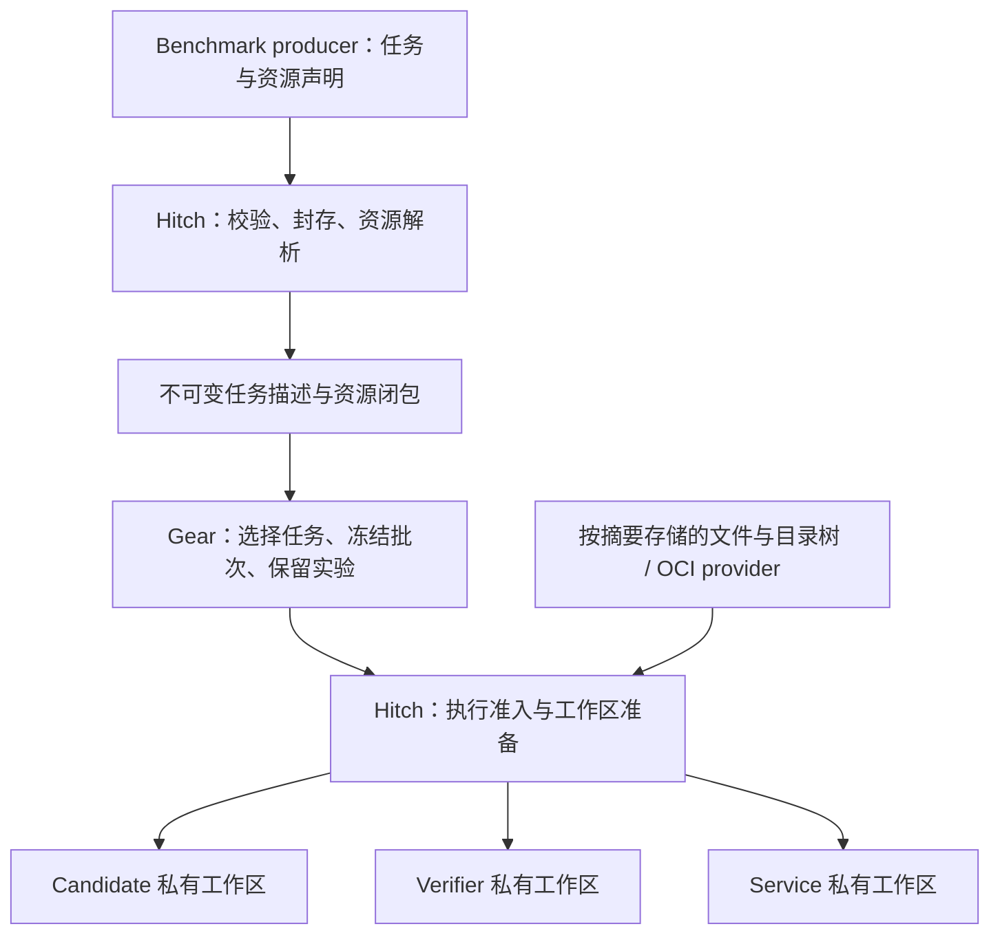

# Gear / Hitch 通用资源存储方案

状态：设计提案，尚未实施。日期：2026-09-24。

本文把优化范围从 AutomationBench 扩展到所有可声明不可变输入的 benchmark。核心是：**公共内容按摘要保存，任务声明依赖，子集保存选择，每次执行创建私有工作区。** AutomationBench 是接入案例，核心实现不得包含 benchmark 名称分支。

与[原修复规格](/Users/tangyehui/gear/docs/gear-hitch-dataset-storage-spec.zh-CN.md)的关系：保留 Gear G1 的普通目录 CoW 优化及其兼容约束；本文定义后续通用资源层，取代“只为 AutomationBench 定义公共 runtime lock”的长期方向。G1 可以先完成，不依赖本文全部实施。本次只新增规格，不修改正在进行的实现。

## 1. 目标与收益边界

解决三个不同层次的重复：

| 重复来源 | 通用处理 | 适用范围 |
| --- | --- | --- |
| 多个任务携带相同代码、数据、依赖 | 按内容摘要存储公共资源，任务保存绑定 | 已接入资源协议的 producer |
| 多个实验、轮次、子集携带相同任务 | 保存任务选择与不可变描述；兼容路径使用 CoW | 新协议；普通目录仍走 G1 |
| 每次执行复制公共输入 | 只读挂载、CoW 或只读底层加私有写层 | 取决于执行后端能力 |

资源可以是单文件、目录树、OCI 镜像。VM 磁盘等以后作为独立 provider 扩展，不列入首版交付。评分方式、任务驱动和 benchmark 执行支持保持各自协议约束；存储支持不等于新增某个 benchmark 的执行支持。

通用性来自共同的资源协议及执行合同。Producer 仍需指出哪些内容是公共输入、哪个角色可以访问、哪里需要写入；不能通过文件名猜测这些语义。普通旧任务可以先获得 G1 收益，无需重写 adapter。

不属于公共输入的内容：凭据、运行日志、模型输出、可变模拟器状态、临时 snapshot 和工作区。它们可有独立的证据保留机制，不能因本方案默认共享或自动删除。Git、`.dsh` 和既有实验目录也不纳入自动扫描清理。

## 2. 分层与职责



| 所属 | 必须负责 | 不承担 |
| --- | --- | --- |
| Producer / adapter | 固定资源版本、声明依赖和角色、生成任务差异 | 自建缓存 GC、推断其他实验是否存活 |
| Hitch | 协议校验、资源导入/获取、封存闭包、角色隔离、执行物化、远程交付 | 猜测哪些 Gear 历史可以删除 |
| Gear | 可信任务身份、子集选择、frozen batch、实验持久引用的创建与释放 | 解析 benchmark 私有格式、拼装 verifier/runtime |
| 资源管理器 | 管理一个 store 的事务、pins、leases、GC；驱动各 provider | 根据 PID、目录年龄推断历史保留意图 |
| 执行后端 | 宣告真实能力，实现只读资源和私有写入，报告实际绑定 | 静默把必需资源降级成可变依赖 |

资源管理器先作为 Hitch 库和 CLI 实现，无需常驻服务。每个 store 有唯一的锁和引用权威；Gear 通过版本化接口登记 owner roots，不直接编辑 Hitch 内部文件。不同机器可以有各自的 store，只共享内容身份和交付协议。相同摘要不代表获得读取授权；共享范围须受本地所有权和远程访问权限约束。

## 3. 资源合同

### 3.1 内容与位置分离

拟新增 `hitch-resource-lock@1`。严格 schema 和跨仓库契约 fixtures 是 P1 的交付项；以下是语义模型，不是已经存在的配置格式：

```ts
type Resource =
  | { kind: 'blob'; digest: Sha256; size: number }
  | { kind: 'tree'; format: 'hitch-tree@1'; manifestDigest: Sha256 }
  | { kind: 'oci-image'; manifestDigest: Sha256; platform: Platform;
      indexDigest?: Sha256 }

type Consumer =
  | { role: 'candidate' | 'verifier' }
  | { role: 'service'; serviceId: string }

type Binding = { resource: ResourceId; consumer: Consumer } & (
  | { use: 'input-file'; target: RelativePath; executable: boolean;
      access: 'read-only' | 'private-copy' }
  | { use: 'input-tree'; target: RelativePath;
      access: 'read-only' | 'private-copy' }
  | { use: 'environment-image'; slot: EnvironmentSlot }
)

type TaskResourceLock = {
  protocol: 'hitch-resource-lock@1';
  resources: Record<ResourceId, Resource>;
  bindings: Binding[];
  requiredCapabilities: string[];
}
```

实际 schema 按 `kind/use` 判别：镜像只绑定明确的环境槽位；路径资源的 target 是角色工作区内的规范相对路径，service 必须指定 ID。Blob 绑定必须声明可执行位并纳入任务/计划身份；其内容摘要仍只覆盖字节，tree 的可执行位由清单提供。未知字段、重复 ID、无效组合、循环依赖、路径冲突均拒绝，不能实现成任意挂载 DSL。

- Blob 摘要覆盖确切字节；tree 是排序的规范清单，记录相对路径、文件类型、可执行位、空目录和文件摘要，递归引用的所有对象必须可验证。格式要定义排序、编码及路径归一化，检测大小写/Unicode 在目标文件系统上的碰撞。
- 首版拒绝软链接、硬链接归档项、设备、FIFO 和根外路径；不能通过宿主符号链接引用公共资源。导入源必须被冻结或受控，单次路径检查不足以防止并发替换。
- Archive 是传输形式；解包到隔离 staging，执行路径及大小检查，再验证目标 tree。压缩包摘要不能代替解包内容的执行身份。
- OCI 使用固定 manifest digest 和平台。若锁定 index，也要校验选中 manifest 属于该 index；构建 recipe、manifest 和 config digest 分别记录。
- 位置、镜像站、临时下载 URL、凭据和本地绝对路径放在独立 transport 配置中，不进入任务内容身份。可记录非敏感来源用于审计；凭据不进入持久资源对象。
- 资源是显式依赖图。构建输入、生成结果分别有身份；运行闭包与重建所需闭包分别声明，不能只锁 Dockerfile 或靠扫描文本猜完整依赖。

### 3.2 存储与验证

文件/tree 对象进入新的 benchmark resource store；OCI 内容由现有镜像 provider 管理，不再把所有镜像层复制到文件 CAS。现有 prepared harness artifact store 保持其用途。

```text
resource-store/
  objects/sha256/...       # 普通字节对象，包括规范 tree manifest
  roots/...                # 带 owner/generation 的持久引用
  leases/...               # 在途导入、物化、执行保护
  transactions/...
  quarantine/...
```

导入使用有大小上限的 staging，流式计算摘要，校验完整闭包后原子发布。多个 producer 导入同一摘要只产生一个正式对象；已存在对象必须验证，发现损坏不得直接当 cache hit。源内容变化、权限或 I/O 错误不能当作“不支持去重”。

缓存读取的完整性保证必须明确：执行准入时验证所有所需对象，或使用能证明发布后不可被普通调用方改写的受保护存储；不能仅凭 mtime 跳过验证。共享目录设为 chmod 只读，不等于对同权限进程的隔离。

大 tree 可采用文件级去重；首版不需要块级去重、全盘扫描、任意可写目录缓存或分布式数据库。

## 4. 数据集与历史兼容

### 4.1 三条明确路径

| 路径 | 对外形式 | 行为 |
| --- | --- | --- |
| Legacy / G1 | 现有普通 Harbor task 和 adapter manifest v1 | 保留原 tree hash、路径、恢复及评分行为；CoW 仅改变物理复制方式 |
| OCI-only 优化 | 仍自包含的普通 task；环境固定镜像 digest | 可保持现有目录协议，镜像需可获取或已正确预载；新版 adapter 产生新数据集身份 |
| Resource-aware | 小型任务描述 + 通用 lock + 外置资源 | 显式新 manifest 版本和能力检查；Hitch 解析及物化后才能执行 |

现有 `benchmark.adapter.json` v1 严格拒绝未知字段；不得把新的执行语义塞进 v1 然后声称旧消费者兼容。拟新增 manifest v2，声明资源协议和必要能力。任务内保留完整 lock 的资源描述与绑定，外置 tree manifest 按摘要解析，不依赖数据集顶层的隐式相对路径。

没有资源协议的旧任务继续原路径；声明了新协议但 lock 损坏、缺失、摘要错误或能力不足时，必须在提交评测前失败，不能当作旧任务继续执行。

### 4.2 身份合同

新协议分别记录：

1. `source_task_digest`：完整小型任务树的版本化规范摘要，覆盖所有文件字节、路径、可执行位和空目录，包括 lock、脚本、Dockerfile、角色绑定及执行声明。Loader 不得将未纳入身份的本地文件带入 staging。
2. `resource_closure_digest`：所需资源图的规范摘要，递归校验全部子对象。
3. `execution_plan_digest`：解析后的角色绑定、影响执行语义的配置、平台及 resolver 语义协议版本；纯实现版本另记证据。
4. `materialized_task_digest`：实际交给后端的文件树验证结果；实际 OCI manifest/config/platform 同时入证据。

新 task identity 绑定前两项和协议版本；dataset identity 再绑定任务成员、adapter 和评分合同。会影响执行语义的 plan 字段进入 Gear condition / 执行身份；纯 clone/copy 选择、缓存路径和下载位置只作为物化证据，不能改变 cell identity。同一输入在支持的不同物化模式下必须呈现相同的内容和访问语义。

为此新增资源 preflight 接口：Hitch 在 Gear 建立依赖该计划的 condition/cell 身份及冻结 batch 之前，返回已校验并封存的任务、闭包和语义 plan 摘要，Gear 将其绑定到新协议的执行记录。真正提交、恢复及远端准入再次核对该计划；平台、角色绑定或 resolver 语义变化必须重新建立显式的新计划/身份，不能提交后才把差异补记为证据并复用旧 cell。旧 manifest v1 不走这条新身份路径，原 hash 预映像和 ref 解析保持不变。

沿用现有哈希必须沿用其完整算法。Gear 的 tree hash 与 Hitch adapter task hash 并非同一合同，不能因都写 `sha256` 就互换；新摘要必须有明确版本和域区分。仅信任 importer 声明、未验证实际内容，不算身份闭合。

### 4.3 Gear 子集与兼容导出

第一步可以继续用 G1 复制小型描述和 lock，已能避免重复搬运大资源。完整目标是新增版本化 selection manifest，只保存 source dataset 身份、排序去重后的 task IDs、对应 task 描述根以及选中任务的资源 roots。

新 evaluator capability 必须在冻结 batch 前确认；Gear 用公共协议校验 task descriptors、选择及摘要绑定，Hitch 负责具体资源解析。旧 `dataset.ref` 的语义不变，不能把引用 JSON 放在旧 ref 路径后冒充普通目录。

Hitch 在运行时为需要普通 Harbor task 的后端创建私有 staging，再交给后端；大资源不写回 Gear projection 或源 dataset。对完全不认识新协议的外部消费者，提供显式 legacy export：展开为普通完整数据集，验证后生成新的 dataset identity，并保留来源关系。该导出不能复用原 frozen cell 身份。

Legacy export 仅在目标 Harbor 配置能表达同等角色边界、访问权限和写入隔离时成功；验证转换后的 build context、挂载及 verifier 可见性。不能表达的能力明确拒绝，展开文件本身不构成语义兼容。

既有 batch 继续用原 absolute ref 恢复。首版不重写、删除或自动迁移历史投影，不重新提交已有评测。历史迁移另做显式、可回滚操作。

## 5. 执行物化与写入隔离

公共资源始终不可变；每个 trial 和角色分别准备视图。Candidate 只获得其 bindings，不能挂整个 CAS、完整 dataset 或 verifier 的 staging。Docker build context 也按角色裁剪，避免 `COPY .` 带入其他角色的文件。

| 后端能力 / 资源用途 | 执行策略 | 实际占用 |
| --- | --- | --- |
| 已有可共享目录视图，后端能安全只读挂载 | 直接挂载已校验的视图或文件 | 复用该视图，挂载元数据很小 |
| 可写输入，支持 CoW | 从公共资源 clone 为私有副本 | 初始块共享，后续写入新增 |
| 支持隔离 overlay | 只读 lower + 每 trial/role 独立 upper | 修改与新文件占空间 |
| 仅接受普通可写目录 | 普通 copy 到有界临时 workspace | 每个活动 workspace 仍有完整副本 |
| OCI 镜像 | 按固定摘要使用共享只读层 | 镜像层复用，容器写层独立 |
| 跨盘 / 跨机 | 目标端获取缺失对象，再选择当地策略 | 传输可去重，不能承诺跨盘 CoW |

Tree manifest 和 blob CAS 本身不是可挂载目录。后端需要普通目录时，Hitch 先创建已验证的 tree view；可以按 tree 身份缓存复用，或使用后端支持的虚拟视图。普通文件系统上 tree view 可能再次复制 CAS 内容，不同 tree 的公共文件也可能重复占空间。视图缓存独立接受 pin/lease、空间预算和 GC 管理，并纳入总占用；不能把 CAS 中一份对象误算为整机仅一份物理内容。

`auto` 只能在经过验证、执行语义等价的策略间选择。若输入声明只读，普通 copy 本身并不能提供只读权限，后端仍须强制只读，否则拒绝准入。不得以共享可写 inode、普通硬链接或 mutable image tag 作为 fallback。

策略须报告能力、实际模式、普通复制字节和原因；提供临时空间预算、并发 workspace 上限、最低剩余空间预检。真实写入仍可能遇到 ENOSPC：停止新工作，等待在途写入结束，清理本次拥有的临时数据，保留已封存资源及证据。

资源 CAS 只减少仓库重复。若后端要求全量 copy，活动工作区仍会膨胀；必须限制并发并在执行、结果封存和远程结束确认后回收临时 workspace，不能承诺跨平台“零复制”。

## 6. 引用、崩溃恢复与 GC

### 6.1 持久 pin 与临时 lease 分开

- 持久 roots：保留的数据集、实验、frozen batch、重放/重评分所需输入、sealed bundle、手工 pin。记录 owner ID、generation、root digest 和用途；不同实验可以独立释放同一内容的引用。
- 临时 leases：导入、物化、在途导出、运行中的本地/远程执行。lease 不能代替历史 pin；实验 complete/failed 不表示用户放弃重放。
- 每个 store 的引用权威负责自己的物理内容；Gear 保留意图通过 durable owner pin 确认后才有效。OCI provider 必须接收相同保护，不能建立一份 image GC 看不到的引用表。

冻结顺序：

```text
写入事务意图并建立 producer lease → 获取并验证闭包 → durable pin 确认
→ Gear 发布 frozen 引用 → 完成事务并释放临时 lease
```

Producer lease 在首个正式对象可见之前生效，逐步保护本次发布的对象直到完整闭包 pin 建立。跨仓库没有原子提交时，以可重试的 owner/generation 操作为合同。崩溃可以留下多余 pin，不能留下已发布 batch 却未受保护的资源。发布前取消可以回滚未使用 pin；发布后取消仍保留历史引用。

释放顺序相反：先在 Gear 锁内确认无该 owner 的持久引用、登记释放意图，再向资源管理器释放。不能因找不到本地路径、PID 退出、mtime 很旧或网络失联直接判 orphan。不同 generation 的旧请求不得释放新引用；进入 release 状态的 owner/generation 不再复用，新引用使用新 generation。

### 6.2 GC 合同

1. 从 durable roots 和有效 leases 遍历完整资源图，做 mark-and-sweep；引用损坏或闭包缺失时保守停止相关回收并报告。
2. pin/acquire、发布、隔离和最终删除遵守同一锁/epoch 合同；不能扫描后无条件删除。
3. 未引用对象先进入 quarantine，宽限期后再次确认无引用才删除。新 acquire 遇 quarantine 时必须在锁内恢复后 pin，或明确重新获取，不能创建即将悬空的引用。
4. Worker 失联或 lease 到期不能独自证明执行已停止；unknown/recovering 继续保护，直到取得结束/撤销确认，或后端实现可证明阻止继续读取的 fencing。
5. 远程缓存可与权威保留 store 分开：只有存在已验证、受保留策略保护的完整可取回来源，才允许回收非活动本地副本。首版默认保守保留。
6. 旧 absolute-ref batch 所指目录仍遵守原 G1/G2 保护，不由新 CAS GC 接管。用户删一个实验只释放它的 roots，其他 owner 仍可完整恢复。

第一阶段只提供引用审计与 GC dry-run；故障注入、并发与远程恢复验收通过后才开放删除。用户显式清理资源仍需走同一引用合同。

## 7. 远程与离线

当前远程输入是单任务完整 tree envelope，并不是文件级 CAS；现有严格 work spec 和 input format 需要显式版本升级。控制端与 worker 都宣告并校验资源协议、provider、平台及物化能力，调度前不兼容即失败。旧 worker 只接受显式 legacy 导出的普通任务。

新 work envelope 携带任务描述及闭包引用；文件对象按摘要查询缺失、流式传输和验证，OCI 经其 provider 获取。不能把公共源码或镜像重复放进每个 task 的 JSON/base64。现有 envelope 限额继续保留，新对象传输另设单对象、总闭包、磁盘、文件数和超时预算。

离线 bundle 包含选定任务描述、完整执行闭包和版本化索引，公共对象只保存一次。导入空机器后逐项校验，执行时强制 cache-only；任何缺失在启动模型或容器前失败。凭据通过独立短期通道处理。

OCI archive load 后必须实测当前 Docker/BuildKit/执行后端能否按原固定 digest 使用；必要时通过受控本地 registry 提供，不能静默换 tag。远程编排和 Package v1 的执行支持仍需按现有范围单独判断，本方案不自动补齐。

## 8. 收益、统计与预算

设 `U` 为作用域内唯一资源的存储占用，`D` 为未计入 U 的任务描述和私有数据，`S` 为子集选择元数据，`V` 为目录视图/解包缓存的新增物理占用，`W` 为并发工作区新增物理占用，`E` 为保留证据，则目标是（共享物理块不重复计量）：

```text
新占用 ≈ U + D + S + V + W + E
旧占用 ≈ 多次重复的公共资源和任务副本 + 运行空间 + E
```

同一公共资源在 100 个任务和多个子集中复用时，持久资源项不随副本数增长；每个 task/trial 本来就不同的输入、输出和写入仍然增长。没有重复内容的 benchmark 收益有限。纯 copy 后端的 W 可达到“并发工作区数量 × 所需输入大小”。

验收同时报告 dataset/projection、文件 CAS、解包缓存、OCI/BuildKit、活动 workspace、临时导入和保留证据；同一共享存储只计一次，并报告峰值。逻辑字节、传输字节、clone 字节与实际新增物理占用分开统计。CoW 收益通过隔离实验的可用空间差值等方法测量，不能把 `du` 合计当独占物理块。

之前 AutomationBench 的 85%–92% 是特定旧实验的目录目标估算，未包含新增共享 store，不能泛化为本方案的全系统承诺。不会因此自动减少模型 token 或提高 benchmark 分数。

## 9. 分阶段交付

| 阶段 | 可独立验收的交付 | 完成条件 |
| --- | --- | --- |
| P0 | 完成现有 Gear G1、复制统计和预算 | 普通任务接口和历史身份不变；clone/copy 隔离及恢复通过 |
| P1 | 通用 lock/schema、blob/tree store、OCI provider 接口、事务与 durable roots | 契约 fixtures 通过；关闭新 CAS 自动 GC；启用的 provider 已识别资源 pins/leases |
| P2 | Hitch 角色物化、准入和证据；Gear 支持新 manifest 并先复制小描述 | 两个结构不同的 producer 接入；所有启用 provider 的持久和活跃引用受保护；旧协议恢复及 legacy export 通过 |
| P3 | Gear 引用子集、远程缺失对象传输、offline bundle | 跨子集只新增元数据；空机器离线与旧 worker 拒绝测试通过 |
| P4 | 显式 GC、崩溃恢复及预算闭环 | pins/leases 与所有 provider 联动；并发与故障注入通过 |

引用保护从 provider 首次使用时就必须生效，不能拖到 P4；尤其现有 image GC 仍可能被用户运行。P4 才开放的是新资源的删除能力。

首批案例：AutomationBench（simulator/verifier 公共 runtime）加一个代码或数据树复用的 terminal/model-call producer。二者至少一个以 file/tree 为主要共享资源，不能只用两个相似 Docker 包装器证明通用性。fixture 可以先验证基础合同，推荐默认启用前还需真实 producer 的执行与评分等价验证。

VM/backing disk、块级去重、历史自动 compaction 和任意挂载扩展留到实际需求出现后。逐步接入其他 producer，无需修改 Gear 调度或在 Hitch 核心增加 benchmark 名称判断。

## 10. 必须通过的验收

1. 三个重叠子集和两个实验引用同一公共资源：CAS 一份，selection 不携带大资源，删除任一 owner 不损坏其余实验。
2. 同一 fixture 在 CoW、普通 copy、跨盘运行，内容及访问语义一致；统计准确反映 fallback 和峰值。
3. 修改一个 trial/role 的私有工作区不影响 CAS、源任务或其他执行；candidate 无法读取 verifier 专属内容，build context 不泄漏。
4. 缺对象、损坏摘要、资源循环、未知必需能力、路径逃逸、解包炸弹、文件系统路径碰撞和错误平台在执行前失败。
5. pin、freeze、acquire、GC 各阶段交错并崩溃，只出现完整成功或安全多保留，不出现悬空 durable roots；quarantine 重获引用安全。
6. Worker 失联、重启、迟到结果和旧 generation 释放请求不提前删除仍需资源。
7. 从空机器导入离线包完成执行；重复导入不重复存储；缺镜像或无法按固定 digest 解析时明确失败。
8. 旧 initial/GEPA/Luna Max 实验沿原 absolute ref 恢复、复用结果，unknown reservation 行为不变，不额外发起模型评测。
9. 两个不同 producer 完成实际执行和评分等价验证；资源层核心不依赖 benchmark 名称。

## 11. 实施落点

Gear 的主要接入点是 [dataset.ts](/Users/tangyehui/gear/src/state/dataset.ts)、[dataset-projection.ts](/Users/tangyehui/gear/src/search/dataset-projection.ts)、[evaluation-adapter.ts](/Users/tangyehui/gear/src/search/evaluation-adapter.ts) 和状态持久化层。共用版本化 schema/契约 fixtures，避免 import Hitch 私有模块。

Hitch 的主要接入点是 [benchmark manifest loader](/Users/tangyehui/agent-hitch/src/evals/benchmark-adapter-manifest.ts)、[task resources](/Users/tangyehui/agent-hitch/src/evals/task-resources.ts)、[image resolution](/Users/tangyehui/agent-hitch/src/control-plane/eval-image-resolution.ts)、[remote inputs](/Users/tangyehui/agent-hitch/src/control-plane/remote-work-inputs.ts)、[worker work spec](/Users/tangyehui/agent-hitch/src/workers/remote-harbor-work-spec.ts) 和 [image GC](/Users/tangyehui/agent-hitch/src/images/gc.ts)。新增通用 resources 模块承接 store 与生命周期。

现有镜像缓存、锁和 pins 可以复用，但目前它们不构成完整的 file/tree CAS、cache-only 离线解析或 Gear 历史保留合同；这些均是新增工作，不能在验收前当作已支持。
