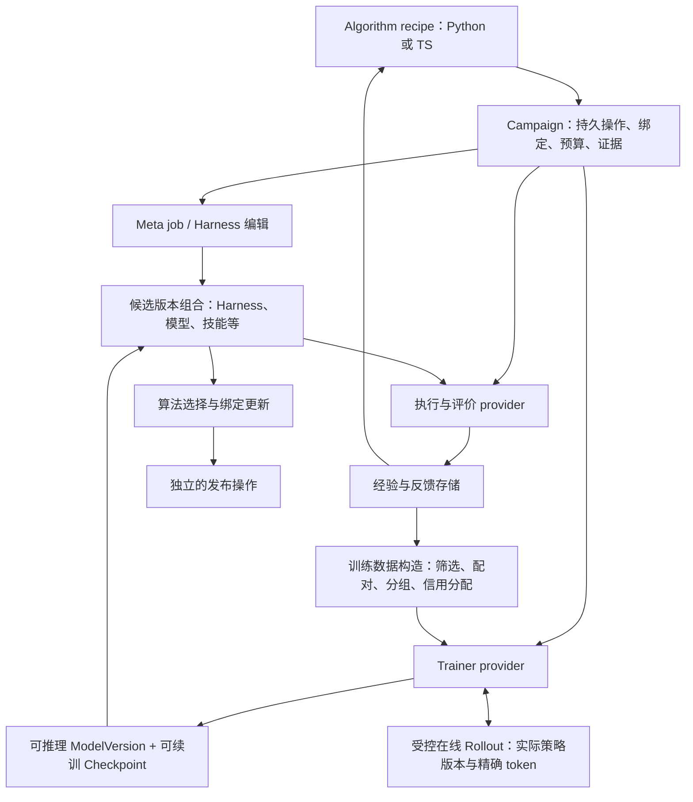

# Gear 统一改进框架：模型训练与 RSI 架构补充评估

- 日期：2026-09-24；状态：架构建议，未实施。
- 基线：`f715748dad576d3055e4a9eaab21b36015348aee`，分支 `codex/meta-agent-algorithm-plan`，沿用前次从 dev 创建的 worktree，本轮未重新同步分支。
- 本文补充 [V2 实现方案](meta-agent-algorithm-implementation-plan-v2.zh-CN.md)，原方案及其审查记录保持不变。以下新增接口、operation 名称和实施批次调整均为提案，不是已发布 API。
- 阅读分工：三个 GPT-6 Sol / xhigh subagent 分别审查权重学习闭环、评价器共同进化、现有 Gear 训练路径；主 agent 核对关键源码、验收归档并综合取舍。

## 1. 结论及对 V2 的修正

**可以支持，但需要把模型训练纳入第一版的明确合同和交付范围。无需推倒 V2 的持久操作、版本绑定和语言协议。**

必须区分三个事实：

| 层次 | 当前事实 | 应采取的行动 |
| --- | --- | --- |
| Gear 现有产品 | 已有独立的 Slime/Megatron agent-GRPO 训练闭环，包含模型版本、完整续训 checkpoint、精确 rollout、评测、晋升与显式发布 | 保留并复用，不重写训练底座 |
| 拟议的新 Campaign 框架 | 动态模型 slot、artifact、operation、预算和恢复设计能表达权重变化；尚未接上现有训练闭环 | 实现训练 adapter、样本/训练计划合同及模型状态映射 |
| 更广的 RSI 方法 | SFT、DPO、蒸馏、课程生成、编辑器训练、评价器共同进化各有不同语义 | 新增对应 recipe/provider，逐项验证；不能因为统一接口存在就声称全部实现 |

V2 §12.3 把 GPU trainer 整体列为后续，范围过宽。应改成：**现有专用 agent-GRPO 的兼容接入和不退化验收进入首版；新的训练方法及更广的 GPU 组合分别交付。** 新 Campaign adapter 尚未实现，不影响现有训练路径已经存在这一事实。

另外，V2 §13 的“已做 toy 反例”应按“已设计、实施时必须通过的 toy 反例”理解；本轮及 V2 文档阶段均未运行这些测试。

## 2. 论文范式：统一控制与证据，保留学习方法的差异

依据两篇总览笔记，我建议把共同范式表述为：

> 获取经验与反馈 → 构造改进操作 → 更新有身份的研究对象 → 测量实际执行结果 → 决定下一步。

这是面向 Gear 的架构归纳，不是声称所有论文使用同一套算法。每个 recipe 必须回答四个问题：**改什么、保留多久、学习信号由谁产生、用什么证据判断进步**。这是 [RSI 总引的四问](</Users/zgq/Library/CloudStorage/OneDrive-个人/笔记/papers/agent/RSI 递归自进化：从输出修正到评价标准共演化.md:20>) 对平台设计最直接的约束。

| 可变对象 | 示例 | 应如何表示 |
| --- | --- | --- |
| 当前回答、推理轨迹 | Self-Refine | episode 内 artifact，不必修改长期 Agent |
| Harness、技能、工具、记忆 | GEPA、RHO、Evo-Harness | 已有代码/文件/技能版本与角色绑定 |
| 目标、编辑器、teacher、judge 的权重 | GRPO、自蒸馏、编辑器训练 | 命名模型 slot；可推理模型与续训状态分开 |
| 训练任务、课程与监督信号 | Absolute Zero、合成数据训练 | 有来源和暴露记录的任务视图、样本视图、反馈版本 |
| 评分模型、rubric、评价程序 | Self-Rewarding LM、RQGM | 版本化 evaluator，以及明确的评分比较条件 |
| 改进算法本身 | 自修改研究流程 | V2 的版本化 continuation；首版仍不承诺自动自修改执行 |

这些对象不应变成每个算法都必须填写的固定大结构。继续使用 `BindingSet` 的命名 slot 和 provider schema，按 recipe 声明所需对象。普通 Harness 作者不需要理解 optimizer，普通训练算法作者也不应被要求构造 Git patch。

## 3. 用户提供的架构图应怎样调整

图中的 Algorithm Registry、Optimization Engine、Trainer、Evaluator 可以保留。需要明确下面的控制关系：**算法决定何时编辑、采样、训练、评价和采用结果；Trainer 执行训练；Meta Agent 负责被分配的诊断、编辑、任务生成等工作。** 梯度循环不必经过 LLM Meta Agent。



对应原图的具体改动：

1. **Engine → Trainer 增加明确的作业控制边。** 不能仅靠“Storage 有新轨迹”隐式触发训练。算法声明初始化模型、数据/采样计划、目标、资源预算和作用对象。
2. **Trajectory Storage → Trainer 加入类型化的数据构造能力。** 相同轨迹可能被变成 SFT 样本、偏好对、GRPO group 或蒸馏 target；这些转换属于可替换算法组件。它是接口能力，不要求新建一个独立服务。
3. **Trainer → Agent 改为先产出候选模型版本。** 完成训练不意味着已经采用或上线。运行中 policy、候选模型、算法选中模型、业务部署分别记录。
4. **Agent 的版本身份表示实际组合。** 评测对象可以是 `(harness H2, model W3, skills S1)`，不能只记一个 Harness commit。
5. **Evaluator 的科学评价部分允许版本化。** 执行适配器仍可复用 Hitch；评分模型、rubric 和评价数据要有独立身份。

原图的离线数据箭头仍成立，但在线 RL 还需要 Trainer 与 rollout 之间的内循环；不能强制所有方法先产生一份静态数据集再训练。

## 4. 最小训练合同：复用现有类型，补齐通用入口

### 4.1 模型与恢复状态分开

现有 [ModelVersion / TrainerCheckpoint](../src/training/types.ts:4) 已经做了关键区分：

- `ModelVersion`：HF snapshot、weights/tokenizer/chat template digest、architecture、dtype、父模型和训练来源。
- `TrainerCheckpoint`：actor 状态、optimizer、scheduler/RNG、data cursor、committed update 和兼容摘要。

新框架应映射这些类型。**HF 权重导出足以用于推理，不代表能无损续训。** 已有训练路径拒绝用已训练模型偷偷冷启动 optimizer，这项语义需要保留。未来 adapter 支持 LoRA 时再声明 base、adapter、组合与导出规则，不把 LoRA 当作当前已验证能力。

建议公共入口只统一作业信封；具体训练配置通过版本化 schema 交给 provider。以下示意包含现有 Slime 产出合法候选时的结果分支，未列 operation 的其他状态：

```ts
type TrainInput = {
  learnerBinding: string;         // 如 target.model / editor.model / shared.policy
  initialModelRef: VersionRef;
  resumeCheckpointRef?: ArtifactRef;
  trainingPlanRef: ArtifactRef;   // 离线样本或在线采样计划，schema 由 provider 声明
  objectiveRef: ArtifactRef;      // 已声明的 loss/reward/credit 合同
  resourceLimits: ResourceLimits;
};

type TrainOutput = {
  kind: "candidate";
  modelVersionRef: VersionRef;
  resumeCheckpointRef: ArtifactRef;
  updateLedgerRef: ArtifactRef;
  trainingEvidenceRef: ArtifactRef;
  usageReceiptRef: ArtifactRef;
};
```

现有 Slime 候选结果必须带完整 checkpoint；输入 checkpoint 可省略仅适用于合同允许的初始冷启动。现有 [parseModelVersion](../src/training/schema.ts:111) 也强制带 `trainingRunId` 的模型附带 checkpoint。未来只产 HF 权重的 provider 需要另外声明有完整训练来源的模型 schema/版本，不能直接套用该解析器或抹去来源绕过校验。`check` 必须在运行前拒绝“要求精确续训、provider 只有权重导出”的配置。

`learnerBinding` 指定候选产出的目标，训练结束后不隐式改变绑定。未形成有效更新时，结果应进入独立的 `no-candidate/inconclusive` 分支，携带实际已有的证据和用量，不伪造模型/checkpoint；通信未知仍是待协调的操作状态。公共 operation envelope 继续负责幂等身份、实现版本、环境和准入能力。

### 4.2 训练计划与样本不能退化成通用 JSON 轨迹

| 方法 | 最低样本语义 | 需要的版本和证据 |
| --- | --- | --- |
| SFT | 输入、目标、训练 token mask、筛选规则 | 生成者、验证者、标签来源、保留/拒绝规则 |
| DPO | 相同输入下的 chosen/rejected pair | 候选生成模型、当轮 judge/rubric、配对规则 |
| GRPO | 同任务 group、实际 behavior policy、token/reward/mask | 同步权重、原生 token/logprob、完整组与 batch、更新归属 |
| 稠密蒸馏 | student prefix 与 teacher target distribution 对齐 | teacher/student 身份、teacher 可见信息、冻结范围与 loss |

公共层保存 schema、引用、来源、暴露史和实际消耗回执；各 adapter 校验对应的数值合同。不要要求所有算法都交 logprob，也不要允许需要精确 logprob 的方法在缺失时降级为文本重分词。

在线 RL 的 `trainingPlanRef` 描述任务来源、采样、reward 和更新策略。每轮生成的数据在实际 policy lease 下封存，进入 update ledger。离线 SFT/DPO 则可引用已经封存的样本视图。二者共用来源追踪，不强行共用一种采样生命周期。

业务上的 `group.id/slot` 只表示关联；训练中的 token mask、角色 reward、组内 advantage、阶段 credit 必须显式定义。比如“编辑器改 Harness，solver 得到更高分”不能自动推出编辑器每个 token 的训练标签。

### 4.3 恢复和预算由清晰的单一所有者管理

Campaign 管外层操作意图、查询、取消、结果接纳和预算预留；训练 provider 管 GPU、内部 rollout、梯度、checkpoint 和 update commit。已有 [ModelTrainer](../src/training/types.ts:335) 的 `preflight/submit/inspect/cancel/collect/control` 是直接可用的接入边界。

`opaque-job` 不等于训练内部不可恢复：Slime 可以在其已验证的 update/checkpoint 边界恢复，Campaign 只查询同一作业。它不需要等待未来的通用 `managed-children` 能力，也不意味着任意 Python 调用栈都可恢复。

Campaign 为一次训练 operation 预留额度，provider 按已验证能力实施限制并返回有身份的用量回执。GPU 秒限额不自动意味着绝不超额：现有控制器累计用量、达到限额后有序暂停，保存/导出和异步释放仍可能继续消耗；超额持续计量并拒绝晋升。新 adapter 必须保留该语义，准入时区别硬上限与触发停止阈值，不支持的硬限制不能承诺。

导入累计账本时只计新增部分，不能重复计入同一 GPU/token 消耗。结果未知时继续查询原 handle，不另开作业、不释放未确认的预留。已有作业的内部重放与提交语义见 [coordinator 校验](../src/training/coordinator.ts:327) 和 `python/gear_training` 的 ledger/driver。

### 4.4 更新作用范围必须明确

recipe 应声明模型更新是用于一个 query、一个 session、一个研究 campaign，还是后续业务部署。局部适配模型不应默认覆盖全局 Agent。

这里不能把所有 TTRL 都描述为“每题训练后重置”：其笔记包含在 benchmark 测试分布上适配的设置。框架应同时容纳局部适配与跨题保留，并记录数据暴露，防止把适配过的问题重新标为未见测试。

## 5. 不重写现有训练：分两层接入

**第一层：兼容完整旧训练周期。** 增加暂名 `training.legacy_cycle` 的 opaque operation，包裹现有 `ModelTrainingCoordinator` 或 CLI。封存原 experiment/run/handle、请求和幂等 key；持续 advance/inspect。返回值按 outcome 区分：形成合法候选时必须附带模型、完整 checkpoint 和 update commit；没有完整 batch/有效更新的 inconclusive 分支可以没有候选。评估未完成时保留实际证据及其完整性状态，决策和成本如实返回，不生成假产物。它包含旧流程自己的基线、dev/held-out gate 和 champion 选择，必须在 API 中明确是完整周期，不能伪装成只执行梯度更新的 `train`。

这层让现有用户保留固定 Harness 的训练行为，先验证 Campaign 接线。Campaign 可投影旧流程的选择结果，但不能再作为第二个 writer 操作同一个 champion 或重复提交训练。旧的显式 publish/rollback 仍单独执行。

**第二层：开放算法控制训练前后流程。** 新 adapter 复用 `NodeSlimeModelTrainer`、`TrainingEpisodeCoordinator`、Python driver、精确生成网关和 checkpoint ledger；算法自己组织训练、评测与选择。将目前在 coordinator 中的产物完整性、谱系、模型/检查点一致性、资源释放等校验保留在可复用的 adapter/验证组件内，不能绕过 coordinator 后只调用 `submit`。

第二层仍先支持当前 `agent-grpo-v1` 合同；新算法改变 loss、训练角色、Harness 条件或 token 格式时，必须声明新的 recipe/provider 能力并重新验证。当前 [ModelTrainingSpecV1](../src/training/types.ts:183) 固定 `training-tool`、Slime/Megatron、同步 rollout、零 policy lag、线性 token 轨迹，无 compaction/subagent/辅助模型调用。这些限制不是给请求多传几个字段就能解除的。

首版交付应完成第一层，并使第二层的训练 operation 能由公开 Python/TS 步骤接口独立编排；仅有完整旧周期 wrapper 不能算完成算法层解耦。先做已有 GRPO 的 adapter，比另起一个 SFT/LoRA 后端更符合 Gear 的现状。

## 6. 代表性论文如何落入框架

以下流程根据本地单篇精读笔记整理；公开 arXiv 摘要对部分核心机制作交叉核对，没有重新通读全部原论文或复现实验。

| 方法 | recipe 控制流 | 需要补的能力，而非改通用内核 |
| --- | --- | --- |
| 现有 Gear GRPO | 固定 H，W0 在线采样与训练 → W1/checkpoint → 同条件评测 → 选择 | 当前 Slime adapter、训练与评估回执映射 |
| TTRL | 无标签问题多次采样 → 共识伪奖励 → 在线 RL → 新策略采样 | 共识 reward provider、group/policy 版本、测试时适配暴露规则；不能套用现有固定 verifier 而宣称复现 |
| Self-Verified Distillation | 生成 → 自验证与筛选 → SFT → 新模型 | 筛选 provenance 与 SFT provider；不等于已有 GRPO 支持 SFT |
| OPSD | student 在线生成 → 固定 teacher 读取 privileged solution 并评价前缀 → 蒸馏更新 | 分离 teacher/student slot、答案权限、稠密 target 和专门训练 loss |
| Self-Rewarding LM | 当前模型生成并评分 → 偏好对 → DPO → 更新下一轮模型 | DPO provider；保留当轮 judge/评分版本，不用新 judge 覆盖旧分数 |
| Absolute Zero | 共享模型出题/解题 → 执行器反馈 → 角色/任务分组更新 → 下一轮课程 | 动态任务视图、共享 policy、角色信用；程序 verifier 仍固定 |
| 编辑器训练、Harness 与模型联合优化 | 训练 editor，或交替更新 H/W → 评价实际组合 → 更新相应绑定 | editor/target 分离、专属 reward/credit、联合候选评测；旧 weight-only gate 不可直接套用 |
| RQGM 类评价器共同进化 | 世代内固定评价条件 → 搜索 → 评价器候选测量/选择 → 新世代 | evaluator 身份、世代比较规则、重评与校准记录 |

关键参考：[TTRL](https://arxiv.org/abs/2504.16084)、[Self-Rewarding LM](https://arxiv.org/abs/2401.10020)、[Absolute Zero](https://arxiv.org/abs/2505.03335)、[RQGM](https://arxiv.org/abs/2606.26294)。它们分别说明无标签 RL、自评分训练、自造课程和评价标准变化；不能把这几种信号混成一个无来源的 reward。

联合优化的候选可以从 `(H0, W0)` 变成 `(H1, W1)`。在相同外部条件下比较二者，可判断组合是否变好；如果要声称收益来自训练，则还应按研究设计测量 `(H0, W1)`、`(H1, W0)` 等对照。两个版本同时更新可以使用 V2 原子 binding transition，但原子提交本身不提供科学归因。

Python/TS 仍是作者语言选择。Python recipe 调用训练 operation，或 TS recipe 调用同一 operation，最终都可执行同一个 Python Slime 后端。**算法不需要写两遍；训练依赖装在 provider 的执行环境里。** 新 loss 的作者写 Python trainer adapter，普通算法作者只编排已提供的能力。

## 7. 评价器共同进化需要额外合同

仅有一个可更换的 `judge.model` slot 不够。应补充 provider-owned `EvaluatorRef` 和 `EvaluationRecord`，至少关联：评价代码/模型/rubric、任务视图、实际被测版本组合、指标方向、提示与采样条件、参考答案可见性及原始证据。

一次内部 reward 的来源可以随算法而变，但报告中的改进主张要有明确比较条件。建议以 `evaluationEpoch` 或等价的测量条件引用划分可直接比较的记录：

- 世代内固定评分含义和任务协议；跨 judge/rubric/任务分布不能直接按一个全局 `score` 排名。
- 历史评分保持不可变；分别展示“当时为何选择”“新标准重新评分”“独立外部测量”。
- 需要跨世代比较时，对共同封存的产物与任务视图做旧/新评价器配对重评，记录覆盖、差异与不确定性。无足够桥接证据就标为不可比较。
- 独立 anchor、gold、程序验证器是否存在，是 recipe 的明确前提。框架可以支持仅内部信号的研究，但报告不能把内部 reward 增长等同于实际能力增长。

RQGM 的世代内冻结机制与这个设计相容；并不意味着跨世代得到同一目标上的单调改进。Self-Rewarding LM/CoNL 的共享参数也不意味着能消除共同偏差。DeepVerifier 的单篇笔记描述的是在线固定 rubric，不能因为总览归入 verifier 方向就误称其在线 rubric 共演化。

平台的身份、权限、预算、原子提交和证据校验继续由固定内核负责。允许变化的是被研究的科学评价对象。若固定 provider 已声明接受可变 evaluator 程序 artifact，可以在允许的 slot 中更新；若变的是 provider 协议或外层算法实现，则按 V2 的新版本/continuation 处理。

## 8. 调整实施顺序与验收

保留 V2 的 P0–P6 顺序，增加一条从第一版开始的训练交付线：

| 批次 | 训练相关增加项 | 退出条件 |
| --- | --- | --- |
| P0 | 固定现有训练代码/运行锁/恢复 fixture 和认证范围；明确旧训练兼容路线 | 不把当前 GRPO 能力误列为尚不存在，也不扩大历史认证范围 |
| P1 | SDK 模板同时展示 edit/rollout/train/evaluate 操作；提供轻量 fake trainer | Python/TS 作者无需训练依赖即可检查和跑 toy |
| P2 | 模型与 checkpoint 分离、在线计划/离线视图、预算回执、角色与评价条件反例 | 在协议冻结前，权重更新与恢复是实际被测消费者；非仅 Harness toy |
| P3 | 接入 `training.legacy_cycle`；实现可独立编排的现有 Slime GRPO adapter | 同一 job 恢复、成本不重复、既有产物校验保留；旧训练路径不退化 |
| P4/P5 | 增加固定 Harness 的公开训练 recipe，与 Harness recipes 并行验证 | 有界实机接线、续训、独立评测、绑定选择；GEPA 解耦另行完成 |
| P6 | 首版范围为原四个 Harness recipe 加已有 GRPO 训练 recipe | 仓库外可运行，明确环境要求与兼容范围；wrapper 与公共操作路径分别验收 |

新的 SFT/DPO、稠密蒸馏、编辑器梯度、复杂多角色 credit、异步训练与评价器联合训练分别推进，不把“新架构能描述”写成“已实现”。现有训练作业的 checkpoint 恢复不依赖通用嵌套操作调度上线。

除 V2 的验收外，至少增加以下可失败的检查：

1. 训练 worker 在结果丢失时恢复同一 handle；重复完成消息不重复采用模型或计费。
2. optimizer/RNG/cursor 与权重不匹配时拒绝续训；只有 HF 导出的 provider 不可冒充完整恢复。
3. editor 更新不改变 target；共享模型更新按声明影响两个角色；组合版本提交不出现半更新。
4. GRPO 缺原生 token/logprob、策略版本漂移或 group 不完整时拒绝/按合同 no-update；合法 reward=0 仍保存。
5. query/session 适配不修改全局部署；取消确认前不假定 GPU 已释放。
6. judge 或任务分布切换后，旧分数不静默进入同一排名；重新评分保留旧依据。
7. train/selection 暴露记录经派生数据继承；不能改名后当成独立 final test。
8. 新 adapter 修改了运行身份时按实际变化补做验证，不挪用历史认证。

这些是实施验收条件，本次没有执行。

## 9. 现有训练证据与本次阅读边界

仓库的 [2026-09-10 单卡验收](training/certifications/2026-09-10-rtx5090-single-gpu/README.zh-CN.md) 记录了本地 Gear/Hitch/Harbor Docker + 远程 Slime/SGLang、单 RTX 5090、Qwen2.5-1.5B 与冻结 recipe/runtime 的两次真实更新，包括 checkpoint 恢复、原生 token/logprob 对齐、独立评测交接、资源和计费检查。

这是仓库保存的 scoped operator attestation。本轮核对了公开归档与代码，未重新读取私有原始 GPU 审计、运行训练或重算数值。独立单样例评估 `valid=true, reward=0`，所以该证据证明运行与恢复链路，不证明模型质量提升。它不覆盖其他模型/训练方法、双卡、远程 Harbor/Docker 或尚未实现的新 Campaign adapter。

源码重点：

- [训练类型](../src/training/types.ts:4)：模型、完整 checkpoint、策略 lease、训练规格与 provider 接口。
- [训练协调器](../src/training/coordinator.ts:88)：基线、幂等提交、查询、收集、产物核对、评测和选择；publish/rollback 独立。
- [Python driver](../python/gear_training/driver.py:31)、[样本校验](../python/gear_training/samples.py:38)、[生成网关](../python/gear_training/gateway.py:45)：GRPO 内循环与精确策略数据合同。
- [运行认证](../python/gear_training/certification.py:16)：正式运行证据准入；静态 preflight 的 ready 状态不能代替它。

本轮读取两篇总览和相关本地单篇笔记，包括 TTRL、SVD、OPSD、Self-Rewarding LM、Absolute Zero、Self-Improvement Can Self-Regress、STV、DeepVerifier、CoNL、RQGM；部分 arXiv 标题/摘要作了交叉核对，没有重新逐篇阅读完整 TeX 或复现论文结果。

笔记入口：

- [RSI 递归自进化：从输出修正到评价标准共演化](</Users/zgq/Library/CloudStorage/OneDrive-个人/笔记/papers/agent/RSI 递归自进化：从输出修正到评价标准共演化.md>)。
- [Recursive Self-Improvement in AI: From Bounded Self-Refinement to Autonomous Research Loops](</Users/zgq/Library/CloudStorage/OneDrive-个人/笔记/papers/agent/Recursive Self-Improvement in AI From Bounded Self-Refinement to Autonomous Research Loops.md>)。
- [SVD](</Users/zgq/Library/CloudStorage/OneDrive-个人/笔记/papers/训练/Self-Verified Distillation Your Language Model Is Secretly Its Own Synthetic Data Pipeline.md:30>)、[OPSD](</Users/zgq/Library/CloudStorage/OneDrive-个人/笔记/papers/训练/Self-Distilled Reasoner On-Policy Self-Distillation for Large Language Models.md:35>)：训练样本与 teacher/student 合同。
- [STV](</Users/zgq/Library/CloudStorage/OneDrive-个人/笔记/papers/reward/Self-Trained Verification：训练时与测试时自改进（2605.30290）.md:32>)、[DeepVerifier](</Users/zgq/Library/CloudStorage/OneDrive-个人/笔记/papers/reward/DeepVerifier：基于 Rubric 验证的测试时 Deep Research 自进化（2601.15808）.md:38>)、[CoNL](</Users/zgq/Library/CloudStorage/OneDrive-个人/笔记/papers/reward/CoNL：通过元评价学习不可验证任务（2601.21464）.md:39>)、[RQGM](</Users/zgq/Library/CloudStorage/OneDrive-个人/笔记/papers/agent/Red Queen Gödel Machine：Agent 与评估器共同进化（2606.26294）.md:59>)：评价器边界与比较条件。

本轮仅新增这份评估文档；没有修改源码、用户笔记或已有方案，没有运行模型、训练、测试、部署或历史实验迁移。
