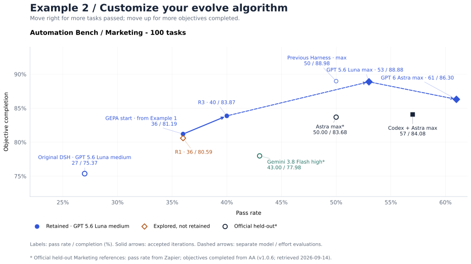
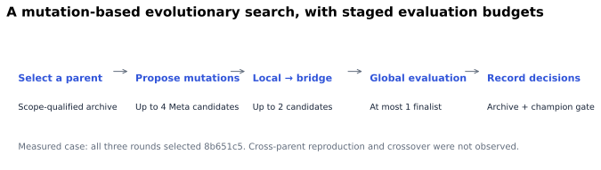

# Example 2: customize your evolve algorithm

Customize Gear's algorithm components with a small elitist selector, then study a Marketing experiment using Gear's [GEPA](https://arxiv.org/abs/2507.19457) variant to optimize the Harness through shared failure diagnosis and staged evaluation.



The horizontal axis is strict pass rate; the vertical axis is object completion (local `partial_credit`). Solid arrows connect retained iterations; dashed arrows connect separate evaluations with different effort settings or models, without another Meta round. Champion `a0740800` with GPT 6 Astra max passed 61/100 tasks with 86.30% object completion. Model references marked `*` use official held-out Marketing results: pass rate from Zapier and objectives completed from AA. [Metric definitions](results.md). The figures use zoomed axes with the same limits in both examples. [Chart data and sources](../assets/marketing-results.json).

## Choose the module to customize

Gear exposes seven algorithm interfaces in [the component library](../../../src/evolution/components.ts). Replace the decision you want to study and keep the rest of the evaluation pipeline fixed.

| Editable module | Entry point | What you can change | Service composition field |
| --- | --- | --- | --- |
| Candidate generation | `CandidateGenerator.plan()` | Candidate slots and parent allocation from the supplied parent pool. | `candidateGeneration.strategy` |
| Task sampling | `TaskSampler.resolve()` | Task scopes, repetitions and frozen conditions for a round. | `rollout.taskSampler` |
| Rollout backend | `RolloutProvider.createEvaluator()` | How exact candidate versions are executed and evidence is collected. | `rollout.provider` |
| Fitness / scoring | `Judge.evaluate()` | Metrics derived from evaluation evidence. | `evaluation.judges` and `evaluation.primaryMetric` |
| Candidate assessment | `CandidateAssessor.assess()` | Ranking evidence and optional verifier reasoning. | `selection.assessor` |
| Survivor selection | `CandidateSelector.select()` | Elite retention, diversity, tie-breaking and the promotion nominee. | `selection.strategy` |
| Champion promotion | `PromotionPolicyProvider.decide()` | Acceptance thresholds and paired baseline/candidate checks. | `promotion.policy` |

Register an implementation through the corresponding `ComponentRegistry.register…()` method, create a versioned `ComponentRef`, and use that ref in a **new** service/evolution composition. Changing a Markdown prompt alone changes the mutation instructions; changing one of these components changes the search algorithm. The model, benchmark, candidate budget and selection count are configuration choices around those components.

The default service passes its champion as the generation parent. A custom generator can select only among parents the controller supplies; population-wide reproduction also needs an archive and parent-pool integration. Candidate mutations run through Meta's Skill lifecycle after slot allocation. A selector cannot add crossover or asynchronous diagnosis by itself.

Keep exact commits/manifests, evidence completeness, matching comparison conditions, held-out isolation and atomic champion updates intact. These are framework contracts shared by all algorithms.



## Define the evolutionary operators

| Operator | Gear implementation responsibility |
| --- | --- |
| Individual | Exact Harness commit, manifest and lineage. |
| Population | Scope-qualified research archive with retained evidence. |
| Parent selection | Sample a qualified scope and parent using a recorded seed and draw. |
| Mutation | Meta turns an evidenced failure hypothesis into an editable Harness change. |
| Fitness | Strict task success and declared process metrics on a comparable, frozen task scope. |
| Survivor selection | Preserve useful specialists and allocate later evaluation stages. |
| Elitism | Keep the champion until a finalist satisfies the promotion rule. |

This is a mutation-based evolutionary variant. The current candidate contract uses one code parent; this case does not implement two-parent crossover. A crossover extension would need explicit source parents, a merge/edit policy, provenance and validation before evaluation.

The implementation can represent an archive and parent selection, but all candidates in these three observed rounds had parent `8b651c5`. The results do not demonstrate multi-generation reproduction from different archive members.

## Implement a small extension first

The shipped [selector component](../../../examples/evolution-search/selection.mjs) is an executable teaching example using Gear's real `ComponentRegistry`. It ranks complete candidates on the same seed condition by strict pass rate, removes duplicate code trees, resolves ties deterministically and selects an elite set. It is deliberately separate from the historical staged engine.

```bash
npm run build
node examples/evolution-search/replay.mjs
node --test examples/evolution-search/selection.test.mjs
```

The replay first displays the historical rounds, then exercises the component on a clearly labeled synthetic fixture. It makes no model calls and writes no experiment state.

```javascript
import { ComponentRegistry } from 'rsi-gear';
import { registerElitistSelector } from './examples/evolution-search/selection.mjs';
const registry = new ComponentRegistry();
const selectorRef = registerElitistSelector(registry);
const selector = registry.selector(selectorRef);
// In your RefineService composition:
// options.selection.strategy = selectorRef;
// pass this same registry to RefineService's final constructor argument.
```

Use this reference when composing `RefineServiceOptions.selection.strategy`. The stock standalone CLI currently chooses built-in component refs internally; merely registering a selector does not activate it there. Build a custom composition from the [standalone control-plane source](../../../src/skill/control-plane.ts), replace the selected ref before service construction, and pass the same registry. Do not edit an existing evolution's sealed spec. Component source/config digests identify the new algorithm.

## Use GEPA with staged evaluation

The experiment uses the GEPA algorithm through Gear's `failure-cluster-gepa-v1` variant. Shared diagnosis groups failures into categories and turns them into distinct mutation workplans for Meta. Candidates are then evaluated locally, on a bridge set and on the full task set, with a 4 → 2 → 1 candidate budget.

The full staged path needs more than a selector. The original synchronous `CandidateGenerator.plan()` allocates slots before asynchronous failure diagnosis; evidence-based workplans require an admission/planning lifecycle in the framework.

The pinned implementation adds search contracts, archive storage, scope sampling, shared diagnosis, an engine and promotion checks. A round freezes its parent, archive snapshot and budgets; diagnosis then seals workplans with hypothesis, allowed modification paths and task scopes. Recovery reuses those decisions rather than resampling.

The [actual algorithm settings](../../../examples/evolution-search/algorithm-settings.json) include:

```json
{
  "search": {
    "mode": "failure-cluster-gepa-v1",
    "seed": 0,
    "parentBatchCount": 1,
    "evaluationStages": {
      "bridge": { "maxCandidates": 2 },
      "globalSeed": { "maxCandidates": 1 },
      "reuseValidCells": true
    }
  }
}
```

This excerpt is explanatory; the downloadable settings include the complete search, promotion and budget configuration. They are not a complete deployable server config. Combine them with actual deployment identities using the pinned implementation, or adapt the component example to your current checkout.

Up to four workplans target different failure categories. Local evaluation selects up to two bridge candidates; at most one receives full 100-task evaluation. Local/shared/cross/bridge ratios are 8%/4%/3%/40%, with actual local sets of 9, 10 or 15 tasks after deduplication and filling. Compare within each frozen scope; do not rank unrelated local means. Reuse valid `(commit, task, attempt)` cells and charge only new executions to the budget.

## Three observed rounds

| Round | Global candidate | What was explored | New physical task executions |
| --- | --- | --- | --- |
| Start | 36/100 baseline | The retained Harness from Example 1: source-backed workflows and structured CLI requests. | 0 |
| 1 | c0: 36/100 | Separate populations for computed metrics; broader Drive lookups after empty results; rule-by-rule decision tables; recipient eligibility checks before sending. | 170 |
| 2 | None | Recipient checks in the request helper; metric calculation before filtering; batch membership versus action selection; lookup of unnamed rules with separate guidance queries. | 104 |
| 3 | c2: 40/100 | Verify spreadsheet schema changes before writing rows; treat missing requirements as lookup dependencies; separate processing queries from guidance queries. | 145 |

The three rounds had 12 actual Meta candidate sessions, 10 sealed candidates and 2 evidence-based declines. There were 419 physical task executions, 414 valid cells and 5 retained invalid executions. Stage totals overlap through evidence reuse and must not be added as new model work. These counts are not API request or token totals, and there is no controlled measurement of algorithm superiority over an equal-budget alternative.

## The final Meta modification and Harness

The actual opening passed by the controller to the candidate Meta agent:

```text
You are the real Meta agent for ONE Gear candidate. The user requests three AutomationBench Marketing rounds with Gear failure-cluster-gepa-v1, Meta gpt-6-astra ultra and rollout gpt-5.6-luna medium. Gear owns the 4-to-2-to-1 staged evaluations and research archive. The verified historical baseline has 100 valid Marketing results, score 36/100; Gear imports it without new baseline rollouts. This is a shared-set research experiment with no independent held-out claims.
```

Read the [actual Meta input](../../../examples/evolution-search/meta-input.txt) and [final patch](../../../examples/evolution-search/last-meta-change.patch). Candidate c2 changed two workflows: unresolved batch requirements become explicit lookup dependencies, and processing queries are separated from guidance queries. A guidance search must not blindly inherit unread/inbox/date filters from the queue being processed.

One key rule from the actual patch:

```diff
+Do not inherit unread-only, inbox-only, active-record, or processing-date filters
+into the guidance query. Governing instructions can be already read, outside
+the queue, or older than the records they govern. Keep the processing scope
+unchanged when broadening guidance discovery; an extra search hit is not itself
+a record to act on.
```

The resulting champion is `a07408001d978e580bbdeab3d7f08d4d2034fb1a`. Relative to its baseline at medium, 14 tasks improved, 10 regressed and 76 kept the same pass/fail state: 36% → 40%. Partial credit was 0.811943599 → 0.838669818. The original automatic round rejected incomplete evidence; the later completion and operator promotion are distinct preserved records.

A separate max evaluation scored 53/100 versus the previous Harness's 50/100 at max: 11 improvements, 8 regressions, 81 unchanged. It had no new Meta round and repaired one infrastructure-invalid slot, for 101 physical executions and 100 valid scored tasks. [Final audit summary](../../../examples/evolution-search/max-evaluation.json).

[Download the algorithm and Harness bundle](../assets/evolution-search-example.zip) or [browse the example](../../../examples/evolution-search/README.md). The public research set was reused for optimization; the official private-set reference is not a direct SOTA comparison.

## Implementation and version

The measured staged implementation is pinned to [Gear e172456](../assets/staged-search-source.zip), developed in PR 21. Inspect `src/search/engine.ts`, `archive.ts`, `diagnosis.ts`, `scope-sampling.ts`, `promotion.ts` and `types.ts` in that revision. The source snapshot used in the experiment remains the reference even if later APIs change.

To study that implementation in an isolated checkout, fetch the PR without switching your working branch:

```bash
git fetch origin pull/21/head
git worktree add --detach ../gear-staged-example e172456672414bfe0a14c8b94fd1b640b6493c30
```

Build in that checkout and compare its configuration contract before any live run. Runtime and Meta CLI identity changed through a recorded migration between rounds 1 and 2; the report preserves those identities. This tutorial ships no credentials, copied private state or launch scripts that could restart an old experiment.
