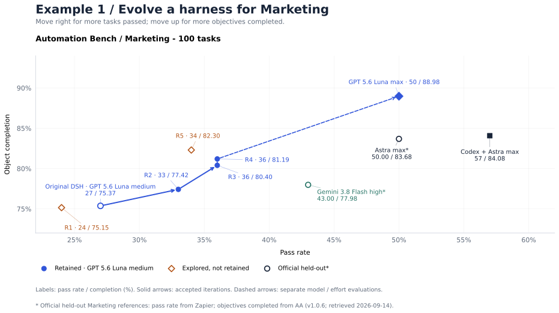

# 案例一：优化 Marketing Harness

使用 Gear 根据真实失败证据改进 Agent Harness。五轮迭代中，Luna medium 在 Marketing 公开研究集上的严格通过率从 27% 提升到 36%；最终保留 Harness 后续以 Luna max 评测达到 50%。



横轴为严格通过率，纵轴为目标完成度（本地 `partial_credit`）。实线连接保留的迭代，虚线表示单独切换到 max effort 的评测，没有新增 Meta 轮次。模型名后的 `*` 表示官方 held-out Marketing 参考，通过率取自 Zapier，目标完成度取自 AA；[指标口径](results.md)。两图使用相同的放大坐标范围。[图表数据与来源](../assets/marketing-results.json)。

## 初始指令

```text
使用 Refine Skill，在全部 100 道公开 AutomationBench Marketing 题上优化 Harness。
Meta 使用 Astra ultra，rollout 使用 DSH + Luna medium。
共优化 5 轮，保持模型和评测设置一致。
```

## 五轮中发生了什么

| 轮次 | 候选通过率 | 保留 champion | 改动与决定 |
| --- | --- | --- | --- |
| 初始 | 27/100 | 27/100 | 原始 DSH，通用仓库任务指引。 |
| 1 | 24/100 | 27/100 | endpoint discovery 后继续读取业务内容；CLI 退出故障后回收真实结果，保留原 failed 轮次。 |
| 2 | 33/100 | 33/100 | 来源驱动业务操作：读取流程，记录处理范围和目的地内容要求。原决定在 33/99 时接受，图中使用后来补齐零分后的全量结果。 |
| 3 | 36/100 | 36/100 | 修改前解析常设流程、补充修订和已有目的地。 |
| 4 | 36/100 | 36/100 | 结构化 CLI 请求传输，partial credit 提高，按已封存的零最小增益策略接受。 |
| 5 | 34/100 | 36/100 | 记录集合与载荷一致性辅助程序，严格通过率下降，被拒绝。 |

最终保留第 4 轮 `8b651c53cadfe70de39078e93d8cb9c3958b9c38`，第 5 轮修改没有进入导出 champion。[图表数据与注释](../assets/marketing-results.json)区分原始决定、证据回收与补齐。

## 最后保留的 Meta 修改

第 4 轮新增 `structured-cli-requests.md` 与 `structured-cli-requests/request.py`，并从 policy 和业务操作 workflow 接入。辅助程序将可读 JSON 序列化为 CLI 参数，并对编码内容做 UTF-8 往返校验，针对手写 shell 引号或复制编码文本造成的内容损坏；它不负责理解业务规则或选择记录。

查看[实际补丁](../../../examples/automationbench-marketing/last-meta-change.patch)。这一机制通过普通 workflow 读取使用，不是原生 Skill。runtime 检查说明加载路径有效；该实验没有逐条统计所有辅助程序在轨迹中的采用率。

新增 workflow 的核心指令（真实补丁节选）：

```diff
+# Structured CLI requests
+
+Keep the reviewed request as readable JSON. Let code handle quoting, nested
+serialization, and encoding; carry encoded output directly into the destination
+call without copying it through a model message.
+
+Use this procedure only with the adapter, tool names, and argument schema
+provided by the current task. It does not discover endpoints, decide recipients,
+select records, or authorize writes. Resolve those with the operational workflow.
```

## 产出的 Harness

```text
harness/
  plugins/policy.js
  preset/agent.cordis.yml
  workflows/source-backed-operations.md
  workflows/resolve-workflow-sources.md
  workflows/structured-cli-requests.md
  workflows/structured-cli-requests/request.py
  manifest.json
```

[下载源码包](../assets/marketing-harness-example.zip)、[浏览源码](../../../examples/automationbench-marketing/README.md)，或在本地验证：

```bash
node examples/automationbench-marketing/inspect.mjs
```

包中包含确切 Harness 源码、历史 manifest、保留补丁、Meta 输入、来源信息和检查工具。运行时按[实验模板](../../../examples/dsh-codex-luna/README.md)导入新载体，产生新的身份与结果；不能靠复制状态文件冒充原实验。

## 结果与范围

五轮期间保持 Target 模型、medium 档、公开题集与评测合同固定。原始与最终全量通过率为 27% 和 36%，观察到 9 个百分点提升；partial credit 约从 75.37% 到 81.19%。

最终 Harness 在单独一次 max 档评测中达到 50/100，全部有效，没有新增 Meta 轮次。因此 36% → 50% 的变化应归入 effort 对照，不记为另一次 Harness 修改收益。

图中官方 Marketing 参考使用私有 held-out 题集，在同一坐标系中加 `*` 标记。公开题集参与过优化，本案例不声称独立泛化提升或官方 SOTA，见[评分与可比性](results.md)。

## 换一种算法继续研究

[案例二](example-algorithm.md)从这个确切的 36% champion 开始，介绍另一种搜索过程，具有独立配置、三轮记录及最终 Harness。
