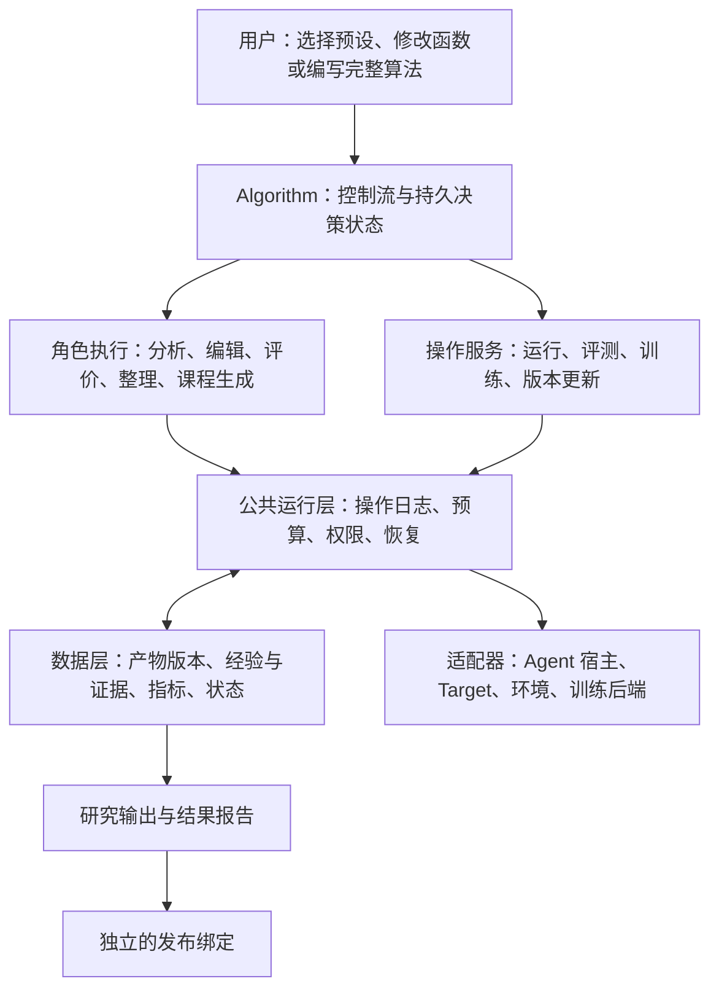

# 从 Harness 演化论文到 Gear Meta Agent 的算法架构

- 日期：2026-09-23
- 状态：研究与设计草案，尚未实现
- 代码基线：`dev` / `f715748`
- 阅读范围：用户提供的总引，以及同目录 19 篇单篇论文笔记；由 3 个 GPT-6 Sol 阅读组交叉归纳，主任务核对 Gear 源码。
- 实施入口：[具体实现方案与批次验收](meta-agent-algorithm-implementation-plan.zh-CN.md)。首版 API 边界以实施方案为准。
- 证据边界：本文对论文的描述依据本地笔记，未重新逐篇审计原始 TeX、作者代码或复现实验；源码结论来自上述 Gear commit。下文接口、目录与验收用例均为建议，不能当成现有 API。

## 1. 结论

这些工作共同研究的是：如何利用执行经验，更新会影响后续行为的持久状态。持久状态可能是可执行 Harness、技能库、记忆、训练课程、环境包装器、模型参数，甚至负责改进的算法程序。

共同基础是“有来源的观察 → 可解释的决策 → 可版本化的状态变化 → 后续反馈”。它们并没有共同采用一个固定的“生成 N 个候选 → 四阶段评测 → 替换冠军”算法。总引也明确，其统一公式只是比较框架。[S0]

Gear 应把 **GEPA 保留为一个完整算法插件**，把 **Meta Agent 扩展为算法可以调用的角色执行服务**，把版本、证据、资源、执行和恢复抽取为公共运行层。用户可通过一个预设加几个函数定制常见变体，也可写完整控制流程；两种路径调用相同运行层。

能表达算法、能忠实复现论文、能达到论文结果是三个不同目标。架构验收先证明第一项；论文未公开的阈值、提示词、预算或训练实现必须列为复现缺口，不能由框架默认值冒充。

## 2. 阅读地图：十九篇实际在更新什么

| 工作 | 持续变化的对象 | 关键流程或贡献 | 对框架的要求 |
| --- | --- | --- | --- |
| Meta-Harness [S1] | 完整 Harness 程序、候选历史、Pareto frontier | Proposer 查询历史代码和原始轨迹，产生并评测新程序；保留低分尝试，最后选输出 | 全历史查询、任意历史父代、种群状态；入库与最终选择分开 |
| Self-Harness [S2] | 当前 Harness 与编辑记录 | 同一基础模型分阶段执行和提案；并行小编辑，双切分非退化门控，兼容修改合并 | 角色独立于模型身份；自定义 gate；编辑组合与组合版本的证据身份 |
| AHE [S3] | 工作区、change manifests、最佳已测版本 | 先评测上一轮版本，核验先前预测并回滚，再提交新修改 | 延迟归因、逐文件回滚、pending 与 measured 分开 |
| HarnessFix [S4] | 受限修复的 Harness、修复经验 | HTIR、数据/控制流与实现锚点 → repair specification → patch → 回归验收 | 可选的轨迹结构索引、读写范围、异步诊断与修复 |
| RHO [S5] | 整个 Harness 目录；主实验只更新一轮 | 无标签选 coreset、重复运行、生成目录候选；最高平均偏好 `S>0` 才替换固定基线 | 标签不可见的 rollout 与偏好反馈；无需强制可执行 grader 才能开展搜索 |
| LLM-as-a-Verifier [S6] | 通常不更新 Harness | 对既有轨迹进行概率评分与 pivot tournament | 可单独使用的评估/排序部件；被选轨迹不能自动等同被验证 Harness |
| Harness-R1 [S7] | Harness engineer 模型参数 | Failure packet → 多个临时 hook overlay → 同批任务重跑 → GRPO 更新 editor | 临时候选、分组奖励、训练作业；不强制选一个 patch 永久晋升 |
| Evo-Harness [S8] | Markdown 技能库 | 每题检索，失败提炼提案，批末 curator 增/并/改/跳过 | 在线任务流、批次快照、技能编译和未来检索；不强加论文没有的评测门 |
| DGM [S9] | 开放的代码版本 archive | 按性能/新颖性选父代，诊断并修改，保留有效但低分的分支 | 非单调搜索、多个可繁殖版本、与部署指针独立的 archive |
| Gödel Agent [S10] | 当前 policy 和 improvement routine 的运行时代码 | 自检 → 交互 → monkey patch → 递归调用更新后的程序 | 算法程序本身可版本化；运行时快照/恢复需专门适配器 |
| RRSI [S11] | 当前 Harness、有效测量账本、历史最佳分数 | 动态编辑基数、critic、停滞探索、剪枝提案、分数/成本/新颖性分支准入 | 历史相关策略、成本和结构指标、多种候选操作；允许噪声带内降分 |
| HarnessDev [S12] | Creator 构建和修改的 Harness | 弱 seed creation、自主开发、冻结评测、creator 声明终版、隐藏集事后审计 | Agent 主导的编排；这是基准协议，不是固定优化算法 |
| RSIAgent [S13] | 外部操作记忆、课程状态 | 广度并行练习、按顺序合并记忆、深度练习、冻结记忆重跑目标 | Fan-out/串行 reducer、会话恢复、环境重置；显式记录目标已暴露 |
| EnvHarness [S14] | 训练环境 wrapper，及由经验提取的技能等状态 | 改训练起点/交互契约，验证 wrapper，收集轨迹；主自动流程为 Stage/Contract，Chain 单独评估 | 环境与 Agent 两条版本线；训练环境候选不等同上线 Harness |
| SkillMaster [S15] | 模型参数与技能库 | 任务执行与技能管理，旧/新技能库 probes，双奖励/分阶段 advantage 训练 | 多对象状态、带 token 阶段的训练样本与自定义 reward/trainer |
| SkillSmith [S16] | 技能、工具、反模式记忆、组件效用、archive | 原子修改包、测试、组件协同/冲突、Pareto 保留和分支组合 | Skill+tool 原子 bundle、组件级统计、多父来源和可替换检索策略 |
| Socratic-SWE [S17] | 共享模型、skill registry、课程 | 轨迹蒸馏 → 生成并验证任务 → 梯度对齐选课程 → 训练 | Proposal 可以是训练任务；registry 主要用于课程生成，不能假定是部署技能库 |
| Learning from Failure [S18] | 可累积的 Agent 代码/策略版本 | 失败诊断、人工筛选、LLM 实施、后续回测 | 可持久等待的人工决策；不能把人工步骤悄悄省略为全自动 |
| Experience Graphs [S19] | 搜索经历、产物、关系、统计、训练视图 | 不同外层搜索共用数据底座，按历史时点构造训练数据 | 经验图与 as-of 查询；本身不是又一种候选生成算法 |

总引原本覆盖前八篇；其余十一篇扩大了状态空间与控制流程。不能仅用前八篇的线性示意图决定新框架的能力边界。

## 3. 共同范式，以及必须保留的差异

### 3.1 学习发生在跨任务或跨步骤保留的状态里

一个任务的重试、一个候选的重复评测、一次 Harness 更新和一次梯度更新是不同事件。系统应分别记录 episode、batch、proposal、measurement、artifact revision、optimizer update、campaign；`round` 是算法定义的分组标签。

按这组笔记，可以将总状态理解为：

`State = artifact revisions + algorithm state + experience index + active bindings`

其中 artifact 可包含 Harness、skills/memory、模型 checkpoint、课程、环境 wrapper、算法版本。一个方法只需使用它实际更新的部分，不必创建所有对象。

### 3.2 证据、解释、评价和接纳是不同对象

原始轨迹与状态观察是证据；失败解释与预测收益是可检验的假设；分数、偏好和训练奖励是带来源的测量或派生结果；采纳与否是算法决策。AHE、HarnessFix 和 RRSI 都说明，记录解释不等于已证明因果贡献，尤其多个编辑共享一个候选结果时。[S3][S4][S11]

同时，反馈信号不能被压成一个没有语义的 `score`：可执行测试、模型自偏好、独立产物检查、gradient alignment、训练奖励和成本有不同含义。`UNVERIFIED`、infra-error、未测量也不能转换成业务失败或零成本。[S5][S6][S13][S17]

### 3.3 保留知识与替换当前版本不是同一个决定

至少区分以下动作：记录尝试、进入研究 archive、可作为父代、成为当前研究状态、成为最终选定输出、正式部署。DGM 的低分节点可以繁殖；AHE 的新 commit 尚待下一轮评测；R1 的 patch 可以完成使命后丢弃；RHO 可以按软偏好选定输出而没有真实标签证明。[S3][S5][S7][S9]

这些含义不能统一由 `accepted: boolean` 或 `championChanged` 表示。正式部署可以附加产品发布策略，但应与论文原始搜索选择分开记录。

### 3.4 同模型、同角色和同会话不是同一件事

Self-Harness 的同模型提案，RHO 的同 backbone 分工，以及 RSI 的 actor/verifier/curriculum 都需要分别记录：角色职责、模型/采样身份、上下文来源、可见证据、会话延续方式。[S2][S5][S13]

一个物理模型可以担任多个角色；一个角色也可以是确定性程序、训练好的小模型或人工步骤。角色名不应成为必须分别创建昂贵 Agent 的硬编码列表。

## 4. 目标架构



### 4.1 Algorithm 拥有流程，GEPA 是其中一个实现

算法决定何时取什么证据、选择何种状态作为起点、生成多少个什么类型的候选、调用哪些评价、怎样保留状态、何时停止。允许循环、分支、并行汇合、延迟反馈、流式事件和嵌套训练；不要求先把流程转换成一个静态 DAG。

运行层负责执行已经验证的请求、保存事实与兑现资源约束。它不隐式替算法增加 global-seed、held-out、唯一 finalist 或严格非退化 gate。

建议底层采用持久的 command/event 协议：决策产生 `operation intents`，执行完成产生 events，算法状态和后续意图一起提交。上层提供两种作者体验，共用这一协议：

- 预设组合：从 GEPA、archive search、skill curation 等 recipe 替换少量决策函数。
- 完整 recipe：使用 Python 或 TypeScript 的 recipe helper / 显式决策函数，通过语言无关的持久操作协议运行；首版不承诺任意函数栈自动恢复，不要求作者手写数据库和恢复循环。详见实施方案第 13 节。

后续可把同一操作协议暴露为受限工具，使 LLM planner 自主提出下一步操作，支持 HarnessDev 式自主工程。每次 planner 决定也要持久化；恢复时不能重新提问并暗中改选父代。

### 4.2 Meta Agent 成为可调用的角色执行服务

把当前面向 `wakeCandidate(round, candidate, baseline)` 的专用任务，向通用 `AgentJob` 演进：

| 字段 | 含义 |
| --- | --- |
| `role` / `implementationRef` | 本次职责和实际模型/preset/Skill/程序版本 |
| `inputRefs` / `contextPolicy` | 输入产物、证据及选取上下文的规则 |
| `readScope` / `writeScope` | 能读取哪些证据、修改哪些产物 |
| `outputContract` | 返回诊断、patch、skill proposal、课程还是结构化决策 |
| `sessionPolicy` | fresh、fork、resume；延续的是哪个已记录上下文 |
| `budget` / `capabilities` | 可执行的资源上限、工具能力和取消能力 |

GEPA 调用 editor；HarnessFix 可以先调用 trace analyst；Evo-Harness 调用 proposer、curator、retriever；RRSI 使用 analyst、critic、proposer。既能调用不同模型，也能共享模型但隔离上下文。

保留现有 DSH 与外部 Skill 宿主接入方式，不重新发明一套 Agent prompt/tool DSL。宿主实现会话与模型执行，Gear 管理实验任务、可见性与结果合同。

### 4.3 以可组合状态版本代替单一 Harness 候选

建议建立小而通用的 `ArtifactRef`，记录 kind、内容身份、schema、生产操作和有类型的来源关系；具体 artifact 由插件提供验证器和 materializer。无需把所有类型字段塞进一个越来越大的公共接口。

运行使用 `BundleRef`：例如某次 rollout 绑定 Harness H3、技能库 K8、模型 M2、环境 E1。组合必须被封存，评测才能绑定实际运行对象。模型权重使用内容寻址的大文件引用，不复制进每个 Git commit。

谱系至少区分：

- `code-base`：工作区从哪个代码版本派生；
- `merged-from` / `informed-by`：合并或参考了哪些产物与证据；
- `trained-from`：模型更新使用哪些 checkpoint 与训练样本；
- `derived-from`：技能、报告、课程从哪些经历形成。

不能仅把 `parentIds` 改为数组，就宣称支持 crossover。必须定义具体 merge 操作、冲突处理、合并后验证，以及新组合的独立身份。Self-Harness 的兼容合并也不能自动继承各个独立 patch 的分数；没有合并版本的实测，就明确标为未测。

SkillMaster 的模型与技能库、SkillSmith 的工具与技能，可以先分别生成不可变产物，再原子更新一个 bundle 指针。跨存储/GPU 过程通过 prepare/commit/reconcile 完成，不能假定一次数据库事务会让外部训练原子执行。

### 4.4 通用操作足够少，科学计算可以扩展

| 操作族 | 典型能力 |
| --- | --- |
| Artifact | fork、edit、merge、validate、seal、checkout/revert |
| Agent/Program | 执行指定角色、读写受限工作区、生成结构化结果 |
| Rollout | 使用冻结 bundle 在任务/环境中运行；支持无评分的轨迹收集 |
| Evidence/Feedback | 查询原件与索引、生成分析、可执行评分、偏好比较、probes |
| State | 更新算法状态、archive、当前绑定；记录每次选择依据 |
| Task/Environment | 接纳任务流、生成/验证练习、重置环境、版本化 wrapper |
| Training | 构造训练视图、提交作业、恢复 checkpoint、绑定新模型 |
| Human | 发出有上下文的决策请求、暂停并持久等待、接收结果 |

框架无需内置每种论文算子。HTIR、RRSI critic、SkillMaster utility reward、Socratic-SWE gradient alignment 可以分别作为有输入输出 schema 的程序/Agent/评价/训练插件。插件注册包含验证、预算计量和外部执行恢复合同。

### 4.5 经验和评价底座

先复用现有文件对象存储、journal、trajectory reader 和 experience memory，建立可查询索引；不必为了采用 Experience Graphs 的逻辑模型，立即引入专用图数据库。[S19]

需能够查询某个逻辑时间点的历史：父代、兄弟候选、失败证据、当时模型看见的上下文、修改预测、已获得反馈、后续 verdict。原件不可变，分析与索引保留派生来源；用最后状态回填过去决策，会污染复现与训练数据。

评价至少区分：被测对象、运行条件、测量来源、信号类型、算法用途、可见性。可以按同一份合法原始测量重新计算不同目标，但重新选择、训练或搜索应产生新的决策记录。

研究 archive、当前版本、最佳已测版本、最终声明版本、已部署版本各有自己的引用。是否保存低分节点、怎样排名、何时剪枝由算法决定；执行失败仍保留诊断记录。

### 4.6 数据角色和访问边界由实验协议声明

仅用 `seed/held-out` 不足以表达所有论文。协议可声明 development、preference-only、adaptive validation、training probe、final test，并分别配置任务可见性、标签可见性、结果投影、允许访问角色和暴露次数。

- RHO 的无标签轨迹仍可用于研究选择；若额外加入可执行 gate，应称为改良协议，不能说完全复现原 RHO。
- Self-Harness 中被反复查询的 held-out gate，应记录为参与自适应选择的验证信号，不能当作始终未触碰的最终测试。
- Socratic-SWE 用于梯度对齐的 validation 是训练/选择信号；RSI 已见目标甚至练习目标，报告中必须保留这种暴露事实。
- EnvHarness 可以在获授权的训练环境面内改变交互，但原始终局评分与最终测试环境必须按所选协议独立绑定。
- HarnessDev 的隐藏审计只覆盖 SWE-Pro 630 题；Terminal 的 89 题属于可见反馈，不能把两个开发 benchmark 描述成均有独立隐藏验证。

EnvHarness 的 Contract 还可能改写 Agent 看到的中间转移后果。建议 Gear 记录这些改写及其与原环境的关系，并提供可选的语义真实性审计；这是面向复用的工程扩展，不能宣称原论文已经保证中间反馈真实。忠实复现模式同时记录主自动流程与单独 Chain 实验的覆盖范围。

硬约束是遵守声明的访问边界、证据身份和预算，不能把某一种论文的统计协议写成所有算法的必经路径。协议本身在创建实验时固定，算法不能临时降低要求来接纳当前结果。

### 4.7 恢复语义不能推给算法作者

公共运行层持久化操作意图、实际请求摘要、reservation、外部执行身份和结果引用。外部作业支持 inspect/reconcile；结果不明时先查原作业，不能直接生成第二份候选或重复训练。

SDK 对循环/并行分支提供稳定的逻辑地址，例如 `round/3/proposals/2`，并校验同一地址恢复时的输入摘要。LLM 输出、随机抽样、数据流游标和人类决定一旦落盘便复用；不要假装普通 `async` 函数或进程内 generator 天然可恢复。

并发 worker 在不可变快照上运行，正式状态由单写者或 CAS 更新。RSI 的“并行练习、顺序合并”应明确体现在算法流程里；研究统计量可以声明较弱一致性，但不能影响已封存操作身份。

Gödel Agent 自修改应发生在插件/实验执行空间：新算法版本及其状态迁移形成显式分支或切换事件。任意进程内 monkey patch 如果没有 checkpoint/export 适配器，就应标记为不可恢复实验；不能为了声称覆盖论文而放开对 Gear 证据与预算核心的修改。

## 5. 开发者应当怎样使用

下面是建议的作者体验，不是当前可以直接运行的 API：

```text
my-algorithm/
  algorithm.ts        # 科学控制流程或对现有 recipe 的覆盖
  experiment.json     # 数据、角色、预算和算法配置
  algorithm.test.ts   # toy provider 上的行为与恢复检查
```

标准 CLI 应能加载本地模块或安装包，先校验配置和运行能力，显示生效算法/角色/评价协议，再开始真实运行。组件实现摘要、默认数据结构、操作记录与报告由 SDK 生成；开发者只在确有外部能力时编写 provider。

可以把一个新算法的主要代码写成下面的顺序。真实 API 应提供类型化版本；这些名字只是职责示意：

```text
加载算法状态和一组历史候选
按照自定义策略选父代 / 技能快照 / 训练状态
查询需要的证据
调用自定义分析器与编辑器产生修改
执行算法需要的测试、rollout、偏好比较或训练
按照算法规则更新 archive / memory / model / 当前状态
记录输出，继续或停止
```

常见用户不必每次写完整流程：可在 GEPA recipe 中替换父代策略、诊断规划或评测分配，也可直接安装 RHO/skill-curation recipe。完整算法作者能够改变步骤顺序，甚至完全不生成 Harness 候选。

“模型支持”应按角色单独绑定，功能要求由 capability 握手验证。例：LLM-as-a-Verifier 的原始评分方法需要评分 token 概率；缺失 logprobs 时可提供明确标识的替代方法，不能静默声称实现了同一算法。外部 Skill 宿主不能强制累计 token 上限时，也不得承诺已执行硬预算。

## 6. 对当前 Gear 的映射与迁移

最新 `f715748` 已增加 raw metric contracts、加权 objective、约束和独立评分证据。需要修正早先“评分无法定制”的笼统表述：**指标与线性加权目标已经可配置；任意评价程序和完整搜索控制流仍未成为通用插件。** [C6]

| 当前实现 | 可复用部分 | 必须调整的边界 |
| --- | --- | --- |
| `FailureClusterSearch`、`RefineService.driveSearch` [C1] | 已验证的 GEPA 流程和接入行为 | 通过 algorithm registry 选择；移除服务对唯一 GEPA driver 的直接依赖 |
| `SearchExecutionRuntime`、`SearchJournal` [C2] | 幂等执行、reservation/settle、结果身份、恢复经验 | `stage`、`round`、`archive`、GEPA workplan 等算法语义移到 recipe，底层保存通用操作与引用 |
| `MetaSessionController`、Skill/DSH adapters [C3] | 会话 fork/resume/cancel、宿主身份、候选隔离 | 加通用角色 job；保留 candidate job 作为兼容封装 |
| `Snapshot`、候选工作区与 builder [C4] | 确切 commit/tree/manifest、文件变更与检查 | 引入 artifact/bundle；区分代码基底与多来源谱系；允许非代码对象 |
| 公开 parent policy 与 testkit [C5] | 冻结输入、确定性随机源、配置身份、toy 测试 | 丰富合法的指标/成本/历史视图；不把父代策略误当完整算法接口 |
| `objective` / raw metrics [C6] | 测量与目标分离、单位/来源、约束、重算 | 保留为默认 scorer；允许偏好、向量、多目标和程序评价而不冒充原始测量 |
| `experience/memory.ts` [C7] | seed 经验卡、逐任务变化、来源和有界查询 | 扩展为算法无关的查询/时间视图，避免只绑定 parent-last-edit |
| `ModelTrainingCoordinator` [C8] | 已有的训练身份、作业、检查点和恢复协议及实现，可复用其控制语义 | 当前 fixedHarness + agent-grpo recipe 不等同 R1/SkillMaster；真实 GPU 执行、新 recipe 与 editor output credit 均须另行验证，静态 preflight 不代表运行时认证 |
| stock CLI / control-plane [C9] | 启动、身份、socket 与服务生命周期 | 加模块加载和统一算法配置；解除内部固定组件 ref 与注册脱节 |

推荐依次实施：

1. **先明确层次和协议。** 定义 algorithm manifest、通用操作意图/结果、artifact/bundle、数据角色；保留历史 schema 的原解释。
2. **把现有 GEPA 完整接入新算法入口。** 原有行为、证据可见性、预算和中断恢复必须保持；旧 evolution 继续由其封存版本执行。
3. **用不同范式验收控制流。** 外部包实现 RHO 和 AHE，分别证明无标签选择与延迟归因；再用 DGM 验证开放 archive。
4. **接入技能与记忆流。** 用 Evo-Harness 和 RSI 验证批次快照、在线游标、并行结果和串行合并，不创建伪造的冠军评测。
5. **接入训练和环境扩展。** R1、SkillMaster 与 EnvHarness 验证临时候选、训练 credit、联合状态和环境版本；梯度算子由 trainer/provider 扩展。
6. **最后提供受控的 Agent 主导流程与算法自修改。** 利用已稳定的操作协议支持 HarnessDev/Gödel 类实验，避免一开始把恢复与身份问题留给任意 Agent 会话。

每一步都要求新增方法通过外部包与公开入口实现。若又要在服务核心加入 `if algorithm === ...` 或增加某篇论文专属公共字段，说明抽象仍未完成。

## 7. 架构验收必须包括的反例

| 用例 | 必须观察到的行为 |
| --- | --- |
| GEPA 等价迁移 | 现有策略决策、已封存结果和恢复合同保持；不因新 SDK 重抽父代 |
| DGM 低分分支 | 低分但有效节点入 archive，并能成为下一次父代；不要求变成部署版本 |
| RHO 无标签 | Proposer/ranker 从未获得真实标签；仅当最高平均偏好 `max(S)>0` 时替换，否则保留基线；报告明确是软信号 |
| AHE 延迟评测 | 下一轮结果绑定被执行的旧版本；文件回滚创建新 revision；未测版本不能误记为 best |
| Evo-Harness 在线流 | 批内读取固定技能快照，批末版本更新，恢复后不重消费任务或重复合并 |
| RSI 并发练习 | 多个练习读同一旧快照，按声明顺序合并到最新记忆；目标暴露有记录 |
| R1 临时 patch 组 | 全组测量可用于 editor 更新，过程中没有自动把 winner patch 设为永久 Harness |
| SkillMaster 联合更新 | reward 分别归于行动/技能 token，模型和技能状态可一致恢复；能力不足时明确拒绝 |
| RRSI 非单调准入 | 正确实现历史最佳下限、成本分支与新颖性规则；不被全局严格增分 gate 覆盖 |
| Self-Harness 合并 | 多编辑合并的 bundle 单独有身份；没有实测时不能继承单编辑分数 |
| EnvHarness 双环境 | 训练 wrapper 与原始测试环境独立绑定；记录可见转移改写和所用 Stage/Contract/Chain 范围，区分额外审计；不把训练环境的简化成绩当原环境成绩 |
| 人工步骤 / 自修改 | 人工决定可持久等待；算法版本切换有历史事件，旧任务不悄悄跑新实现 |
| 独立开发者体验 | 打包后在仓库外安装，仅用公开 API 完成配置检查、toy round、中断恢复和真实 provider 接线 |

覆盖这些控制流只能证明架构表达力，不能证明完整复现全部论文，更不能代替实际基准结果。建议首先交付 GEPA + RHO + AHE + Evo-Harness 四个可运行范例，再逐步覆盖训练与环境类工作。

## 8. 参考索引

### 本地总引与单篇笔记

正文及对照表中的 S0–S19 可点击打开对应笔记；各笔记保留原论文链接及阅读范围。

[S0]: </Users/zgq/Library/CloudStorage/OneDrive-个人/笔记/papers/harness/Harness Evolution Papers Comparative Review.md>
[S1]: </Users/zgq/Library/CloudStorage/OneDrive-个人/笔记/papers/harness/Meta-Harness End-to-End Optimization of Model Harnesses.md>
[S2]: </Users/zgq/Library/CloudStorage/OneDrive-个人/笔记/papers/harness/Self-Harness Harnesses That Improve Themselves.md>
[S3]: </Users/zgq/Library/CloudStorage/OneDrive-个人/笔记/papers/harness/Agentic Harness Engineering Observability-Driven Automatic Evolution of Coding-Agent Harnesses.md>
[S4]: </Users/zgq/Library/CloudStorage/OneDrive-个人/笔记/papers/harness/From Failed Trajectories to Reliable LLM Agents Diagnosing and Repairing Harness Flaws.md>
[S5]: </Users/zgq/Library/CloudStorage/OneDrive-个人/笔记/papers/harness/Evolving Agents in the Dark Retrospective Harness Optimization via Self-Preference.md>
[S6]: </Users/zgq/Library/CloudStorage/OneDrive-个人/笔记/papers/harness/LLM-as-a-Verifier A General-Purpose Verification Framework.md>
[S7]: </Users/zgq/Library/CloudStorage/OneDrive-个人/笔记/papers/harness/Harness-R1 Learning to Edit Executable Runtime Harnesses from Agent Failure Trajectories.md>
[S8]: </Users/zgq/Library/CloudStorage/OneDrive-个人/笔记/papers/harness/Evo-Harness Context-to-Harness Skill Compilation for Self-Evolving Agents.md>
[S9]: </Users/zgq/Library/CloudStorage/OneDrive-个人/笔记/papers/harness/Darwin Gödel Machine Open-Ended Evolution of Self-Improving Agents.md>
[S10]: </Users/zgq/Library/CloudStorage/OneDrive-个人/笔记/papers/harness/Gödel Agent A Self-Referential Agent Framework for Recursively Self-Improvement.md>
[S11]: </Users/zgq/Library/CloudStorage/OneDrive-个人/笔记/papers/harness/RRSI Regularized Recursive Self-Improvement of Agent Harnesses.md>
[S12]: </Users/zgq/Library/CloudStorage/OneDrive-个人/笔记/papers/harness/HarnessDev Can LLMs Create and Evolve Their Own Agent Harness.md>
[S13]: </Users/zgq/Library/CloudStorage/OneDrive-个人/笔记/papers/harness/RSIAgent Autonomous Exploration for Recursive Self-improvement in New Environments.md>
[S14]: </Users/zgq/Library/CloudStorage/OneDrive-个人/笔记/papers/harness/EnvHarness Awakening Static Worlds for Agent Learning.md>
[S15]: </Users/zgq/Library/CloudStorage/OneDrive-个人/笔记/papers/harness/SkillMaster Toward Autonomous Skill Mastery in LLM Agents.md>
[S16]: </Users/zgq/Library/CloudStorage/OneDrive-个人/笔记/papers/harness/SkillSmith Co-Evolving Skills and Tools for Self-Improving Agent Systems.md>
[S17]: </Users/zgq/Library/CloudStorage/OneDrive-个人/笔记/papers/harness/Socratic-SWE Self-Evolving Coding Agents via Trace-Derived Agent Skills.md>
[S18]: </Users/zgq/Library/CloudStorage/OneDrive-个人/笔记/papers/harness/Learning from Failure Inference-Time Self-Improvement for Computer-Use Agents.md>
[S19]: </Users/zgq/Library/CloudStorage/OneDrive-个人/笔记/papers/harness/Experience Graphs The Data Foundation for Self-Improving Agents.md>

### Gear 源码（f715748）

对应迁移表中的 [C1] 搜索接入、[C2] 执行层、[C3] Meta 会话、[C4] 候选版本、[C5] 父代策略、[C6] 原始指标与目标、[C7] 经验、[C8] 训练、[C9] 控制面。

[C1]: /Users/zgq/.codex/worktrees/meta-agent-algorithm-plan/gear/src/refine/service.ts:2448
[C2]: /Users/zgq/.codex/worktrees/meta-agent-algorithm-plan/gear/src/search/runtime.ts
[C3]: /Users/zgq/.codex/worktrees/meta-agent-algorithm-plan/gear/src/meta/controller.ts:62
[C4]: /Users/zgq/.codex/worktrees/meta-agent-algorithm-plan/gear/src/search/types.ts:135
[C5]: /Users/zgq/.codex/worktrees/meta-agent-algorithm-plan/gear/src/search/parent-selection.ts
[C6]: /Users/zgq/.codex/worktrees/meta-agent-algorithm-plan/gear/docs/refine-objectives.zh-CN.md
[C7]: /Users/zgq/.codex/worktrees/meta-agent-algorithm-plan/gear/src/experience/memory.ts
[C8]: /Users/zgq/.codex/worktrees/meta-agent-algorithm-plan/gear/src/training/types.ts:183
[C9]: /Users/zgq/.codex/worktrees/meta-agent-algorithm-plan/gear/src/skill/control-plane.ts
