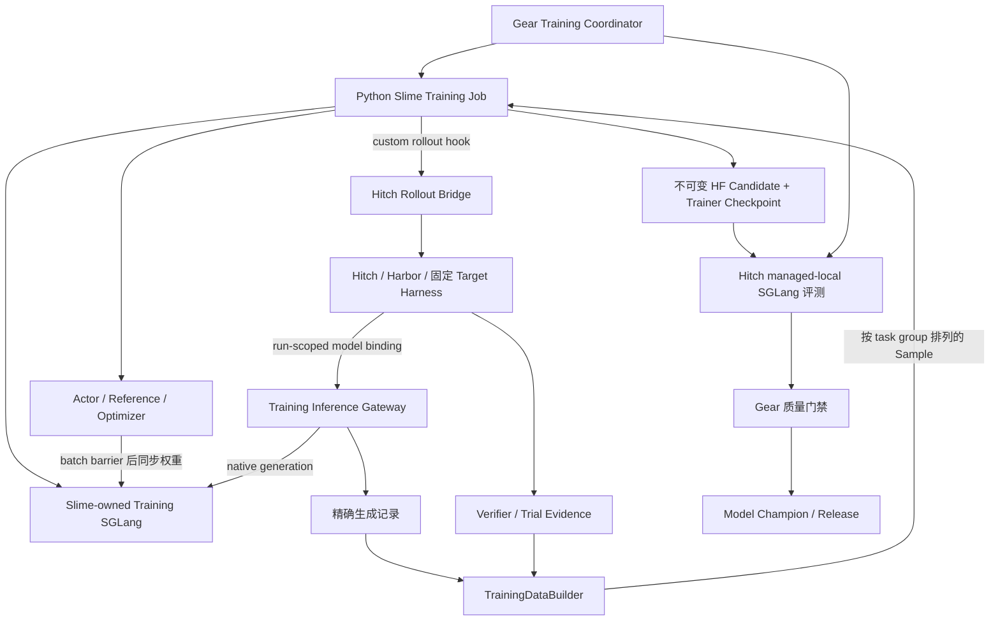

# Gear × Hitch × Slime 模型训练链路

本文定义 Gear 模型权重训练的数据、执行、恢复与评估合同。模型训练复用 Hitch 的 Agent 执行、Harbor 评分和 SGLang 模型评测；实际配置和支持范围见 [训练指南](training/README.zh-CN.md)。

## 1. 建议先确定的方案

建议第一版交付一个可追溯的批次 RL 闭环：

```text
固定 Harness 与训练任务集
  → Slime 当前策略生成同任务的多条 Agent 轨迹（Hitch / Harbor 执行）
  → 生成时记录精确 token / logprob / 模型版本
  → 独立 verifier 评分，封存训练批次
  → Slime GRPO 更新 Target Model
  → 导出不可变 HF checkpoint
  → Hitch 本地 SGLang 评测 baseline / candidate
  → Gear 选择、晋升或拒绝
  → 下一轮从已晋升模型继续
```

职责建议如下：

| 组件 | 本链路的职责 |
| --- | --- |
| Gear | 实验、数据分区、训练任务编排、模型谱系、独立评测、champion 与发布决策 |
| Hitch / Harbor | 精确 Harness 版本执行、任务环境、并发与取消、原始轨迹、verifier 产物，以及不可变模型的本地评测 |
| Slime | Actor / reference model、优化器、GRPO、训练 checkpoint、训练用 SGLang 与权重同步 |
| 新增 Python 训练桥 | 将 Slime rollout hook 接到 Hitch，将生成事实与任务结果转换为 Slime `Sample` |
| 新增训练推理网关 | 将 Agent 请求接到 Slime SGLang，记录生成时 token 证据，绑定 episode 与策略版本 |

Gear 是唯一演进控制面，管理训练任务、模型版本、评测和发布决策；Hitch 与 Slime 通过明确的执行和数据合同接入。

第一版固定 Harness、tokenizer、chat template、任务集及 verifier，仅改变模型权重。Seed Task Evolution、Harness 与模型联合搜索、在线用户反馈训练、其他训练算法、LoRA 多租户与无停机热发布留作后续扩展。

## 2. 核查基线与真实能力

本稿按以下源码快照设计；实施前应锁定一组通过集成测试的版本，不能按浮动 `dev` / `latest` 安装。

| 项目 | 核查版本 | 与本方案有关的事实 |
| --- | --- | --- |
| Gear | `c417aec76d54447c2ff777338396c1adbd1772ea` | 当前 `EvolutionSpec.rollout.model` 固定模型；candidate、champion 仍以 Harness Git commit 为中心。[类型](../src/types.ts)、[组件](../src/evolution/components.ts) |
| Hitch `origin/dev` | `9788b85199f3f087fa59fff85dd7ddfba8831ed4` | 已合并 managed SGLang、HF safetensors 模型导入、推理锁、设备预留与模型 endpoint binding；真实 GPU / Harbor 集成仍有 Preview 验收边界。[已合并规范](https://github.com/rsi-gear/agent-hitch/blob/9788b85199f3f087fa59fff85dd7ddfba8831ed4/docs/local-model-inference-spec.zh-CN.md) |
| Slime | 首期候选版本：`41014d1f29e201137fdffce737bb8bac65bc5219`；另核查上游 `4c193f1f37509cca70f0e88807a9305b70f63f4e` | 两版均有 custom rollout、外部 SGLang 接入及 disk 权重更新相关实现；这些能力不代表 Hitch gateway 已暴露对应合同。[Slime 固定源码](https://github.com/THUDM/slime/tree/41014d1f29e201137fdffce737bb8bac65bc5219) |

### 2.1 Hitch 可以直接复用什么

- `models add / inspect` 导入并校验 HF safetensors、tokenizer、template，产生内容寻址模型 ID。
- `local prepare` 与 managed SGLang 生命周期；`local/<name>` 最终解析为不可变模型身份。
- 普通 Harbor dataset eval、run / trial / verifier 证据、模型访问代理及 endpoint 注入。
- 模型 snapshot、runtime 与 inference lock 可组成评测装配身份。

### 2.2 训练还缺什么

| 缺口 | 影响 |
| --- | --- |
| 当前 inference lock 固定 `temperature=0`、TP / DP / PP = 1，context 默认上限 8192，output 默认上限 2048 | 不能直接当作可配置的随机多样本训练 rollout 服务；长 Agent 任务也可能被截断 |
| local inference preflight 当前只放行 `model-call` 与 `codex@version:0.145.0` | 不能默认 DSH 或任意 Harness 已可使用本地模型；选择其他 Harness 需要增加受测 adapter 支持 |
| 现有 gateway 仅支持受限兼容 API 路由，默认 protocol 为 Responses | `/generate`、`/server_info`、管理与权重更新不是现有公开桥接合同 |
| `model_endpoint.kind` 当前仅 `managed-local` | Slime 所有的训练 endpoint 需要新增类型及 request → plan → runtime 投影 |
| 捕获记录主要是脱敏 HTTP / provider 内容与 usage | “capture complete” 不保证 exact token IDs、逐 token logprob、loss mask 或训练策略版本完整 |
| 现有身份绑定 immutable model snapshot | 在该服务里热改权重，会使实际策略与已记录的 model ID 不符 |
| Gear 当前 evaluator 仍以固定模型、可变 Harness 比较为中心 | 需要模型轴的配对身份与模型 candidate，不能仅换 `--model` 字符串 |

证据：[Hitch lock](https://github.com/rsi-gear/agent-hitch/blob/9788b85199f3f087fa59fff85dd7ddfba8831ed4/src/inference/lock.ts#L56)、[gateway](https://github.com/rsi-gear/agent-hitch/blob/9788b85199f3f087fa59fff85dd7ddfba8831ed4/src/model-access/local-gateway.ts#L97)、[endpoint 类型](https://github.com/rsi-gear/agent-hitch/blob/9788b85199f3f087fa59fff85dd7ddfba8831ed4/src/domain/inference.ts#L170)、[interaction 类型](https://github.com/rsi-gear/agent-hitch/blob/9788b85199f3f087fa59fff85dd7ddfba8831ed4/src/domain/interactions.ts#L28)、[Harness allowlist](https://github.com/rsi-gear/agent-hitch/blob/9788b85199f3f087fa59fff85dd7ddfba8831ed4/src/inference/preflight.ts#L91)。

## 3. 核心设计约束

1. 生成记录与反馈通过明确的 run / episode / request ID 关联。
2. 训练数据构造器校验样本资格、精确 token、loss mask 和终止状态，保存拒收原因。
3. 同一 episode / batch 内冻结策略版本，权重更新只发生在生成请求全部结束后。
4. 模型版本、训练恢复点与部署 release 分别保存不可变记录。
5. 候选必须通过独立 dev 与 held-out 评测；训练 loss / reward 上升不能直接触发晋升。

第一版选择同步 GRPO：同一可复位任务可以生成多条独立尝试，并由固定 verifier 给出终局分数，适合按任务组计算相对优势。多轮轨迹、采样和分组约束见第 7 节。

## 4. 运行架构与资源所有权



### 4.1 推荐：训练与评测分开拥有推理服务

Slime 管理 training SGLang，沿用其训练框架的权重同步流程；Hitch 管理 eval SGLang，只加载封存的模型。新训练网关可以是 Python bridge 的模块，不要求第一版另建一个常驻平台。

Hitch 的新增外部绑定只给任务提供生成能力。Actor 及 SGLang 管理 API 不进入 Agent 容器；Harbor 容器只持有本 run 的生成凭据。网关地址必须从容器可达，不能把宿主 `127.0.0.1` 直接作为容器 endpoint。

### 4.2 备选：全部 SGLang 由 Hitch 管理

Slime 原生有 external engine 入口，但需要原生服务信息、权重同步和管理能力。采用它需要 Hitch 新增专用 training service、可变 policy identity、管理租约、采样配置、多卡资源与重启后的版本核验。现有 immutable eval service 不能直接复用为这种训练服务。

此方案可作为后续统一运维方向；第一版选择上面的职责划分，减少对 Hitch 当前推理管理器的改动。[Slime 外部引擎实现](https://github.com/THUDM/slime/blob/41014d1f29e201137fdffce737bb8bac65bc5219/slime/backends/sglang_utils/external.py)。

### 4.3 GPU 与进程

- Slime / Ray 独占训练分配的 GPU，Hitch eval 使用另一个设备池，或在训练进程停止并释放设备后运行。
- Slime 内部也要预算 Actor 与 rollout 引擎：非 colocate 需要两者资源之和；colocate 是 Slime 管理的显存切换能力，先独立验证再启用。Hitch baseline profile 的显存估算不能用于估算训练所需资源。
- 同一设备不能同时被 Hitch 推理预留与 Ray 训练分配；两个调度器不会天然感知彼此占卡。
- 第一版采用单训练任务、同步 batch；多卡由 Slime 自己管理。Gear 只管理外部 job handle，不再实现一套 Ray 调度器。
- 资源紧张时按“训练结束 → 持久化 → 释放 → 评测”串行执行；不把显存 offload 宣称为设备已释放。
- 起步模型、GPU 型号、卡数与 context 长度由 preflight 和实测决定。这里没有测量过显存或吞吐，不能承诺单卡能运行完整配置。

## 5. 一轮训练的执行合同

`ModelTrainingRun` 表示一个 Gear 候选生成任务；它内部包含有限个 Slime update。其父版本必须是创建时固定的 champion。

1. **冻结实验**：解析模型与 Harness 内容摘要、train / dev / held-out 分区、recipe、verifier、runtime、预算、采样和 promotion policy。
2. **建立基线**：查找该模型与固定评测条件下的完整证据；可用则复用，缺失才评测。无法证明兼容时明确阻塞。
3. **启动训练**：从父模型对应 trainer checkpoint 恢复 Actor / optimizer；初始外部模型没有 optimizer 时执行明确的 cold start。
4. **打开 batch**：同步 Actor 到 training SGLang，验证权重版本，生成一份只允许当前版本的 `PolicyLease`。
5. **生成 task groups**：每个 task 从同一环境初始快照独立运行 G 次；Hitch 保存每次实际运行，网关保存模型调用事实。
6. **反馈与封存**：收齐完整有效组后，将 lease 从 serving 改为 draining，拒绝新请求与延迟重试；确认本 batch 的 Hitch runs、原生生成请求及 receipt 写入全部结束后关闭 lease，再封存 batch、返回 Sample。token / 版本 / 分区 / 终止检查必须在返回训练框架前完成。
7. **训练一步**：将 batch 交给 Slime，完成配置允许的优化步骤。批次消费与对应 checkpoint 关联。
8. **下一步或导出**：本 run 仍有预算则更新 training policy 后采新 batch；否则保存 trainer checkpoint，导出并校验 HF candidate。
9. **独立评测**：释放或隔离训练资源，通过 Hitch immutable 本地服务评测候选；同一 Harness、环境、任务、预算、采样，仅模型权重不同。
10. **决策**：候选通过门禁后成为新 champion；否则保留为研究记录，下一次新训练 run 仍从旧 champion 开始。

训练任务内部，策略从 `P0 → P1 → ... → Pk` 是正常优化过程。Gear round 之间，只有被接受的 `Pk` 可以成为下一轮父模型。不能把这两个层级混为一个 mutable champion。

Reference / KL 锚点采用实验开始时封存的 `referenceModelRef`，新 Gear round 不自动重置为新 champion。接受候选后继承它的 optimizer / scheduler / RNG 恢复点；拒绝候选后回到旧 champion 对应的恢复点。外部初始模型的 cold start 和 optimizer reset 必须在 spec 中明确；改变 reference 或 reset 策略应创建新实验，不能借恢复操作隐式改变算法。

## 6. 数据合同

以下类型均为**拟议版本化合同**，必须配套运行时 schema 校验。`ContentRef = {uri, digest, mediaType}`；digest 按规范化对象或文件字节计算，排除自身摘要字段。大数组保存到只读对象，不塞进 Gear round JSON。

### 6.1 模型、恢复点与运行时策略

```ts
interface ModelVersion {
  schemaVersion: 1;
  id: string;                         // immutable manifest digest
  parentModelVersionId?: string;
  hfSnapshotRef: ContentRef;           // weights + config + tokenizer + template
  weightsDigest: string;
  tokenizerDigest: string;
  chatTemplateDigest: string;
  architecture: string;
  dtype: string;
  trainingRunId?: string;
  trainerCheckpointRef?: ContentRef;
  provenanceRef: ContentRef;           // recipe, data, runtimes, export validation
}

interface TrainerCheckpoint {
  manifestRef: ContentRef;
  actorWeightsDigest: string;
  hfExportRef: ContentRef;              // file manifest，不反向引用 ModelVersion
  actorStateRef: ContentRef;
  optimizerStateRef: ContentRef;
  schedulerAndRngRef: ContentRef;
  dataCursorRef: ContentRef;
  committedUpdate: number;
  compatibilityDigest: string;         // backend, model topology, code, config
}

interface PolicyLease {
  trainingRunId: string;
  batchId: string;
  policyVersion: string;               // includes job incarnation + update number
  parentModelVersionId: string;
  synchronizedWeightsRef: ContentRef;
  runtimeInstanceId: string;
  samplingDigest: string;
  state: 'serving' | 'draining' | 'closed';
}
```

`policyVersion` 不等于模型昵称，也不等于 optimizer step 数。它映射 `(job incarnation, engine weight_version, synchronized weights identity)`，所有实际参与本 batch 的 replica 都必须完成同步确认。进程重启、从同一 step 重新加载，也必须核验权重并产生新的运行实例身份。只接受服务器生成时绑定并被 bridge 验证的版本。

`TrainerCheckpoint` 与 `hfSnapshotRef` 必须是同一个完成 update 的产物。先封存权重/HF 文件与训练状态，再构造 checkpoint manifest，最后生成引用它们的 ModelVersion；不得通过相互引用产生内容摘要循环。HF export 可以部署；仅 HF 文件不足以声称精确续训。Hitch model ID 和 Gear ModelVersion ID 可以不同，通过导入 manifest 建立明确映射，不能假定二者 hash 相同。

### 6.2 生成事实与反馈

```ts
interface GenerationReceipt {
  id: string;
  runId: string;
  episodeId: string;
  taskId: string;
  logicalAttempt: number;
  callIndex: number;
  requestId: string;
  policyVersion: string;
  runtimeInstanceId: string;
  tokenizerDigest: string;
  chatTemplateDigest: string;
  effectiveSamplingRef: ContentRef;
  inputTokenIdsRef: ContentRef;
  outputTokenIdsRef: ContentRef;
  behaviorLogProbsRef: ContentRef;
  rawRequestRef: ContentRef;
  rawResponseRef: ContentRef;
  finishReason: 'stop' | 'tool-call' | 'length' | 'abort' | 'error';
  complete: boolean;
}

interface FeedbackRecord {
  id: string;
  episodeId: string;
  runId: string;
  receiptIds: string[];
  verifierVersion: string;
  verifierEvidenceRef: ContentRef;
  outcome: 'valid' | 'invalid';
  reward?: number;                     // valid 时必须有限，不能 NaN
  feedbackRef?: ContentRef;
  supersedes?: string;                 // 修订追加，不覆盖历史
}
```

HTTP receipt 可放响应 header，但必须同时耐久关联 run / episode，不能依赖 Agent 会保留 header。streaming 的 receipt 在请求开始时分配，全部 token 与 terminal 信息持久化后才标记完整。

训练事实在生成边界获取：网关使用封存的 tokenizer / template 构造实际输入 token，以 token IDs 调用经过验证的 SGLang 原生生成接口，同时收集实际输出 IDs 和 logprob。若 runtime 只提供显示文本或缺失输出 token 身份，RL admission 失败；不得 decode 后重新 tokenize 来冒充生成事实。

网关负责把生成结果转换为 Harness 所需的工具调用协议。该协议适配、模板与 reasoning / tool parser 都属于模型装配身份，不能在训练与评测之间无记录地变化。

脱敏显示记录与精确训练记录是不同投影。若训练记录被删改而不再是实际输入，不能继续用于该次 on-policy 更新；第一版仅允许明确许可的训练任务进入精确数据集。

### 6.3 Episode、组与 batch

```ts
interface TrainingEpisode {
  id: string;
  groupId: string;
  slot: number;
  harnessRef: ContentRef;
  taskRef: ContentRef;
  environmentRef: ContentRef;
  policyVersion: string;
  runId: string;
  receiptIds: string[];
  feedbackId: string;
  termination: 'terminated' | 'truncated' | 'aborted' | 'infra-error';
  eligibility: 'eligible' | 'ineligible';
  rejectionReasons: string[];
}

interface TrainingBatchManifest {
  id: string;
  trainingRunId: string;
  policyVersion: string;
  recipeDigest: string;
  datasetSplitDigest: string;
  groupsRef: ContentRef;               // ordered groups, each exactly G episodes
  samplesRef: ContentRef;
  sourceEvidenceDigest: string;
  state: 'sealed';
}
```

去重键至少包括 `(trainingRunId, batchId, taskVersion, groupId, slot)`。反馈 ID、网络重试、Hitch rerun 不得制造新的逻辑样本槽。评分修订只影响尚未封存的 batch；已消费样本需要新数据版本或新的显式实验。

## 7. 多轮 Agent 到 Slime Sample

### 7.1 第一版选择：一个线性 episode 对应一个 Sample

Slime 的标准 Sample 已有 `tokens`、`response_length`、`loss_mask`、`rollout_log_probs`、`reward` 与 terminal status；bridge 必须按所锁定版本的精确长度语义转换。[Sample 源码](https://github.com/THUDM/slime/blob/41014d1f29e201137fdffce737bb8bac65bc5219/slime/utils/types.py)。

约定：

- `tokens = 初始 prompt + 第一次模型输出 + 后续上下文/工具结果 + 后续模型输出 ...`。
- `response_length` 是初始 prompt 之后的整个后缀长度，包含中间的工具 observation。
- `loss_mask` 与 `rollout_log_probs` 都与这一后缀等长；只有本策略生成、应优化的 token mask=1。
- 工具结果、用户输入、system、重渲染 scaffold 等外部上下文 mask=0，对应 logprob 位置用不参与损失的占位值；不能把它们作为模型生成 token。
- 每个 receipt 的输出 token、logprob 长度必须一致，所有有效值有限，episode 至少有一个可训练 token。
- 相邻调用的实际输入必须能证明是已有序列的前缀扩展。第一版遇到 compaction、rewind、分叉、上下文裁切或无法证明连续的模板重写，拒收整个 episode。
- 训练 profile 应预先关闭 compaction、子 Agent 与隐藏辅助模型调用；后续扩展必须显式描述调用图和信用分配。

示例（`C` 是上下文，`A` 是模型输出，`O` 是工具 observation）：

```text
tokens:          C C C | A A | O O O | A A A
training suffix:        A A | O O O | A A A
loss_mask:              1 1 | 0 0 0 | 1 1 1
log_probs:              p p | 0 0 0 | p p p
```

这种限制是第一版的可训练域，不应被解释为所有现有 DSH / Codex / Pi 轨迹都可直接训练。先用一个固定且通过模板连续性测试的 Target Harness；普通历史轨迹仍可用于诊断或另行构造 SFT 数据。

### 7.2 GRPO 分组与 credit assignment

- 一个 group 固定任务、环境初始快照、Harness、policyVersion 和采样策略，包含 G 条独立 episode；建议 smoke 从 `G=4` 开始。
- reward 由外部 verifier 产生；第一版只用封存定义的任务终局分数。有效失败保留为 0 或 recipe 定义的低分，不能被“只保留成功”过滤掉。
- 先按 episode 计算组内 relative advantage，再作用到 episode 的可训练 token；stock GRPO 可用于一 episode 一 Sample 的固定组。
- 全组同分时标记 `zero-variance`；不伪造优势。选择保留零优势组或整组跳过必须固定在 recipe；第一版建议整组跳过，并设置有上限的补采预算。
- 任一 episode 属于基础设施失败或不合格数据，整组不进入更新。仅在策略仍冻结且预算允许时修复缺失槽；策略已变化则关闭旧组，在新 batch 重采。
- 不把不同 task 的轨迹混成一组。Slime 内部 batch size、G、dynamic batching 与 DP 整除条件由 bridge preflight 验证，不够时不能复制样本凑数。
- 设 Slime `rollout_batch_size=B`、`n_samples_per_prompt=G`，交给 stock GRPO 的 batch 必须恰好有 B 个完整组、B×G 条连续按组排列的 Sample。过滤之后补采到 B 组才封存；预算不足由 bridge/coordinator 形成 `no-update / inconclusive` 结果并结束该次更新，不能向默认 manager 返回空列表，也不能以较小 batch 触发跨任务归一化。

**不能把变长多轮 episode 拆成若干 Sample 后直接交 stock GRPO。** 它的默认归一化按扁平样本布局处理，可能破坏 task group，还会让长 episode 获得更多权重。后续若支持 per-call transition，需要自定义 group advantage、episode 权重和损失聚合，并新增独立算法验收。

### 7.3 终止、采样与策略一致性

第一版采用同步采样 → 更新屏障；采样期间 Actor 不更新，SGLang 不换权重。`maxPolicyLag=0` 表示开始该次更新时行为策略就是当前 rollout 策略，不能拿数轮前的成功轨迹冒充本轮 on-policy 数据。

训练采样建议从 `temperature=1, top_p=1, top_k=disabled, repetition_penalty=1` 开始，显式映射 Slime / SGLang 的 disabled 表达。top-p 截断等行为分布改变先不启用：所核查 Slime 在 `top_p≠1` 时还要求 nucleus token IDs / offsets，仅 chosen-token logprob 不够。[实际校验](https://github.com/THUDM/slime/blob/41014d1f29e201137fdffce737bb8bac65bc5219/slime/ray/rollout.py#L828)。训练 runtime、Actor 重算与行为 logprob 的分布口径必须做数值验证；策略版本相同不自动意味着推理与训练数值完全一致。

训练网关必须拒绝 Harness 请求里与 recipe 锁冲突的采样值，不能只给 adapter 设置 defaults；所核查上游 adapter 允许请求值覆盖默认采样。token budget 只能在封存上限内收紧，并记录实际值及截断状态。[采样优先级](https://github.com/THUDM/slime/blob/41014d1f29e201137fdffce737bb8bac65bc5219/slime/agent/adapters/common.py#L416)。

PPO / GRPO 同一批次的有限 minibatch 更新是算法的一部分；必须封存 epochs、clip、KL/reference 配置。训练后不再跨 update 复用本 batch 作为新的 on-policy batch。

`terminated` 才默认参与本 recipe；`length` / step budget 耗尽是 `truncated`，取消是 `aborted`，容器、连接或 verifier 故障是 `infra-error`。第一版拒收后三类，不做 value bootstrap。将来若要用截断轨迹，需新 recipe 明确 bootstrap 与评分含义，不能硬编码为正常终止。

## 8. 新接口与仓库改动边界

本节接口名称是设计名称，**不是当前可执行命令**。

### 8.1 Gear

新增独立 `ModelTrainingSpec` 和 `ModelTrainingCoordinator`，避免把训练步骤伪装成 Harness 源码修改。复用现有内容摘要、durable intent、外部操作对账、evidence 和 promotion 机制；模型状态用独立 schema 存储，旧 Harness evolution 保持按其原 schema 读取。

拟议 provider：

```ts
interface ModelTrainer {
  preflight(spec: ModelTrainingSpec): Promise<TrainingCapabilities>;
  submit(request: TrainingRequest, idempotencyKey: string): Promise<TrainingHandle>;
  inspect(handle: TrainingHandle): Promise<TrainingStatus>;
  cancel(handle: TrainingHandle): Promise<TrainingStatus>;
  collect(handle: TrainingHandle): Promise<TrainingArtifacts>;
}
```

Gear 通过子进程 / job API 调用 Python bridge；状态、进度与产物是结构化 JSON，日志独立保存。不可 deep-import Hitch 的 Node 内部类，也不应把 Python / CUDA 栈装进 Gear plugin 进程。

模型比较至少需要：`EvaluationSubject = {harnessRef, modelVersionRef}`。模型 candidate 不能用假的 Git commit 替代，也不能原地改写旧 `EvolutionSpec.rollout.model`。

建议代码落点：新增 `src/training/`、模型 state / schema、Slime provider adapter；扩展 `src/evaluator/hitch-cli.ts` 的 subject / binding 与证据核验。先提取可共享评测身份逻辑，不在两个 coordinator 各复制一份隐式规则。

### 8.2 Hitch

新增 `training-external` model binding，与现有 `managed-local` 并列：

```ts
interface TrainingExternalBinding {
  kind: 'training-external';
  bindingId: string;
  trainingRunId: string;
  policyLeaseRef: ContentRef;
  expectedPolicyVersion: string;
  fencingToken: string;
  expiresAt: string;
  endpointRef: string;                 // resolve 到受控生成网关
  credentialRef: string;               // 不序列化明文凭据
  generationContractDigest: string;
  requiredCapture: 'exact-policy-tokens-v1';
}
```

该绑定必须进入 CLI / daemon request、frozen execution plan、Harbor runtime 注入、最终 run evidence。admission 校验 lease 与用途；取消或租约关闭后不能继续生成。它不让 Hitch 接管 Slime 的服务生命周期。

扩展训练证据出口，把 canonical run、生成 receipts、verifier、complete / invalid 原因关联起来。Hitch 已有 training-data candidate / feedback 概念可以复用其来源引用，但其 `eligible` 不等同于“满足本 RL recipe 的 token 合同”。

必须提供 capability 协商；缺失 `training external binding`、精确捕获或策略冻结任一能力时，训练在派发前失败。不能静默退化到普通 HTTP capture 或通过 `passEnv` 覆盖 provider 地址逃过模型身份校验。

### 8.3 Python bridge / Slime recipe

建议开始为仓库内独立 Python package（候选目录 `python/gear_training/`），包含：

| 模块 | 职责 |
| --- | --- |
| `job` | Slime 进程 / Ray job handle、checkpoint、幂等状态与结构化结果 |
| `rollout` | 实现 Slime custom rollout hook，创建 groups，提交并等待 Hitch runs |
| `gateway` | Agent 协议适配、原生 SGLang 请求、exact receipts、lease 检查 |
| `samples` | receipt 与 reward join、线性 episode 组装、mask 与分组验证 |
| `recipes/agent_grpo` | reward 口径、采样、GRPO 参数、batch admission 与数值约束 |
| `export` | trainer checkpoint → HF snapshot、完整性和模型导入校验 |

首期建议锁 Slime `41014d1f29e201137fdffce737bb8bac65bc5219`，该版本已核查具备所需的 rollout hook、Sample 与 HF 导出能力；CUDA、PyTorch、Megatron、SGLang、镜像 digest 与本地 patch 一并封存。Hitch eval 当前 CUDA runtime 为 SGLang `0.5.16`，不能因此假定与训练镜像协议/数值等价；M0 必须验证相同 HF snapshot 在两端的模板、工具协议与生成行为。[Hitch runtime catalog](https://github.com/rsi-gear/agent-hitch/blob/9788b85199f3f087fa59fff85dd7ddfba8831ed4/src/inference/runtime-catalog.ts#L6)。

调用 Slime 已存在的 rollout / reward / data conversion 扩展点，不另造训练器。第一步优先保留 stock outer rollout，以 `--custom-generate-function-path` 实现下面的官方 hook，在函数内部等待完整 Hitch episode，再填充同一个 Sample；需要组级过滤/封存时通过受测外层 wrapper 完成，不能在返回后随意删行。

```python
async def generate(args, sample, sampling_params):
    # await Hitch run + verifier + exact receipts
    # validate and assemble one complete episode into this Sample
    return sample
```

确需接管 group 调度才覆盖 `--rollout-function-path`，实现 `generate_rollout(args, rollout_id, data_source, evaluation=False)` 并返回 `RolloutFnTrainOutput`。由一次外层调用保证完整、固定数量且连续排列的 groups；任何组过滤后都必须补足配置声明的有效 groups，预算耗尽则不更新，不能触发 stock normalization 的整批 fallback。[官方扩展接口](https://github.com/THUDM/slime/blob/41014d1f29e201137fdffce737bb8bac65bc5219/docs/en/get_started/customization.md#L49)、[默认分组归一化](https://github.com/THUDM/slime/blob/41014d1f29e201137fdffce737bb8bac65bc5219/slime/ray/rollout.py#L722)。

Slime 自带的 OpenAI / Anthropic capture adapter 已有 `input_ids → /generate → logprob` 的模式，应优先评估复用或薄封装，再补 Hitch receipt、用途绑定与租约；不从零重写全套 provider 协议。[现有 adapter](https://github.com/THUDM/slime/blob/41014d1f29e201137fdffce737bb8bac65bc5219/slime/agent/adapters/common.py#L450)。优先使用原生同步训练入口，暂不采用 fully async。

## 9. 导出、评测、晋升与发布

### 9.1 导出与导入

1. 在完成 update 的一致性边界保存 trainer checkpoint。
2. 用所选 Slime backend 的 HF 导出路径产生临时目录；补齐与原模型一致的 tokenizer / template / config。
3. 校验权重文件、dtype、shape、index 完整性及摘要，完成后原子封存目录；不将正在写的 checkpoint 交给 Hitch。
4. 用 Hitch `models add` 导入，保存 `ModelVersion → Hitch model_id` 映射；使用 digest ref 评测，不依赖可变 alias。
5. tokenizer、template、architecture 或量化方式发生意外变化，拒绝作为本轮仅权重候选。新配置需创建独立实验。

所核查 Slime Megatron backend 已提供 `--save`、`--save-interval` 与 `--save-hf '/exports/{rollout_id}'`：先保存训练状态，再通过官方 HF saver 写 safetensors 并复制 tokenizer / config。首期直接使用该路径；若选择其他 backend，必须另验其恢复与 HF 导出能力。[save 调用](https://github.com/THUDM/slime/blob/41014d1f29e201137fdffce737bb8bac65bc5219/slime/backends/megatron_utils/actor.py#L566)、[HF saver](https://github.com/THUDM/slime/blob/41014d1f29e201137fdffce737bb8bac65bc5219/slime/backends/megatron_utils/hf_checkpoint_saver.py#L42)。

Hitch 现有导入接受 HF safetensors，不接受 Megatron 训练目录或只含 optimizer 的恢复文件；也禁止某些可执行/反序列化文件。训练恢复点与 serving export 必须分目录。[模型导入](https://github.com/rsi-gear/agent-hitch/blob/9788b85199f3f087fa59fff85dd7ddfba8831ed4/src/inference/model-store.ts#L24)。

以下是 **Hitch dev 已有命令形态**，仅用于说明导入衔接；路径为示例，本文没有执行：

```bash
hitch --root /srv/hitch models add /srv/gear-training/exports/candidate-001 --name candidate-001 --json
hitch --root /srv/hitch models inspect local/candidate-001 --verify --json
hitch --root /srv/hitch local prepare local/candidate-001 --device cuda --profile baseline --json
```

Agent 评测使用普通 `--dataset` 路径。当前 local inference 不覆盖所有 benchmark package / remote worker 拓扑；第一版固定本地 Linux Docker + Harbor dataset，且选通过 endpoint 协议验收的 Harness adapter。

### 9.2 数据隔离与评测身份

三类数据分别保存用途：

| 分区 | 可用于梯度更新 | 可用于选择候选 | 可暴露给训练 / Meta |
| --- | --- | --- | --- |
| train | 是 | 训练诊断 | 是 |
| dev | 否 | 是 | 可暴露汇总与已声明的诊断 |
| held-out | 否 | 只作为发布门禁 | 不暴露任务、轨迹、逐题结果 |

从 dataset snapshot / source task family 分组切分，不能只按随机 run ID 切分，避免同题或近重复题泄漏。若使用公开 benchmark，报告中必须说明训练污染可见范围；held-out 只说明本实验未使用，并不自动证明基座预训练未见过。

评测身份分开表达：

```text
CommonCondition = dataset + slots + environment + verifier + budgets
                + sampling + runtime/protocol/template/tokenizer semantics
Subject         = harness identity + model weights identity
EvidenceKey     = digest(CommonCondition, Subject)
```

模型轴比较要求 Harness 一致，模型权重允许不同；Harness 轴比较仍要求模型一致。Hitch `inference_id` 会包含模型 ID，因此两边通常不同；只能核对受控的权重差异，不能简单要求整个 lock 相等，也不能删除所有模型相关字段后无条件比较。

候选晋升后，其已完成的 dev / held-out evidence 可成为该新 champion 的基线；复用键仍必须包括模型内容身份。修复只补 invalid / missing slots，有效零分不能重跑刷分。

### 9.3 门禁与发布

- smoke 的成功标准是正确完成闭环，**不要求模型必须涨分**。
- 正式晋升至少要求证据完整、dev 达到预设增益、held-out 回归在阈值内、required tasks 约束通过、推理错误率与预算达标。
- 门槛、评测次数与最终候选选择规则在实验开始前封存。训练 reward / loss 只做诊断，不能替代 dev / held-out。
- 正式报告应提供以 task 为单位的 paired 差值及不确定性估计，重复 attempts 不能当作完全独立任务扩大样本量。
- 限制 held-out 查询次数，尽量只对 dev 选出的 finalist 使用；不能根据逐题门禁失败无限调 recipe。

`ModelChampion` 是研究结果；`ModelRelease` 是部署选择。晋升以 CAS 原子提交 champion、模型 lineage、baseline evidence 与 decision。默认由显式 publish 选择已接受版本；自动发布作为可配置实验策略，不隐含在 trainer 完成事件里。

已有进行中的 Agent episode 继续使用原模型绑定，新 episode 才绑定新 release。第一版可以在批次边界切换，不要求线上零停机；rollback 只选择已封存旧 release，不把旧模型伪装成刚训练出的候选。

## 10. 状态、幂等与失败恢复

业务阶段与运行状态分开持久化：

```text
admitted → collecting → batch-sealed → training → checkpointed
         → exporting → evaluating → accepted | rejected | inconclusive

execution = running | pausing | paused | interrupted | blocked | failed | completed
```

| 中断位置 | 恢复要求 |
| --- | --- |
| Hitch run 已提交、Gear 未收到响应 | 先按已保存 idempotency key / handle 对账，不能再提交一个逻辑槽 |
| rollout 部分完成 | 保留完整 receipts；同策略 lease 可恢复才补缺口，不能跨版本补齐原组 |
| batch 封存、未开始更新 | 验证 manifest，消费同一 batch；不重新采样替换内容 |
| optimizer 更新中崩溃 | 不声称 exactly-once；从最近完整恢复点恢复。明确丢弃未提交内存状态，并登记 replay attempt |
| checkpoint 写完、导出失败 | 复用完成 checkpoint 重试 export，不重训 |
| HF 已导入、评测中断 | 复用相同 candidate ID 和有效 trial，仅补缺口 |
| 门禁完成、champion CAS 冲突 | 记录 superseded；不能覆盖另一个写者已晋升的模型 |
| champion 提交后服务激活失败 | 保留 decision，release 保持旧值；按 activation intent 重试或回滚 |

每个训练 run 保存 actor update cursor、已消费 batch 摘要、optimizer/RNG、recipe/runtime digest、Hitch eval/run IDs 和累计预算。只有完整恢复点允许继续；模型权重文件存在不能证明优化器步骤完成。

第一版每个完整 update 都保存恢复点，并最后原子提交 `UpdateCommitManifest(checkpointRef, consumedBatchDigest, committedUpdate, rngRef, dataCursorRef)`。提交前的 optimizer 内存更新与暂记消费都不构成已完成 update；崩溃后一起回退到上一个 commit。恢复不能只回退权重却保留更前进的数据 cursor，也不能把未 checkpoint 的 batch 记为永久 consumed。

重启关闭旧 lease，原 receipts 的 `policyVersion` 永不改写。恢复专用 replay 仅允许 Actor 恢复到该 batch 的原始 pre-update checkpoint，并证明权重、采样、reference、recipe 与原行为策略相符；记录 `replayOfBatch` 和原/新 runtime incarnation 的验证关系后才重放。若只有更早的 checkpoint，必须先按已封存账本恢复到精确边界，或放弃该未消费 batch 重新采样；不得把任意旧 batch 当作当前 on-policy 数据。

暂停时先停止新任务，关闭或 drain 生成 lease，再等待 Hitch 取消/结束与 Slime 到可恢复边界。没有 GPU 释放/进程终止确认前，不派发占用同设备的下一阶段。

引用中的 checkpoint、receipt、verifier 与模型 export 在训练及发布记录仍引用时不得 GC。短期可用本地原子文件 manifest + 内容寻址对象，未来更换对象存储不改变逻辑 ID；Hitch root 仍由 Hitch 独占管理。

## 11. 配置草案

以下 YAML 是**待实现的 Gear 配置示意**，不是现有 CLI 可执行配置；`<...>` 必须在 preflight 前解析，不能写入已封存实验。

```yaml
schemaVersion: 1
kind: model-training
name: agent-grpo-pilot
fixedHarness: { ref: "<exact-commit>", digest: "<manifest-digest>" }
initialModel: { versionRef: "<immutable-model-version>" }
referenceModel: { versionRef: "<fixed-reference-model-version>" }
datasets:
  train: { ref: "<harbor-train-snapshot>", digest: "<digest>" }
  dev: { ref: "<harbor-dev-snapshot>", digest: "<digest>" }
  heldOut: { ref: "<private-heldout-snapshot>", digest: "<digest>" }
trainer:
  provider: slime
  runtimeLock: "<validated-container-and-code-lock>"
  recipe: agent-grpo-v1
  backend: "<validated-slime-backend>"
  hyperparametersRef: "<optimizer-reference-kl-clip-and-batching-config>"
  updatesPerCandidate: 1
  checkpointEveryUpdate: true
  optimizerResetPolicy: initial-cold-start-only
rollout:
  provider: hitch
  mode: synchronous
  groupSize: 4
  maxPolicyLag: 0
  temperature: 1.0
  topP: 1.0
  episodeFormat: linear-token-trajectory-v1
  capture: exact-policy-tokens-v1
  truncation: reject
  zeroVarianceGroup: skip-with-bounded-resampling
evaluation:
  provider: hitch-managed-local
  topology: local-docker-harbor-dataset
  samplingProfile: baseline
  policyRef: "<sealed-paired-dev-heldout-policy>"
resources:
  trainingPool: "<exclusive-slime-gpus>"
  evaluationPool: "<separate-pool-or-explicit-sequential-reuse>"
budgets:
  totalGpuSeconds: "<required-limit>"
  maxRolloutTokens: "<required-limit>"
  maxEpisodeSteps: "<required-limit>"
  maxGroupResamples: "<required-limit>"
publication:
  mode: explicit
```

模型规模、backend 与学习率不写成未经验证的默认产品承诺。P0 可先选择一个两端均支持的小型 dense instruct 模型，完成 token 连续性、导出和工具协议探针，再封存实际参数。

## 12. 实现顺序与验收

当前部署与配置见 [v2 controller 指南](training/controller-v2.zh-CN.md)，通过范围见 [单卡认证记录](training/certifications/2026-09-10-rtx5090-single-gpu/README.zh-CN.md)。已有认证仅覆盖记录中的模型、代码与拓扑；新增范围仍需满足下面的训练数据、checkpoint、模型晋升和发布合同。

| 阶段 | 交付 | 通过条件 |
| --- | --- | --- |
| M0：契约探针 | 版本 lock、固定 Harness、精确生成网关、最小 tool task | 同一次调用的 input/output IDs 与原生生成一致；mask/版本/采样校验通过；Hitch Preview 所需真实 GPU 与 Harbor 探针通过 |
| M1：数据链路 | Hitch training binding、rollout hook、group/episode/sample manifest | 1 个可复位任务 × 4 个 slots；有效成功和失败可入组；工具 observation 不参与 loss；普通 capture、错版本与不连续 episode 被拒 |
| M2：一次真实更新 | Slime recipe、trainer checkpoint、HF export、Hitch 导入 | 完成真实 backward/update；参数有预期变化且无 NaN；HF 可加载，导出与 trainer 权重一致；训练恢复点可恢复 |
| M3：Gear 闭环 | 模型状态、配对评测、门禁、晋升/拒绝与发布 | 至少分别走通 accepted 与 rejected 路径；候选落选不改父模型；相同模型基线可复用；release 可回滚 |
| M4：故障与小规模试验 | replay/取消/故障注入、指标报告、固定预算 pilot | 在关键边界中断后不重复提交逻辑槽、不误认已更新、不丢有效评测；报告收益、不确定性与总 GPU 成本 |

M0 是进入训练的前置门槛；M2 完成不等于模型质量提升。每个阶段都应能独立 review，不把“训练能跑”和“值得晋升”合并为一个通过条件。

必须覆盖的行为测试：

1. 同一反馈重复到达、Hitch submit 超时、rerun 返回重复槽，都不会导致双倍梯度样本。
2. 一个 episode 内混入不同策略、缺失 streaming 尾包、输出 logprob 错位，batch admission 拒绝。
3. 两次 tool call 的完整轨迹组装，只有模型生成 token 有梯度；不因输出 decode/re-encode 改 token。
4. 全零组、有效失败、infra failure、truncated 四种情况分别处理，不能通过过滤获得虚假的高成功率。
5. 训练开始后不可改 verifier、模板、数据分区或 sampling；漂移被记录并阻塞。
6. 导出不完整、checkpoint/optimizer 不匹配、Hitch 模型摘要不符时不得评测或发布。
7. baseline 与 candidate 只变权重时配对通过；Harness、template 或环境同时变化时拒绝比较。
8. 暂停、训练 crash、export crash、CAS 冲突均从已保存边界恢复，保留累计预算。

持续记录：group 有效率、拒收原因、零方差/截断率、tokens/s、任务耗时、训练 KL/entropy/clip fraction/grad norm、policy 同步耗时、export/加载耗时、dev/held-out 质量与每个 accepted update 的总 GPU 时间。Rear 后续只读展示这些记录，不参与训练与发布决策。

## 13. 需要讨论的决策

| 决策 | 本稿建议 | 如果选择另一条路 |
| --- | --- | --- |
| 第一条学习算法 | 固定任务组的同步 GRPO | 若数据主要是稀疏 live feedback，需另行设计反馈与信用分配；历史专家数据可另开 SFT warm start |
| 训练 SGLang 的所有者 | Slime；Hitch 拥有任务与 immutable eval 推理 | 全由 Hitch 管理需新增 mutable training service 和管理租约 |
| 第一版多轮范围 | 单线性、无 compaction/fork 的固定 Harness | 全功能 Agent 要增加调用图、per-call credit assignment 和专用 loss |
| 第一批实验 | 一个小模型 + 可复位、有 verifier 的短工具任务 | 直接上长 Terminal-Bench 会同时承担 context、环境、工具兼容与训练问题 |
| 数据与机器 | 待选 train/dev/held-out 数据、Target Harness、模型和 GPU 池 | 决定正式 recipe 参数与真实预算，不影响上述合同结构 |
| 晋升与部署 | 独立门禁，显式 publish | 可以后续配置 gate 后自动发布，仍保留版本化激活与回滚 |

建议先讨论学习算法、训练 SGLang 的所有者和多轮范围；确定后再将 M0–M3 拆成 Gear、Hitch、Python bridge 的实现 spec，并以真实机器探针决定模型与资源配置。

## 14. 实现依据与证据导航

- [Gear 路径 A / B 愿景](vision.md)：模型训练属于路径 B，当前接口以代码中的版本化训练合同为准。
- [Gear 当前评测配对](../src/refine/service.ts)、[基线复用](../src/refine/baseline-reuse.ts)：模型轴应保留严格证据核验，同时拆开 subject 与共同条件。
- [Slime 固定源码](https://github.com/THUDM/slime/tree/41014d1f29e201137fdffce737bb8bac65bc5219)：训练 hook、样本语义、权重同步；最终采用的版本由 M0 compatibility lock 决定。
- [Hitch dev 推理源码](https://github.com/rsi-gear/agent-hitch/tree/9788b85199f3f087fa59fff85dd7ddfba8831ed4/src/inference)：模型导入、推理锁、进程与设备生命周期。

本稿经过源码核查，尚未执行 GPU 训练、HF 数值对齐或 Harbor 端到端测试；这些是 M0–M4 的验收项。
