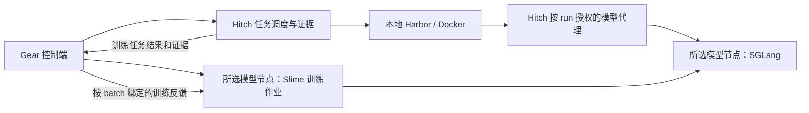

# Harbor 执行位置与模型节点解耦设计

本文说明任务执行与模型节点的部署合同。使用方式见 [v2 controller 配置](controller-v2.zh-CN.md)，实机验证范围见 [单卡认证记录](certifications/2026-09-10-rtx5090-single-gpu/README.zh-CN.md)。当前验收部署为本地 Gear / Hitch / Harbor Docker，加远程单卡 Slime / SGLang 进程；远程 Harbor 和双卡能力需要独立验证。

## 配置与冻结规则

以下是部署合同的说明片段，不是完整可执行训练 spec；实际 CLI 配置见 `controller-v2.zh-CN.md`：

```json
{
  "schemaVersion": 2,
  "taskExecution": {
    "placement": "local",
    "provider": "local-docker"
  },
  "modelRuntime": {
    "nodeRef": "training-node",
    "launcher": "process"
  },
  "gpuScheduling": {
    "actorRollout": "colocated",
    "trainEvaluation": "sequential"
  },
  "nodes": {
    "training-node": {
      "transport": { "type": "ssh", "host": "training-node" },
      "workspace": "/workspace/gear"
    }
  }
}
```

`training-node` 是用户配置的 SSH Host 别名。Python 路径、runtime lock、实际 GPU UUID、预算、模型与数据仍在对应配置中显式提供。模型节点改成本地时选择一个 `transport.type=local` 的节点。`launcher=process` 表示在已准备好的、版本锁定的 Python 环境启动服务；租来的外层容器不需要提供 Docker Engine。

远程 Harbor 使用以下独立选项，开放该拓扑前仍需完成实机验收：

```json
{
  "taskExecution": {
    "placement": "remote",
    "provider": "harbor-remote"
  }
}
```

`harbor-remote` 必须是已经注册、通过能力检查的 provider。需要固定一台主机时，首版为该主机注册专用 provider，不虚构现有 CLI 中不存在的 worker selector。模型节点配置不随之改变。首版同一 `taskExecution` 应用于训练 rollout、dev 和 held-out，避免不经意地混用环境。

- 部署文件负责节点连接与本机路径；实验 spec 冻结解析后的执行策略、模型节点 runtime、GPU 拓扑和版本身份。密钥及临时端口不进入 spec 或内容摘要。
- GPU 标识改为 `(nodeId, gpuUuid)`；进程身份带 node generation，不能把两个节点的 PID 或 GPU 序号当作同一资源。
- `actorRollout=colocated|disaggregated` 控制 Slime 内部布局；`trainEvaluation=sequential|isolated` 控制训练与独立评估的资源关系。二者分别验证、分别计费。
- 切换容器位置或 runtime 必须形成新的冻结配置，重建相应比较基线。不得在一个已启动 run 中通过改配置静默切换，或直接复用旧位置的 baseline evidence。
- v1 记录继续按原 schema 和摘要读取，使用 legacy adapter 保留原行为；v2 新实验使用新合同。迁移产生新 spec，不能重写旧 CAS 对象或活动 run 的身份。

## 目标执行链路



图中的模型代理是逻辑边界。它可以包含 worker 上的 lease-local relay 和控制端 gateway，但 sandbox 只获得自己的生成权限；训练管理、服务启停与权重更新接口保持在控制通道。

### 训练 rollout：由控制端调度任务

将当前 `rollout.py` 中的 Hitch 调用移到控制端，新增 `TrainingEpisodeCoordinator`；GPU 侧保留 native SGLang、精确 receipts、组装 Slime Sample 与 optimizer 所需状态。

1. GPU 作业持久化本 batch 的 rollout intent：run / incarnation / batch / policy lease / task refs / group / slot，以及生成 gateway 的受控引用。
2. Gear 通过已有 `advance` 协调循环读取并处理 intent；在控制端注册 training binding，按所选 provider 提交 Harbor 任务。
3. Harbor 在执行节点操作工具、运行 verifier；模型调用经过受控代理到 GPU 的精确生成 gateway。
4. 控制端收集并核验 canonical run、verifier、终止原因和 runId，再将反馈及所需证据引用传回 GPU。一个 intent 只有一个幂等 logical slot。
5. GPU 将本机 token / logprob receipts 与已核验反馈匹配；完整 B×G group 才可封存并进行训练。缺失、损坏、过期或版本不一致不能补成有效零分。

RPC 用版本化 JSON 信封，至少包含 request ID、job ID、incarnation、policy fence、batch / slot ID 和输入摘要。新增读取 intent、确认已提交 slot、提交结果等操作；同一请求重试返回已有结果，内容冲突必须报错。双方保留 journal，不依赖长连接上的一次成功回复。

本机部署也走同一套 logical protocol，以 transport 差异替代两套训练逻辑。GPU 不再要求安装 Hitch CLI、持有本地 harness Git 路径或访问控制端 task 目录。训练完整数据校验在控制端进行；GPU 只接收训练需要的版本化描述、模型输入、生成证据与已授权 train 反馈。

### 评估模型：独立启动、固定权重

保留 Hitch 对 immutable eval SGLang 的所有权和 lock 校验，新增“模型节点上的进程服务”实现。训练 SGLang 仍由 Slime 管理。

- 将 `SGLangLaunchedService.container_id` 等 Docker 专属假设推广为带类型的 service handle：Docker handle 或 `(nodeId, generation, serviceId, processIdentity)`。
- 增加 `ProcessSGLangLauncher` 及远程控制客户端；准备、检查、停止、恢复都在目标模型节点执行。不能让控制端的 `nvidia-smi` 代替远端核验。
- 远程启停使用持久作业监督与幂等 service ID，沿用进程身份和恢复原则。不能仅把 `ssh python -m sglang ...` 长连接当作服务生命周期。
- 模型按内容摘要在节点缓存。评估锁固定实际 HF 权重、tokenizer、模板、协议、采样、runtime 与设备；不能把任意可变 `base_url` 当作已验证的模型版本。
- 增加受管理远程模型 binding，更新 request → plan → runtime → canonical record 投影；模型位置不再决定 Harbor provider。
- 进程 launcher 使用实测环境清单生成 runtime identity。扩展现有 OCI-only runtime catalog / observation / doctor，不伪造内层容器 ID 或镜像摘要。外层容器镜像与 Python 包版本分别记录、核验。

单卡评估流程是：训练 checkpoint / HF export 完成 → 确认训练进程释放 GPU → 在同一模型节点启动独立评估 SGLang → 本地 Harbor 评估 → 停止评估服务并确认释放。

### 远程 Harbor：待验证拓扑

- 给 remote work spec 增加版本化的 training / managed inference binding，不只删除入口的 topology 检查。
- 保留一个训练 logical task、一份 binding、一次 attempt、无自动重试等现有语义。worker 实际 runId 必须在首次生成前绑定到对应 policy lease。
- 扩展 lease-local capture / relay，传递 canonical run identity、policy fence、receipt 关联及终态。只有经过身份和完整性验证的结果才能导入控制端。
- 模型凭据复用现有 generation / lease / epoch 受限的短期传递机制；task sandbox 得到 run-scoped 路由，不得到模型节点管理凭据。
- 不具备精确训练绑定或模型路由能力的旧 worker，在提交前返回具体缺失能力。不能把“支持普通 API 代理”视为“支持精确训练证据”。
- worker 离线不会自动把当前 task 移到本地；迁移或重试必须由既有恢复合同决定，并保留旧 lease 的状态。

## 网络、制品与资源

### 网络

首版模型节点 transport 支持本机进程和 SSH。控制端主动建立 SSH 通道，连接远端回环监听的 RPC / gateway；配置稳定的节点端口和可恢复的路由，不把现有每批随机端口直接当作公网端口。控制端无需接受 GPU 节点主动拨入。

远程 Harbor worker 继续使用现有 worker 协议与控制端通信；跨 NAT 时提供 SSH 隧道或明确可达的受控 endpoint。分别验证控制 RPC、worker 到模型代理、实际 sandbox 到代理的链路，不能只在宿主机 curl 成功就判定通过。

### 制品

- 控制端保留 task snapshots、harness 和评估证据；Harbor worker 复用现有内容寻址分发。两端绝对路径不能互传后直接使用。
- 初始模型、reference、运行时必需配置和恢复 checkpoint 按摘要同步到模型节点；缺失对象才传输，每端独立 materialize。
- 新增流式 CAS 导入 / 导出；模型分片和 checkpoint 不能塞入 JSON/base64 RPC，也不能套用 Hitch 现有 256 MiB 的 worker input envelope。
- GPU 每步封存完整 checkpoint、HF export 和 update commit；收集阶段将控制端所需对象及其依赖同步、验摘要后才完成 `collect`。回复丢失只重做同步，不重跑 optimizer step。
- 同一 GPU 节点上的 eval 可复用已核验 HF 缓存；数据本地性不能替代控制端对产物的持久化要求。恢复时若远端状态或所需 checkpoint 已丢失，应明确不可恢复，不能假装从最新一步继续。
- train / dev / held-out 仍按权限隔离。dev / held-out 的完整任务、verifier 和逐任务反馈不进入 Trainer；评估模型服务按正常推理收到完成任务所必需的 prompt。只给相应执行 worker 分发它被分配的任务。

### 资源与恢复

- Docker CPU / RAM / build slot / 容器数由 Harbor 所在节点核验；CUDA、显存和模型进程由模型节点核验。普通 GPU 节点不运行 Docker doctor。
- Slime 与 Hitch eval 在同一模型节点共享设备占用账本，并使用实际进程 / 服务身份确认释放。跨主机不共享 `flock` 文件，也不能只依靠两个控制端各自的本地锁。
- 训练内 colocate/offload 不代表整个 GPU 已释放给评估。设备租约在 Slime 完全退出或明确归还前保持有效。
- 断网先停止分派新 episode；已发出的请求进行状态协调，无法确认的生成保守记账。lease 过期后禁止继续生成；不在状态不明时补发同一 logical slot。
- `pause/resume` 协调两边 journal、worker lease、policy lease、GPU 服务和已封存 batch；继续沿用 checkpoint 前重放、checkpoint 后只重导出的规则。
- GPU 用量按唯一已分配物理设备的占用时间记录；单卡 actor + rollout 不能算两张。远程失联期间资源未确认释放，不能把用量清零。

## 单卡生命周期

`actorRollout=colocated` 由 bridge 管理 Slime 生命周期，recipe 不可覆盖保留参数。

由 bridge 根据已封存配置生成 colocate / offload 参数，核对锁定 Slime commit 的调用顺序：生成 → 完成请求与 receipt drain → 必要的显存切换 → backward / checkpoint → 权重同步 → 恢复生成。actor / optimizer / reference / rollout 的峰值占用、CPU RAM、token 上限和启动时显存都在探针中验证。

每种模型、group、学习率和显存配置需要单独冻结和验证。已有单卡 1.5B 证据不证明 disaggregated 双卡或 3B 模型通过验收。

## 验收标准

1. **部署与端到端身份**：真实本地 Harbor 执行工具，远程 GPU 节点无需 Docker；native token IDs、behavior logprobs、runId、policy version、verifier 和 sealed batch 一致；真实 backward、完整导出和独立 reload 有证据。
2. **单卡正常交接**：生成 / 训练切换、两次更新及独立评估串行复用同一 GPU；物理进程、节点账本与用量一致，无未释放时的重复占用。已有正常路径证据可复用，但源代码与冻结身份必须对应。
3. **单卡故障恢复**：分别覆盖 intent / Hitch 提交回包丢失、生成响应与反馈丢失、sealed batch 后中断、checkpoint / export 中断、commit 发布后回复丢失和服务停止回复丢失。未提交 optimizer 状态从原 pre-update 权重和 sealed batch 重放；完整 pending checkpoint 只恢复导出，不再执行 backward；已提交更新不得再次训练。旧实例未确认停止时不准入新所有者。
4. **断联与成本**：控制端或 SSH 中断后停止新分派，过期权限不能复活；未确认释放期间继续计费。实际中断 canary 和独立停止守护的到期停止需实测，不能以守护已启动代替。测试结束确认设备和进程已释放。
5. **制品与信息隔离**：大文件传输中断可续传，摘要错误拒收，collect 的全部依赖可读。dev / held-out 完整任务、verifier 和逐任务反馈不上传 Trainer；推理服务仍可接收执行任务必需的正常 prompt。任务沙箱只有本 run 生成权限，不能访问训练管理、权重更新或其他 run。公开制品不含控制凭据。验证同时覆盖请求字段和实际 CAS 对象，不能只搜索字段名。
6. **认证范围与证据**：正式 runtime 认证只适用于本地 Harbor + 远程进程节点、已冻结模型 / tokenizer / recipe 及单卡调度。CPU 合同、真实进程/网络、真实 Harbor/GPU 证据分开记录；证据绑定实际代码和身份，校验检查项与依赖摘要。缺少故障恢复或信息隔离证据时保持 pending；不得凭任意 checks=true JSON、旧代码证据或正常流程通过就认证新范围。

这些标准完成后，对应远程训练 / 推理节点可正式准入；模型效果、晋升 / 发布仍沿用原训练 spec 的独立门禁。
