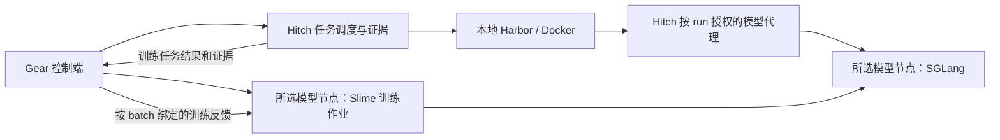

# Harbor 执行位置与模型节点解耦改动方案

状态：本轮范围已完成。2026-09-09 按用户决定收窄为本地 Harbor / Docker + 远程训练与推理节点；2026-09-10 完成单卡故障恢复、信息隔离验证和对应 runtime 认证，正式 preflight 无阻塞。分阶段证据见 `execution-placement-status.zh-CN.md`，最终认证见 [单卡验收记录](certifications/2026-09-10-rtx5090-single-gpu/README.zh-CN.md)。

2026-09-10 探针修正：在等待持久化故障边界时提前定位并缓存带创建时间的 driver 身份，边界出现后立即暂停并复核；错过窗口仍判失败。第一阶段未完成的诊断仅在旧执行已释放、没有 pending checkpoint / commit、保留原封存批次时允许显式继续，原失败日志和丢响应记录归档保留，不计作通过。

适用分支：Gear `codex/slime-model-training`、Hitch `codex/slime-training-binding`。

## 1. 目标与默认部署

本轮部署固定为：控制端本地运行 Gear、Hitch、Harbor Docker；远程 Vast GPU 容器仅运行 Slime、训练 SGLang 和独立评估 SGLang 进程。远端不需要 Docker Engine，也不新增远程 Docker 主机。

训练与 rollout 在同一 GPU 交替执行，使用 Slime 的 CPU offload；训练完成并确认释放后，独立评估 SGLang 串行复用该卡。当前验收使用 Qwen2.5-1.5B、小 batch、短上下文以及实际冻结的单卡环境；不据此承诺 3B 或其他 GPU 配置。

| 项目 | 本轮范围 |
| --- | --- |
| 本地 Harbor + 远程训练 / 推理进程 | 必须完成；固定任务 provider 和模型节点身份 |
| 单卡故障恢复 | 第一优先级；验证重放、导出恢复、资源释放和累计用量 |
| 信息隔离 | 必须验证实际上传对象、训练反馈投影、生成权限和制品脱敏 |
| runtime 认证 | 必须完成上述范围的证据封存及正式准入；不得仅修改 validation 标记 |
| 远程 Harbor / Docker 主机、四种部署组合 | 延后，不再作为本轮完成条件；已有代码保留，未验收 capability 不开放 |
| 双卡回归 | 暂不实施，不租第二张卡；已有分卡路径保留且不宣称通过 |

以下保留部署解耦合同及后续远程 worker 设计，但本轮交付以第 7、8 节收窄后的标准为准。

## 2. 初始实现差距与可复用能力（历史设计）

以下记录开始实施时的差距；当前落地状态见实施记录，不能据此判断现有代码仍禁止单卡。

| 位置 | 初始行为 | 改动 |
| --- | --- | --- |
| Gear `src/training/types.ts`、`schema.ts` | evaluation 固定 `hitch-managed-local` 和 `local-docker-harbor-dataset`；GPU 只有 UUID | 增加版本化部署合同、执行 provider、模型节点与节点内 GPU 标识 |
| Gear `src/training/hitch.ts` | 调用 `hitch local plan --gpu`，提交固定 `--provider local-docker` | 分别解析任务执行位置和受管理模型服务 |
| Gear `python/gear_training/rollout.py`、`hitch.py` | Slime 进程直接调用 Hitch CLI，传递同机 task / binding / harness 路径 | GPU rollout hook 与控制端的 Hitch episode 调度解耦 |
| Gear `src/training/slime.ts`、`process.ts` | Python JSON 子进程 RPC；没有跨节点制品传输和身份核验 | 提供 local / SSH 两种显式 transport，不把 SSH 命令前缀当作完整远程支持 |
| Gear `python/gear_training/preflight.py` | 同机核验 Hitch、Slime、CUDA 与 GPU | 拆成控制端、Harbor worker、模型节点及链路检查 |
| Gear `python/gear_training/driver.py` | 显式禁止 colocate / offload，训练和生成使用不同 GPU | 增加受控的单卡生命周期分支，保留现有分卡模式 |
| Hitch `src/evals/service.ts` | training binding 限制为本地 Harbor，强制 host-side capture | 根据已验证 worker 能力分派，保持一个 logical task / attempt 的训练语义 |
| Hitch `src/control-plane/eval-scheduler.ts` | 拒绝将 local inference 请求派发到远程 provider | 按模型路由是否可达判断，解除模型节点与任务执行节点的绑定 |
| Hitch `src/workers/remote-harbor-work-spec.ts`、`remote-harbor-worker.ts` | 有严格的 work spec、输入分发、凭据、结果回传；未承载本分支的训练 / 受管理模型绑定 | 扩展版本化 work spec，端到端投影绑定并验证 canonical 证据 |
| Hitch `src/inference/sglang.ts` | 已有 `SGLangLauncher` 接口，但返回值和恢复依赖 container ID | 保留 Docker launcher，增加进程 launcher 与远程服务 handle |

复用 Hitch 的 `hitch worker register/run`、provider 调度、worker generation、lease / epoch、输入制品分发及结果导入。无需另外实现一套 Harbor 调度器。现有远程 worker 能力不代表训练绑定已经支持远程。

## 3. 配置与冻结规则

以下是部署合同的说明片段，不是完整可执行训练 spec；实际 CLI 配置见 `controller-v2.zh-CN.md`：

```json
{
  "schemaVersion": 2,
  "taskExecution": {
    "placement": "local",
    "provider": "local-docker"
  },
  "modelRuntime": {
    "nodeRef": "vast-debug",
    "launcher": "process"
  },
  "gpuScheduling": {
    "actorRollout": "colocated",
    "trainEvaluation": "sequential"
  },
  "nodes": {
    "vast-debug": {
      "transport": { "type": "ssh", "host": "vast-debug" },
      "workspace": "/workspace/gear"
    }
  }
}
```

`vast-debug` 是用户配置的 SSH Host 别名。Python 路径、runtime lock、实际 GPU UUID、预算、模型与数据仍在对应配置中显式提供。模型节点改成本地时选择一个 `transport.type=local` 的节点。`launcher=process` 表示在已准备好的、版本锁定的 Python 环境启动服务；租来的外层容器不需要提供 Docker Engine。

后续恢复远程 Harbor 验收时，配置使用以下独立选项（本轮不启用）：

```json
{
  "taskExecution": {
    "placement": "remote",
    "provider": "harbor-remote"
  }
}
```

`harbor-remote` 必须是已经注册、通过能力检查的 provider。需要固定一台主机时，首版为该主机注册专用 provider，不虚构现有 CLI 中不存在的 worker selector。模型节点配置不随之改变。首版同一 `taskExecution` 应用于训练 rollout、dev 和 held-out，避免不经意地混用环境。

- 部署文件负责节点连接与本机路径；实验 spec 冻结解析后的执行策略、模型节点 runtime、GPU 拓扑和版本身份。密钥及临时端口不进入 spec 或内容摘要。
- GPU 标识改为 `(nodeId, gpuUuid)`；进程身份带 node generation，不能把两个节点的 PID 或 GPU 序号当作同一资源。
- `actorRollout=colocated|disaggregated` 控制 Slime 内部布局；`trainEvaluation=sequential|isolated` 控制训练与独立评估的资源关系。二者分别验证、分别计费。
- 切换容器位置或 runtime 必须形成新的冻结配置，重建相应比较基线。不得在一个已启动 run 中通过改配置静默切换，或直接复用旧位置的 baseline evidence。
- v1 记录继续按原 schema 和摘要读取，使用 legacy adapter 保留原行为；v2 新实验使用新合同。迁移产生新 spec，不能重写旧 CAS 对象或活动 run 的身份。

## 4. 目标执行链路



图中的模型代理是逻辑边界。它可以包含 worker 上的 lease-local relay 和控制端 gateway，但 sandbox 只获得自己的生成权限；训练管理、服务启停与权重更新接口保持在控制通道。

### 4.1 训练 rollout：由控制端调度任务

将当前 `rollout.py` 中的 Hitch 调用移到控制端，新增 `TrainingEpisodeCoordinator`；GPU 侧保留 native SGLang、精确 receipts、组装 Slime Sample 与 optimizer 所需状态。

1. GPU 作业持久化本 batch 的 rollout intent：run / incarnation / batch / policy lease / task refs / group / slot，以及生成 gateway 的受控引用。
2. Gear 通过已有 `advance` 协调循环读取并处理 intent；在控制端注册 training binding，按所选 provider 提交 Harbor 任务。
3. Harbor 在执行节点操作工具、运行 verifier；模型调用经过受控代理到 GPU 的精确生成 gateway。
4. 控制端收集并核验 canonical run、verifier、终止原因和 runId，再将反馈及所需证据引用传回 GPU。一个 intent 只有一个幂等 logical slot。
5. GPU 将本机 token / logprob receipts 与已核验反馈匹配；完整 B×G group 才可封存并进行训练。缺失、损坏、过期或版本不一致不能补成有效零分。

RPC 用版本化 JSON 信封，至少包含 request ID、job ID、incarnation、policy fence、batch / slot ID 和输入摘要。新增读取 intent、确认已提交 slot、提交结果等操作；同一请求重试返回已有结果，内容冲突必须报错。双方保留 journal，不依赖长连接上的一次成功回复。

本机部署也走同一套 logical protocol，以 transport 差异替代两套训练逻辑。GPU 不再要求安装 Hitch CLI、持有本地 harness Git 路径或访问控制端 task 目录。训练完整数据校验在控制端进行；GPU 只接收训练需要的版本化描述、模型输入、生成证据与已授权 train 反馈。

### 4.2 评估模型：独立启动、固定权重

保留 Hitch 对 immutable eval SGLang 的所有权和 lock 校验，新增“模型节点上的进程服务”实现。训练 SGLang 仍由 Slime 管理。

- 将 `SGLangLaunchedService.container_id` 等 Docker 专属假设推广为带类型的 service handle：Docker handle 或 `(nodeId, generation, serviceId, processIdentity)`。
- 增加 `ProcessSGLangLauncher` 及远程控制客户端；准备、检查、停止、恢复都在目标模型节点执行。不能让控制端的 `nvidia-smi` 代替远端核验。
- 远程启停使用持久作业监督与幂等 service ID，沿用进程身份和恢复原则。不能仅把 `ssh python -m sglang ...` 长连接当作服务生命周期。
- 模型按内容摘要在节点缓存。评估锁固定实际 HF 权重、tokenizer、模板、协议、采样、runtime 与设备；不能把任意可变 `base_url` 当作已验证的模型版本。
- 增加受管理远程模型 binding，更新 request → plan → runtime → canonical record 投影；模型位置不再决定 Harbor provider。
- 进程 launcher 使用实测环境清单生成 runtime identity。扩展现有 OCI-only runtime catalog / observation / doctor，不伪造内层容器 ID 或镜像摘要。外层容器镜像与 Python 包版本分别记录、核验。

单卡评估流程是：训练 checkpoint / HF export 完成 → 确认训练进程释放 GPU → 在同一模型节点启动独立评估 SGLang → 本地 Harbor 评估 → 停止评估服务并确认释放。

### 4.3 远程 Harbor：后续设计，本轮延后

- 给 remote work spec 增加版本化的 training / managed inference binding，不只删除入口的 topology 检查。
- 保留一个训练 logical task、一份 binding、一次 attempt、无自动重试等现有语义。worker 实际 runId 必须在首次生成前绑定到对应 policy lease。
- 扩展 lease-local capture / relay，传递 canonical run identity、policy fence、receipt 关联及终态。只有经过身份和完整性验证的结果才能导入控制端。
- 模型凭据复用现有 generation / lease / epoch 受限的短期传递机制；task sandbox 得到 run-scoped 路由，不得到模型节点管理凭据。
- 不具备精确训练绑定或模型路由能力的旧 worker，在提交前返回具体缺失能力。不能把“支持普通 API 代理”视为“支持精确训练证据”。
- worker 离线不会自动把当前 task 移到本地；迁移或重试必须由既有恢复合同决定，并保留旧 lease 的状态。

## 5. 网络、制品与资源

### 网络

首版模型节点 transport 支持本机进程和 SSH。控制端主动建立 SSH 通道，连接远端回环监听的 RPC / gateway；配置稳定的节点端口和可恢复的路由，不把现有每批随机端口直接当作公网端口。控制端无需接受 GPU 节点主动拨入。

远程 Harbor worker 继续使用现有 worker 协议与控制端通信；跨 NAT 时提供 SSH 隧道或明确可达的受控 endpoint。分别验证控制 RPC、worker 到模型代理、实际 sandbox 到代理的链路，不能只在宿主机 curl 成功就判定通过。

### 制品

- 控制端保留 task snapshots、harness 和评估证据；Harbor worker 复用现有内容寻址分发。两端绝对路径不能互传后直接使用。
- 初始模型、reference、运行时必需配置和恢复 checkpoint 按摘要同步到模型节点；缺失对象才传输，每端独立 materialize。
- 新增流式 CAS 导入 / 导出；模型分片和 checkpoint 不能塞入 JSON/base64 RPC，也不能套用 Hitch 现有 256 MiB 的 worker input envelope。
- GPU 每步封存完整 checkpoint、HF export 和 update commit；收集阶段将控制端所需对象及其依赖同步、验摘要后才完成 `collect`。回复丢失只重做同步，不重跑 optimizer step。
- 同一 GPU 节点上的 eval 可复用已核验 HF 缓存；数据本地性不能替代控制端对产物的持久化要求。恢复时若远端状态或所需 checkpoint 已丢失，应明确不可恢复，不能假装从最新一步继续。
- train / dev / held-out 仍按权限隔离。dev / held-out 的完整任务、verifier 和逐任务反馈不进入 Trainer；评估模型服务按正常推理收到完成任务所必需的 prompt。只给相应执行 worker 分发它被分配的任务。

### 资源与恢复

- Docker CPU / RAM / build slot / 容器数由 Harbor 所在节点核验；CUDA、显存和模型进程由模型节点核验。普通 GPU 节点不运行 Docker doctor。
- Slime 与 Hitch eval 在同一模型节点共享设备占用账本，并使用实际进程 / 服务身份确认释放。跨主机不共享 `flock` 文件，也不能只依靠两个控制端各自的本地锁。
- 训练内 colocate/offload 不代表整个 GPU 已释放给评估。设备租约在 Slime 完全退出或明确归还前保持有效。
- 断网先停止分派新 episode；已发出的请求进行状态协调，无法确认的生成保守记账。lease 过期后禁止继续生成；不在状态不明时补发同一 logical slot。
- `pause/resume` 协调两边 journal、worker lease、policy lease、GPU 服务和已封存 batch；继续沿用 checkpoint 前重放、checkpoint 后只重导出的规则。
- GPU 用量按唯一已分配物理设备的占用时间记录；单卡 actor + rollout 不能算两张。远程失联期间资源未确认释放，不能把用量清零。

## 6. 单卡支持作为独立工作包

为 `actorRollout=colocated` 增加明确受控的 Slime 生命周期；不能只移除 `driver.py` 的拒绝条件，也不能允许 recipe 任意覆盖保留参数。

由 bridge 根据已封存配置生成 colocate / offload 参数，核对锁定 Slime commit 的调用顺序：生成 → 完成请求与 receipt drain → 必要的显存切换 → backward / checkpoint → 权重同步 → 恢复生成。actor / optimizer / reference / rollout 的峰值占用、CPU RAM、token 上限和启动时显存都在探针中验证。

GPU 验收用已跑通的 1.5B、小 batch 和短上下文，冻结模型、group、学习率和显存配置。现有 disaggregated 双卡路径保留；双卡回归与 3B 验证延后，本轮不增加这两项算力开销。

## 7. 当前实施顺序与交付

| 顺序 | 交付 | 完成标志 |
| --- | --- | --- |
| 已有基础 | 本地 Harbor + 远程 Slime / SGLang、单卡交替、checkpoint / HF / collect、独立评估交接 | 第 46 轮两次真实更新、第 49 轮独立评估和设备互斥已有实机证据；零奖励结果不表示学习提升 |
| R1 单卡故障恢复 | 固定 request / job / node 身份；恢复前协调旧 episode、物理进程和设备租约；区分 batch 重放与已保存更新的导出恢复 | 故障后不重复消费更新、不丢已承认样本、不提前释放 GPU；用量跨恢复单调累计 |
| R2 信息隔离 | 最小训练请求与反馈、按授权同步 CAS；dev / held-out、私有 verifier、管理凭据分别留在对应边界 | 真实传输路径的哨兵与拒绝测试通过；记录检查的对象、方向及例外（正常推理 prompt） |
| R3 runtime 认证 | 绑定实际 runtime / bridge / protocol / provider / 模型与 recipe / 单卡布局的证据；校验证据闭包和检查集合 | 全部本轮必需检查通过后产生可核验认证对象，正式 preflight 接受；漂移、缺项或伪造范围拒绝 |

R1 → R2 → R3 顺序推进。CPU 可完成的故障注入、检查脚本和证据审计在开 GPU 前完成；利用现有模型和依赖缓存，将真实 GPU 检查集中在有明确退出条件的短运行中。独立停止守护必须覆盖控制端失联，取回所需日志后停止并保留可用容器。不可用实例有需保留数据时先 copy、校验再删除。

最新执行约束（2026-09-09）：用户要求实例启动后连续完成当前全部测试，阶段结束或对话结束时不再停机。旧的短阶段到期停机脚本不复用；各测试仍有执行时限并记录用量。实际断联停止验收安排在全部模型测试之后，再统一关闭实例，保留磁盘和环境。

价格授权更新（2026-09-10）：用户允许被抢占后提高出价，总单价不超过 $1/小时；当前选择 GPU 出价 $0.94/小时，加存储约 $0.99/小时。该授权不改变单实例、远端保留大文件与全部测试后停机的要求。

用户已授权原机加价仍无资源时切到按需实例。本次新建 `50406574`（1×RTX 5090、约 128 GB 主机内存、220 GB 磁盘、约 $0.748/小时），`50380854` 保持停止。只将现有初始模型和固定 Slime / Megatron 源码直接 copy 到目标，不中转本地；原 native checkpoint 仍在源机保留。新 GPU / node 身份单独冻结，不改写第 66 轮已提交请求。

最新节点选择：使用已保留完整检查点的 `50380854`。`50392374` 已按要求停止，随后被另一个 key ID 的删除请求移除，现已不可用；不再将其磁盘列为可保留数据源。已提交请求的 runtime / GPU 身份不跨机器改写；旧检查点可作为独立恢复诊断输入，最终认证仍要求当前冻结节点上的完整验收。

完整 optimizer 恢复补充：Megatron 在构造 distributed checkpoint 的加载目标时已分配 Adam 状态，实际加载后再次调用 TE FusedAdam 的 loader 会重复分配，CPU dummy 补丁不能覆盖第二次调用。仅当固定 TE FusedAdam 的入参逐参数引用其现有状态、且没有自定义加载 hook 时，第二次调用只通过上游 loader 恢复参数组元数据并保留原张量；实际 checkpoint 状态仍由 Megatron 的参数状态加载路径恢复。不同状态映射、其他优化器和带 hook 的情况保持原始 loader 行为。验收需确认 step / scheduler、有限 moments、显存释放和随后真实更新，不能只以无 OOM 判断恢复正确。

2026-09-09 补充存储约束：Vast 实例迁移直接使用 `vastai copy C.<源实例>:/workspace/... C.<目标实例>:/workspace/...`，不得以用户本地磁盘中转模型、checkpoint 或安装缓存。停止状态完成复制及内容核验；确认目标可用、所需数据已完整保留后，再删除不可用源实例。仍可使用且尚未测完的实例只停止，不删除。

诊断的大文件留在远端，远端执行完整性与有限权重校验，控制端只接收有界摘要。旧诊断 checkpoint 不再作为恢复输入时可清理，记录其保留范围；不能把删除过状态的历史作业宣称为仍可恢复。原始控制端记录如需远端存档，应先加密，解密密钥不能上传到模型节点。

远端持久化接线使用显式 `artifactStorage: "model-node"`：模型节点校验并保留模型和训练状态的 CAS 闭包（包括 commit 隐含的 consumed batch），同步文件与目录后封存绑定节点、根引用和对象清单的回执。闭包中的任务、harness、原始 verifier/canonical 证据由控制端核验其本地依赖并提供摘要和字节数；这些内容不补传到模型节点，回执明确区分两端的保管责任。控制端复核回执及闭包，只导入总量不超过 16 MiB 的描述和轨迹元数据；快照文件作为不透明对象留在节点，不递归跟随 JSON 模型配置中的引用。正式 collect 必须取得完整持久化确认，错误、断联或任一端缺对象均不能完成。本机存在权重不能替代远端的模型文件。既有 controller 存储模式保留；远程 SSH 配置默认选用 model-node 模式，不能在缺文件时自动下载大对象。

控制端 canonical 证据可能经 policy lease 再次引用远端 HF 快照。这些返回模型节点的依赖边作为附加根参与同一持久化回执验证，既不漏掉快照文件，也不上传 lease 或原始 verifier。远端缺失该快照时直接失败，不用本机副本代替。文件散列与封存使用传输时限，普通状态 RPC 继续使用较短的控制时限。

认证增加 `remoteArtifactRetention`，要求真实远端回执及本地无权重副本的收集/模型注册证据，方法为 `remote-process`。已有正常训练日志不能代替这项验收。

2026-09-09 第 56 轮确认 pending checkpoint 已完整保存，但恢复导出仍创建了 SGLang、reference 与 optimizer；FusedAdam 加载状态的临时分配超过单张 32 GB GPU。导出恢复改为独立的只读权重加载阶段：使用固定 Slime/Megatron 的模型构建、checkpoint 模型加载及 HF writer，不构造 optimizer、reference 或 rollout 服务，不执行 backward。完整 optimizer、scheduler、RNG 和原 batch/cursor 仍由原 checkpoint 引用保留，不能以缺失训练状态的新快照替换。HF 导出和 commit 完成后释放导出进程；如果还有更新，再从完整 checkpoint 初始化训练组件。只读阶段的内部加载选项不能开放为训练 recipe 覆盖，也不能改变冻结请求。后续训练的完整 optimizer 恢复仍需独立验证，不能凭导出成功宣称通过。

先对保留在远端的第 56 轮 checkpoint 做独立导出诊断，验证显存峰值和 HF 可加载性；代码变更后的正式故障恢复使用新的冻结请求，不改写旧作业的兼容性摘要或认证范围。诊断只回收有界日志和元数据。

完整训练恢复另有一次性显存峰值：Megatron 为尚未初始化的 optimizer 构造全量 CUDA 占位状态，再由 Transformer Engine 的 FusedAdam loader 分配实际 CUDA 状态，两份同时存活。固定版本补丁仅将这批未初始化的 TE 占位张量放在 CPU；实际 Adam 状态仍由原 loader 恢复到 GPU，dtype、step、训练参数和 checkpoint 格式不变。这不是训练时 optimizer offload。补丁摘要纳入 runtime lock；GPU 恢复时需核验载入完整 optimizer/RNG 并完成下一次真实更新。

新冻结诊断开启固定 Slime 的训练数据 capture，在节点上按每个已提交 batch 核对原生 receipt、sealed sample 与训练端实际 token IDs、response length、loss mask 和 behavior logprob。工具返回及模板追加的 token 必须继续为零 mask；actor/native 差异只统计参与 loss 的 policy token，要求有限且平均绝对差不超过 0.1。核验同时绑定 request、commit、batch 和原始 capture 文件摘要；控制端只保留数值摘要，不下载 tensor 文件或原始模型。该审计不能替代真实 backward、优化器恢复和独立评估证据。

初始 HF 模型在模型节点封存。Hitch 通过已注册、已冻结身份的节点读取实际 HF 文件清单，按既有模型身份规则注册远端模型，并保存节点绑定及快照引用。规划和启动时重新核验内容；没有对应远端来源或节点身份漂移时拒绝，不能假冒已导入本地文件。模型语义及推理锁规则保持一致，控制端不 materialize 权重。

远程 Harbor / Docker 与双卡不阻塞本轮 R3，也不得由本轮认证顺带启用。未来新增范围需新冻结身份及独立证据；v1 记录不改写，运行中不静默切换拓扑。

## 8. 本轮验收标准

1. **部署与端到端身份**：真实本地 Harbor 执行工具，远程 GPU 节点无需 Docker；native token IDs、behavior logprobs、runId、policy version、verifier 和 sealed batch 一致；真实 backward、完整导出和独立 reload 有证据。
2. **单卡正常交接**：生成 / 训练切换、两次更新及独立评估串行复用同一 GPU；物理进程、节点账本与用量一致，无未释放时的重复占用。已有正常路径证据可复用，但源代码与冻结身份必须对应。
3. **单卡故障恢复**：分别覆盖 intent / Hitch 提交回包丢失、生成响应与反馈丢失、sealed batch 后中断、checkpoint / export 中断、commit 发布后回复丢失和服务停止回复丢失。未提交 optimizer 状态从原 pre-update 权重和 sealed batch 重放；完整 pending checkpoint 只恢复导出，不再执行 backward；已提交更新不得再次训练。旧实例未确认停止时不准入新所有者。
4. **断联与成本**：控制端或 SSH 中断后停止新分派，过期权限不能复活；未确认释放期间继续计费。实际中断 canary 和独立停止守护的到期停止需实测，不能以守护已启动代替。测试结束确认 Vast 已停止。
5. **制品与信息隔离**：大文件传输中断可续传，摘要错误拒收，collect 的全部依赖可读。dev / held-out 完整任务、verifier 和逐任务反馈不上传 Trainer；推理服务仍可接收执行任务必需的正常 prompt。任务沙箱只有本 run 生成权限，不能访问训练管理、权重更新或其他 run。公开制品不含控制凭据。验证同时覆盖请求字段和实际 CAS 对象，不能只搜索字段名。
6. **认证范围与证据**：正式 runtime 认证只适用于本地 Harbor + 远程进程节点、已冻结模型 / tokenizer / recipe 及单卡调度。CPU 合同、真实进程/网络、真实 Harbor/GPU 证据分开记录；证据绑定实际代码和身份，校验检查项与依赖摘要。缺少故障恢复或信息隔离证据时保持 pending；不得凭任意 checks=true JSON、旧代码证据或正常流程通过就认证新范围。

这些标准完成后，本轮远程训练 / 推理节点可正式准入；模型效果、晋升 / 发布仍沿用原训练 spec 的独立门禁。
