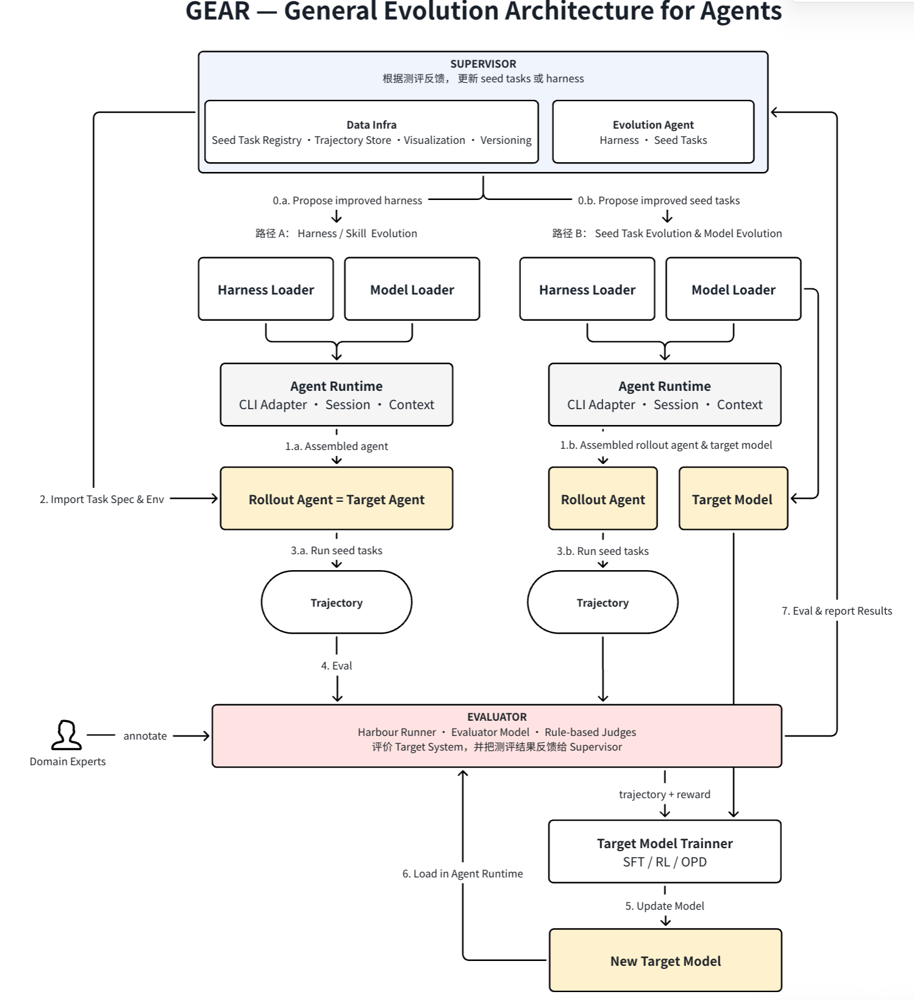

# GEAR 愿景与总体架构

**General Evolution Architecture for Agents**

> 本文描述 GEAR 的长期项目愿景。当前仓库已经提供独立 Gear Core、通用
> Refine Agent Skill、DSH 兼容适配层，以及基于 Hitch/Harbor 的 Target rollout；
> 更多 Target builder、模型训练与数据基础设施能力仍属于后续规划。

GEAR 是一个面向智能体持续演进的通用架构。它将 Agent 运行、轨迹评测和
数据基础设施解耦，并通过评测反馈持续改进 Harness、Seed Tasks 和模型能力。

## 核心模块

### Supervisor

Supervisor 负责协调每轮演进，并根据评测结果决定更新 Harness 或 Seed Tasks。

- **Data Infra**：管理 Seed Task、Trajectory、可视化标注与数据版本。
- **Evolution Agent**：根据历史轨迹和评测反馈生成新的 Harness 或 Seed Tasks。

### Agent

Agent 由以下部分动态装配：

- **Harness Loader**：加载 Prompt、Skill、Tool 和 Workflow 等运行配置。
- **Model Loader**：加载 Base Model 或指定 Checkpoint。
- **Agent Runtime**：Meta 侧通过 Refine Skill 和本地能力协议接入 Codex、Claude Code、DSH 等 Harness；Target 侧由独立 rollout provider 管理。

### Evaluator

Evaluator 接收 Agent 产生的轨迹并返回评测结果与训练信号，包括：

- **Harbor Runner**：执行任务并回放或调用轨迹。
- **Evaluator Model**：对任务完成质量和行为轨迹进行评判。
- **Rule-based Judges**：计算可验证指标、成本与安全约束。
- **Domain Expert Annotations**：为评测提供人工标注和监督信号。

## 演进路径

### 路径 A：Harness / Skill Evolution

Rollout Agent 与 Target Agent 使用相同模型。系统保持模型不变，通过 Seed Tasks
生成轨迹、完成评测，并根据反馈持续改进 Harness、Skill、Prompt、Tool 或
Workflow。

### 路径 B：Seed Task & Model Evolution

Rollout Agent 在演进后的 Seed Tasks 上生成轨迹，Evaluator 为轨迹提供 reward
和反馈。随后 Target Model Trainer 使用这些数据执行 SFT、RL 或 OPD，得到新的
Target Model，并重新加载到 Agent Runtime 中接受评测。

## 一轮演进流程

1. Supervisor 提出新的 Harness 或 Seed Tasks。
2. Harness Loader 和 Model Loader 装配 Agent。
3. Data Infra 提供 Task Spec 和运行环境。
4. Rollout Agent 执行任务并生成 Trajectory。
5. Evaluator 对轨迹进行评分、标注并生成反馈。
6. 路径 B 使用 trajectory 与 reward 更新 Target Model。
7. 新模型重新加载到 Agent Runtime 中进行评测。
8. 评测结果返回 Supervisor，开始下一轮演进。

## 设计目标

- 支持 Harness、Seed Task 和 Model 三个层面的独立演进。
- 统一管理任务、轨迹、标注和模型版本。
- 支持自动评测、规则评测与专家标注组合。
- 兼容不同 Agent CLI、模型和训练方式。

当前实现的安装、算法扩展点和 roadmap 请参阅项目 [README](../README.md)。
